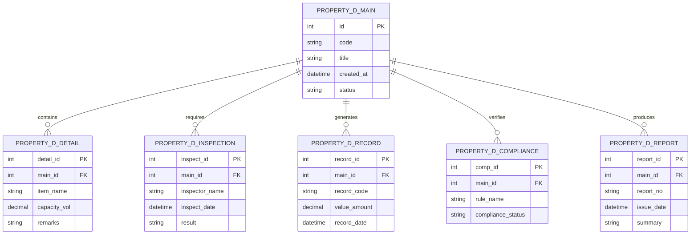

# Conceptual ERD — Property Developer Project Management System

## Mermaid Code

## Entity Description Table | Bang mo ta Entity

| # | Entity Name | Vietnamese Name | Description | Key Attributes | Main Relationships |
|---|-------------|-----------------|-------------|----------------|-------------------|
| 1 | PROPERTY_D_MAIN | Entity property_d_main | Stores property_d_main data for Property Developer Project Management System | id | Main core entity |
| 2 | PROPERTY_D_DETAIL | Entity property_d_detail | Stores property_d_detail data for Property Developer Project Management System | detail_id | Main core entity |
| 3 | PROPERTY_D_INSPECTION | Entity property_d_inspection | Stores property_d_inspection data for Property Developer Project Management System | inspect_id | Main core entity |
| 4 | PROPERTY_D_RECORD | Entity property_d_record | Stores property_d_record data for Property Developer Project Management System | record_id | Main core entity |
| 5 | PROPERTY_D_COMPLIANCE | Entity property_d_compliance | Stores property_d_compliance data for Property Developer Project Management System | comp_id | Main core entity |
| 6 | PROPERTY_D_REPORT | Entity property_d_report | Stores property_d_report data for Property Developer Project Management System | report_id | Main core entity |

## Relationship Description | Mo ta Quan he

| # | From Entity | Cardinality | To Entity | Relationship Label | Business Explanation |
|---|-------------|-------------|-----------|-------------------|----------------------|
| 1 | PROPERTY_D_MAIN | one-to-many | PROPERTY_D_DETAIL | contains | Thanh phan chinh bao gom nhieu chi tiet nghiep vu |
| 2 | PROPERTY_D_MAIN | one-to-many | PROPERTY_D_INSPECTION | requires | Thanh phan chinh yeu cau cac dot kiem tra kiem dinh |
| 3 | PROPERTY_D_MAIN | one-to-many | PROPERTY_D_RECORD | generates | Thanh phan chinh xuat cac ban ghi thong ke |
| 4 | PROPERTY_D_MAIN | one-to-many | PROPERTY_D_COMPLIANCE | verifies | Thanh phan chinh kiem tra tinh tuan thu quy chuan |
| 5 | PROPERTY_D_MAIN | one-to-many | PROPERTY_D_REPORT | produces | Thanh phan chinh xuat cac bao cao tong hop |
