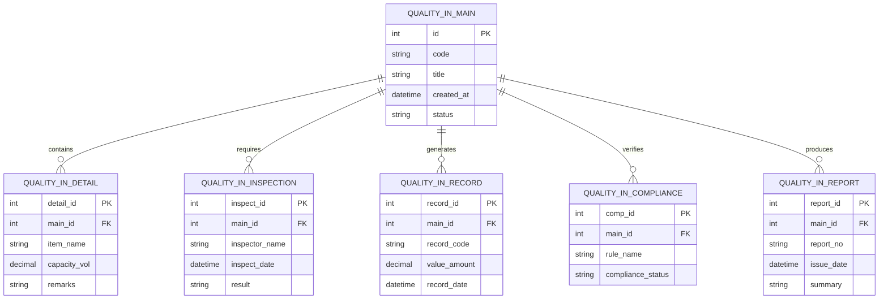

# Conceptual ERD — Quality Inspection Management System

## Mermaid Code

## Entity Description Table | Bang mo ta Entity

| # | Entity Name | Vietnamese Name | Description | Key Attributes | Main Relationships |
|---|-------------|-----------------|-------------|----------------|-------------------|
| 1 | QUALITY_IN_MAIN | Entity quality_in_main | Stores quality_in_main data for Quality Inspection Management System | id | Main core entity |
| 2 | QUALITY_IN_DETAIL | Entity quality_in_detail | Stores quality_in_detail data for Quality Inspection Management System | detail_id | Main core entity |
| 3 | QUALITY_IN_INSPECTION | Entity quality_in_inspection | Stores quality_in_inspection data for Quality Inspection Management System | inspect_id | Main core entity |
| 4 | QUALITY_IN_RECORD | Entity quality_in_record | Stores quality_in_record data for Quality Inspection Management System | record_id | Main core entity |
| 5 | QUALITY_IN_COMPLIANCE | Entity quality_in_compliance | Stores quality_in_compliance data for Quality Inspection Management System | comp_id | Main core entity |
| 6 | QUALITY_IN_REPORT | Entity quality_in_report | Stores quality_in_report data for Quality Inspection Management System | report_id | Main core entity |

## Relationship Description | Mo ta Quan he

| # | From Entity | Cardinality | To Entity | Relationship Label | Business Explanation |
|---|-------------|-------------|-----------|-------------------|----------------------|
| 1 | QUALITY_IN_MAIN | one-to-many | QUALITY_IN_DETAIL | contains | Thanh phan chinh bao gom nhieu chi tiet nghiep vu |
| 2 | QUALITY_IN_MAIN | one-to-many | QUALITY_IN_INSPECTION | requires | Thanh phan chinh yeu cau cac dot kiem tra kiem dinh |
| 3 | QUALITY_IN_MAIN | one-to-many | QUALITY_IN_RECORD | generates | Thanh phan chinh xuat cac ban ghi thong ke |
| 4 | QUALITY_IN_MAIN | one-to-many | QUALITY_IN_COMPLIANCE | verifies | Thanh phan chinh kiem tra tinh tuan thu quy chuan |
| 5 | QUALITY_IN_MAIN | one-to-many | QUALITY_IN_REPORT | produces | Thanh phan chinh xuat cac bao cao tong hop |
