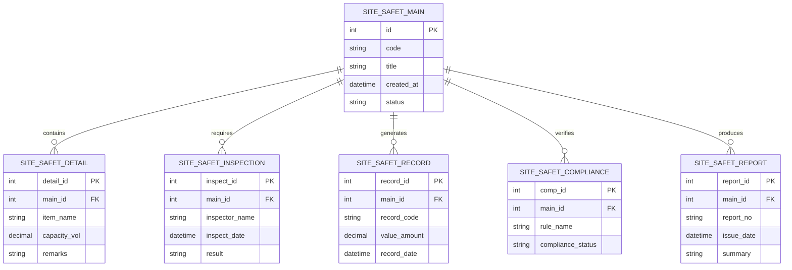

# Conceptual ERD — Site Safety Management System

## Mermaid Code

## Entity Description Table | Bang mo ta Entity

| # | Entity Name | Vietnamese Name | Description | Key Attributes | Main Relationships |
|---|-------------|-----------------|-------------|----------------|-------------------|
| 1 | SITE_SAFET_MAIN | Entity site_safet_main | Stores site_safet_main data for Site Safety Management System | id | Main core entity |
| 2 | SITE_SAFET_DETAIL | Entity site_safet_detail | Stores site_safet_detail data for Site Safety Management System | detail_id | Main core entity |
| 3 | SITE_SAFET_INSPECTION | Entity site_safet_inspection | Stores site_safet_inspection data for Site Safety Management System | inspect_id | Main core entity |
| 4 | SITE_SAFET_RECORD | Entity site_safet_record | Stores site_safet_record data for Site Safety Management System | record_id | Main core entity |
| 5 | SITE_SAFET_COMPLIANCE | Entity site_safet_compliance | Stores site_safet_compliance data for Site Safety Management System | comp_id | Main core entity |
| 6 | SITE_SAFET_REPORT | Entity site_safet_report | Stores site_safet_report data for Site Safety Management System | report_id | Main core entity |

## Relationship Description | Mo ta Quan he

| # | From Entity | Cardinality | To Entity | Relationship Label | Business Explanation |
|---|-------------|-------------|-----------|-------------------|----------------------|
| 1 | SITE_SAFET_MAIN | one-to-many | SITE_SAFET_DETAIL | contains | Thanh phan chinh bao gom nhieu chi tiet nghiep vu |
| 2 | SITE_SAFET_MAIN | one-to-many | SITE_SAFET_INSPECTION | requires | Thanh phan chinh yeu cau cac dot kiem tra kiem dinh |
| 3 | SITE_SAFET_MAIN | one-to-many | SITE_SAFET_RECORD | generates | Thanh phan chinh xuat cac ban ghi thong ke |
| 4 | SITE_SAFET_MAIN | one-to-many | SITE_SAFET_COMPLIANCE | verifies | Thanh phan chinh kiem tra tinh tuan thu quy chuan |
| 5 | SITE_SAFET_MAIN | one-to-many | SITE_SAFET_REPORT | produces | Thanh phan chinh xuat cac bao cao tong hop |
