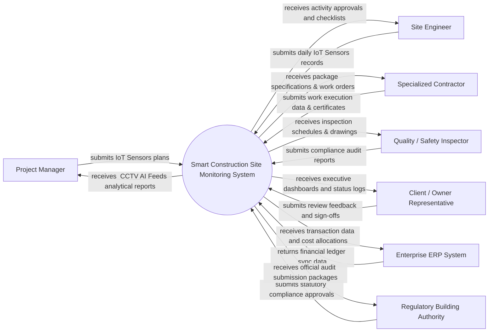

# Context Diagram — Smart Construction Site Monitoring System

## Mermaid Code

## Actor & Interaction Table | Bang Actor & Tuong tac

| # | Actor | Actor Type | Data Sent TO System | Data Received FROM System | Notes |
|---|-------|------------|---------------------|---------------------------|-------|
| 1 | Project Manager | Primary | submits IoT Sensors plans | receives  CCTV AI Feeds analytical reports | Key stakeholder in Smart Construction Site Monitoring System |
| 2 | Site Engineer | Primary | submits daily IoT Sensors records | receives activity approvals and checklists | Key stakeholder in Smart Construction Site Monitoring System |
| 3 | Specialized Contractor | Primary | submits work execution data & certificates | receives package specifications & work orders | Key stakeholder in Smart Construction Site Monitoring System |
| 4 | Quality / Safety Inspector | Primary | submits compliance audit reports | receives inspection schedules & drawings | Key stakeholder in Smart Construction Site Monitoring System |
| 5 | Client / Owner Representative | Primary | submits review feedback and sign-offs | receives executive dashboards and status logs | Key stakeholder in Smart Construction Site Monitoring System |
| 6 | Enterprise ERP System | Supporting | returns financial ledger sync data | receives transaction data and cost allocations | Key stakeholder in Smart Construction Site Monitoring System |
| 7 | Regulatory Building Authority | Regulatory | submits statutory compliance approvals | receives official audit submission packages | Key stakeholder in Smart Construction Site Monitoring System |

## System Boundary Description | Mo ta Pham vi He thong

He thong He thong Giam sat Cong truong Xay dung Thong minh (Smart Construction Site Monitoring System) quan ly toan bo quy trinh nghiep vu cot loi trong pham vi du an. He thong tiep nhan du lieu tu cac ben lien quan, kiem tra tinh hop le va xu ly luu vet minh bach. Cac he thong ben ngoai va co quan quan ly tuong tac voi he thong thong qua giao dien ket noi va API duoc bao mat.
