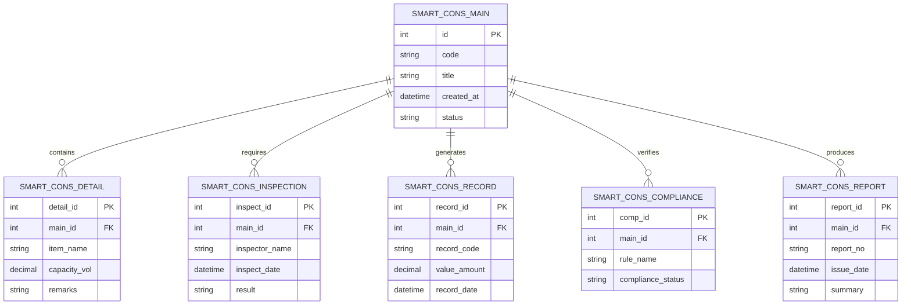

# Conceptual ERD — Smart Construction Site Monitoring System

## Mermaid Code

## Entity Description Table | Bang mo ta Entity

| # | Entity Name | Vietnamese Name | Description | Key Attributes | Main Relationships |
|---|-------------|-----------------|-------------|----------------|-------------------|
| 1 | SMART_CONS_MAIN | Entity smart_cons_main | Stores smart_cons_main data for Smart Construction Site Monitoring System | id | Main core entity |
| 2 | SMART_CONS_DETAIL | Entity smart_cons_detail | Stores smart_cons_detail data for Smart Construction Site Monitoring System | detail_id | Main core entity |
| 3 | SMART_CONS_INSPECTION | Entity smart_cons_inspection | Stores smart_cons_inspection data for Smart Construction Site Monitoring System | inspect_id | Main core entity |
| 4 | SMART_CONS_RECORD | Entity smart_cons_record | Stores smart_cons_record data for Smart Construction Site Monitoring System | record_id | Main core entity |
| 5 | SMART_CONS_COMPLIANCE | Entity smart_cons_compliance | Stores smart_cons_compliance data for Smart Construction Site Monitoring System | comp_id | Main core entity |
| 6 | SMART_CONS_REPORT | Entity smart_cons_report | Stores smart_cons_report data for Smart Construction Site Monitoring System | report_id | Main core entity |

## Relationship Description | Mo ta Quan he

| # | From Entity | Cardinality | To Entity | Relationship Label | Business Explanation |
|---|-------------|-------------|-----------|-------------------|----------------------|
| 1 | SMART_CONS_MAIN | one-to-many | SMART_CONS_DETAIL | contains | Thanh phan chinh bao gom nhieu chi tiet nghiep vu |
| 2 | SMART_CONS_MAIN | one-to-many | SMART_CONS_INSPECTION | requires | Thanh phan chinh yeu cau cac dot kiem tra kiem dinh |
| 3 | SMART_CONS_MAIN | one-to-many | SMART_CONS_RECORD | generates | Thanh phan chinh xuat cac ban ghi thong ke |
| 4 | SMART_CONS_MAIN | one-to-many | SMART_CONS_COMPLIANCE | verifies | Thanh phan chinh kiem tra tinh tuan thu quy chuan |
| 5 | SMART_CONS_MAIN | one-to-many | SMART_CONS_REPORT | produces | Thanh phan chinh xuat cac bao cao tong hop |
