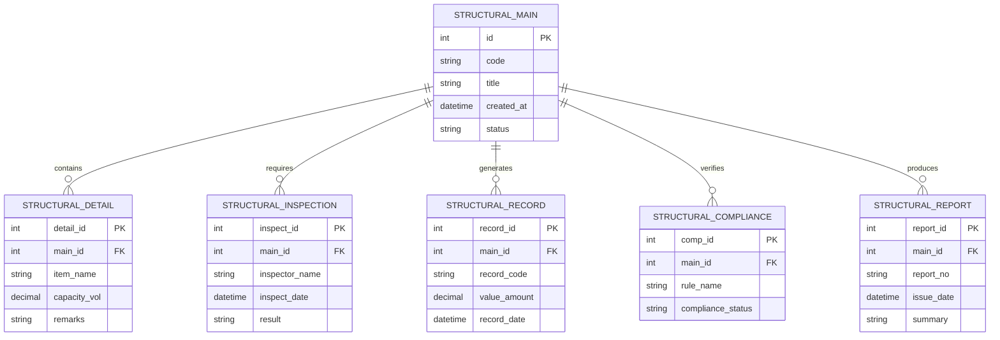

# Conceptual ERD — Structural Inspection & Monitoring System

## Mermaid Code

## Entity Description Table | Bang mo ta Entity

| # | Entity Name | Vietnamese Name | Description | Key Attributes | Main Relationships |
|---|-------------|-----------------|-------------|----------------|-------------------|
| 1 | STRUCTURAL_MAIN | Entity structural_main | Stores structural_main data for Structural Inspection & Monitoring System | id | Main core entity |
| 2 | STRUCTURAL_DETAIL | Entity structural_detail | Stores structural_detail data for Structural Inspection & Monitoring System | detail_id | Main core entity |
| 3 | STRUCTURAL_INSPECTION | Entity structural_inspection | Stores structural_inspection data for Structural Inspection & Monitoring System | inspect_id | Main core entity |
| 4 | STRUCTURAL_RECORD | Entity structural_record | Stores structural_record data for Structural Inspection & Monitoring System | record_id | Main core entity |
| 5 | STRUCTURAL_COMPLIANCE | Entity structural_compliance | Stores structural_compliance data for Structural Inspection & Monitoring System | comp_id | Main core entity |
| 6 | STRUCTURAL_REPORT | Entity structural_report | Stores structural_report data for Structural Inspection & Monitoring System | report_id | Main core entity |

## Relationship Description | Mo ta Quan he

| # | From Entity | Cardinality | To Entity | Relationship Label | Business Explanation |
|---|-------------|-------------|-----------|-------------------|----------------------|
| 1 | STRUCTURAL_MAIN | one-to-many | STRUCTURAL_DETAIL | contains | Thanh phan chinh bao gom nhieu chi tiet nghiep vu |
| 2 | STRUCTURAL_MAIN | one-to-many | STRUCTURAL_INSPECTION | requires | Thanh phan chinh yeu cau cac dot kiem tra kiem dinh |
| 3 | STRUCTURAL_MAIN | one-to-many | STRUCTURAL_RECORD | generates | Thanh phan chinh xuat cac ban ghi thong ke |
| 4 | STRUCTURAL_MAIN | one-to-many | STRUCTURAL_COMPLIANCE | verifies | Thanh phan chinh kiem tra tinh tuan thu quy chuan |
| 5 | STRUCTURAL_MAIN | one-to-many | STRUCTURAL_REPORT | produces | Thanh phan chinh xuat cac bao cao tong hop |
