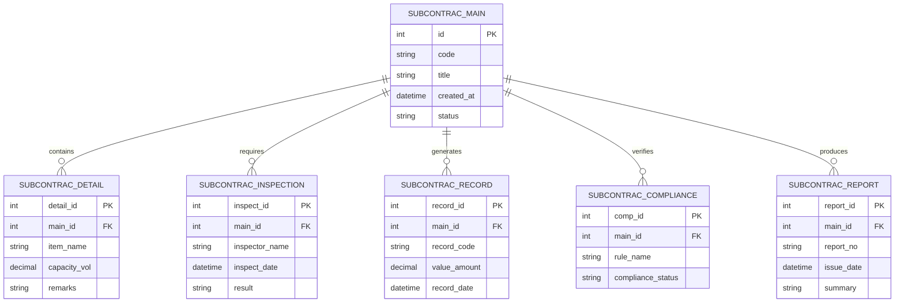

# Conceptual ERD — Subcontractor Management System

## Mermaid Code

## Entity Description Table | Bang mo ta Entity

| # | Entity Name | Vietnamese Name | Description | Key Attributes | Main Relationships |
|---|-------------|-----------------|-------------|----------------|-------------------|
| 1 | SUBCONTRAC_MAIN | Entity subcontrac_main | Stores subcontrac_main data for Subcontractor Management System | id | Main core entity |
| 2 | SUBCONTRAC_DETAIL | Entity subcontrac_detail | Stores subcontrac_detail data for Subcontractor Management System | detail_id | Main core entity |
| 3 | SUBCONTRAC_INSPECTION | Entity subcontrac_inspection | Stores subcontrac_inspection data for Subcontractor Management System | inspect_id | Main core entity |
| 4 | SUBCONTRAC_RECORD | Entity subcontrac_record | Stores subcontrac_record data for Subcontractor Management System | record_id | Main core entity |
| 5 | SUBCONTRAC_COMPLIANCE | Entity subcontrac_compliance | Stores subcontrac_compliance data for Subcontractor Management System | comp_id | Main core entity |
| 6 | SUBCONTRAC_REPORT | Entity subcontrac_report | Stores subcontrac_report data for Subcontractor Management System | report_id | Main core entity |

## Relationship Description | Mo ta Quan he

| # | From Entity | Cardinality | To Entity | Relationship Label | Business Explanation |
|---|-------------|-------------|-----------|-------------------|----------------------|
| 1 | SUBCONTRAC_MAIN | one-to-many | SUBCONTRAC_DETAIL | contains | Thanh phan chinh bao gom nhieu chi tiet nghiep vu |
| 2 | SUBCONTRAC_MAIN | one-to-many | SUBCONTRAC_INSPECTION | requires | Thanh phan chinh yeu cau cac dot kiem tra kiem dinh |
| 3 | SUBCONTRAC_MAIN | one-to-many | SUBCONTRAC_RECORD | generates | Thanh phan chinh xuat cac ban ghi thong ke |
| 4 | SUBCONTRAC_MAIN | one-to-many | SUBCONTRAC_COMPLIANCE | verifies | Thanh phan chinh kiem tra tinh tuan thu quy chuan |
| 5 | SUBCONTRAC_MAIN | one-to-many | SUBCONTRAC_REPORT | produces | Thanh phan chinh xuat cac bao cao tong hop |
