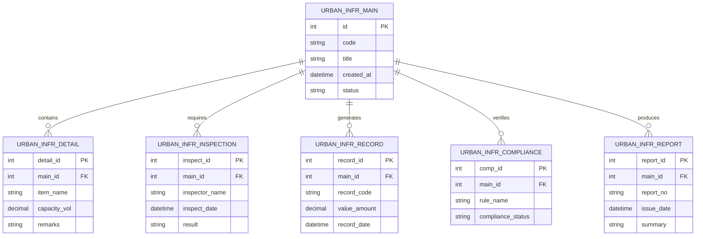

# Conceptual ERD — Urban Infrastructure Planning System

## Mermaid Code

## Entity Description Table | Bang mo ta Entity

| # | Entity Name | Vietnamese Name | Description | Key Attributes | Main Relationships |
|---|-------------|-----------------|-------------|----------------|-------------------|
| 1 | URBAN_INFR_MAIN | Entity urban_infr_main | Stores urban_infr_main data for Urban Infrastructure Planning System | id | Main core entity |
| 2 | URBAN_INFR_DETAIL | Entity urban_infr_detail | Stores urban_infr_detail data for Urban Infrastructure Planning System | detail_id | Main core entity |
| 3 | URBAN_INFR_INSPECTION | Entity urban_infr_inspection | Stores urban_infr_inspection data for Urban Infrastructure Planning System | inspect_id | Main core entity |
| 4 | URBAN_INFR_RECORD | Entity urban_infr_record | Stores urban_infr_record data for Urban Infrastructure Planning System | record_id | Main core entity |
| 5 | URBAN_INFR_COMPLIANCE | Entity urban_infr_compliance | Stores urban_infr_compliance data for Urban Infrastructure Planning System | comp_id | Main core entity |
| 6 | URBAN_INFR_REPORT | Entity urban_infr_report | Stores urban_infr_report data for Urban Infrastructure Planning System | report_id | Main core entity |

## Relationship Description | Mo ta Quan he

| # | From Entity | Cardinality | To Entity | Relationship Label | Business Explanation |
|---|-------------|-------------|-----------|-------------------|----------------------|
| 1 | URBAN_INFR_MAIN | one-to-many | URBAN_INFR_DETAIL | contains | Thanh phan chinh bao gom nhieu chi tiet nghiep vu |
| 2 | URBAN_INFR_MAIN | one-to-many | URBAN_INFR_INSPECTION | requires | Thanh phan chinh yeu cau cac dot kiem tra kiem dinh |
| 3 | URBAN_INFR_MAIN | one-to-many | URBAN_INFR_RECORD | generates | Thanh phan chinh xuat cac ban ghi thong ke |
| 4 | URBAN_INFR_MAIN | one-to-many | URBAN_INFR_COMPLIANCE | verifies | Thanh phan chinh kiem tra tinh tuan thu quy chuan |
| 5 | URBAN_INFR_MAIN | one-to-many | URBAN_INFR_REPORT | produces | Thanh phan chinh xuat cac bao cao tong hop |
