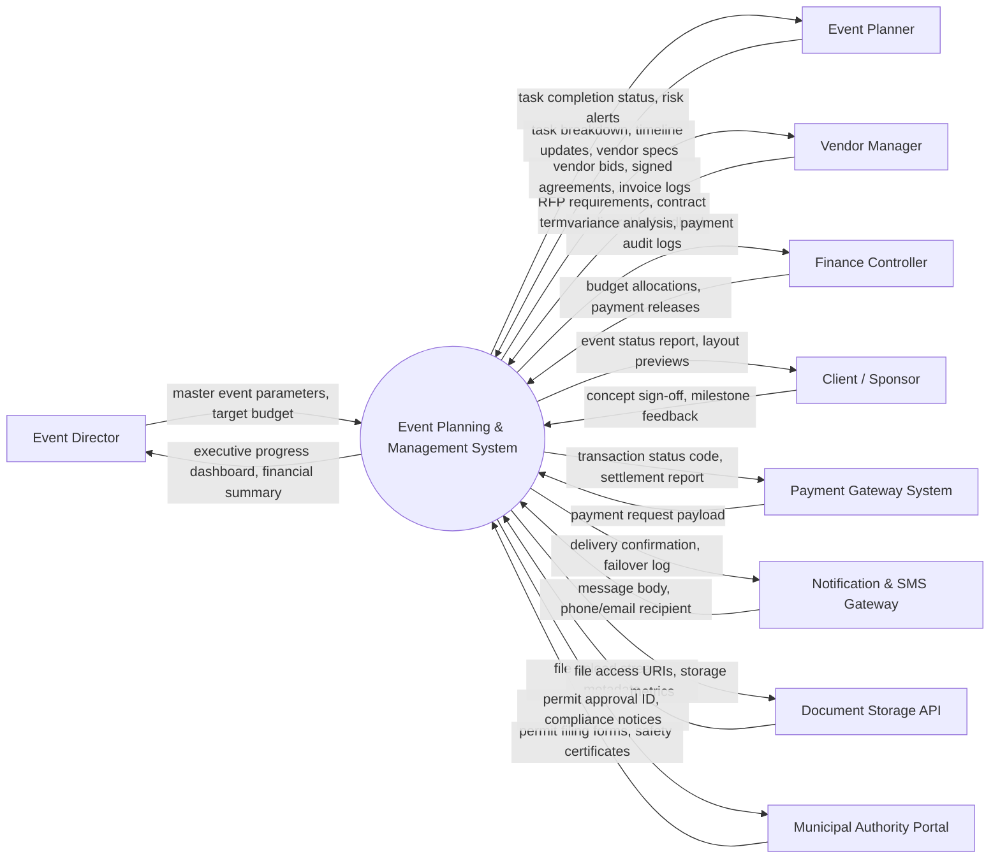

# Context Diagram — Event Planning & Management System

## Mermaid Code

## Actor & Interaction Table | Bảng Actor & Tương tác

| # | Actor | Actor Type | Data Sent TO System | Data Received FROM System | Notes |
|---|-------|------------|---------------------|---------------------------|-------|
| 1 | Event Director | Primary | master event parameters, target budget | executive progress dashboard, financial summary | Oversees master event strategy, budget limits, and high-level milestones. |
| 2 | Event Planner | Primary | task breakdown, timeline updates, vendor specs | task completion status, risk alerts | Manages day-to-day task assignments, vendor schedules, and operational workflows. |
| 3 | Vendor Manager | Primary | RFP requirements, contract terms, deliverable feedback | vendor bids, signed agreements, invoice logs | Sources suppliers, evaluates quotes, and monitors contract deliverables. |
| 4 | Finance Controller | Primary | budget allocations, payment releases | variance analysis, payment audit logs | Audits expenses, tracks budget burn rates, and approves payment releases. |
| 5 | Client / Sponsor | Primary | concept sign-off, milestone feedback | event status report, layout previews | Reviews event concepts, approves major milestones, and monitors progress. |
| 6 | Payment Gateway System | Supporting System | payment request payload | transaction status code, settlement report | Processes vendor deposits, milestone payments, and client billings. |
| 7 | Notification & SMS Gateway | Supporting System | message body, phone/email recipient | delivery confirmation, failover log | Dispatches automated alerts, task reminders, and deadline notifications. |
| 8 | Document Storage API | Supporting System | file upload stream, metadata | file access URIs, storage metrics | Stores contracts, floor plans, permit PDFs, and branding assets. |
| 9 | Municipal Authority Portal | Regulatory System | permit filing forms, safety certificates | permit approval ID, compliance notices | Receives event permit applications and municipal compliance forms. |

## System Boundary Description | Mô tả Phạm vi Hệ thống

Hệ thống **Event Planning & Management System** (Hệ thống Quản lý và Lập kế hoạch Sự kiện) được thiết kế nhằm quản lý toàn diện các hoạt động nghiệp vụ tập trung bên trong ranh giới hệ thống. Ranh giới hệ thống bao gồm các mô-đun xử lý dữ liệu trung tâm, cơ sở dữ liệu tích hợp, công cụ tự động hóa quy trình và hệ thống phân tích báo cáo. Tất cả các tương tác với các nhân tố bên ngoài (Primary Actors, Supporting Systems, Regulatory Portals) đều được kiểm soát nghiêm ngặt thông qua giao diện lập trình ứng dụng (API) bảo mật, các cổng kết nối thanh toán và cổng tích hợp chính phủ. Các thành phần hạ tầng phần cứng bên ngoài như mạng viễn thông công cộng, thiết bị cá nhân của người dùng và cổng dịch vụ bên thứ ba nằm ngoài phạm vi trực tiếp của hệ thống nhưng được liên kết thông qua chuẩn kết nối an toàn.
