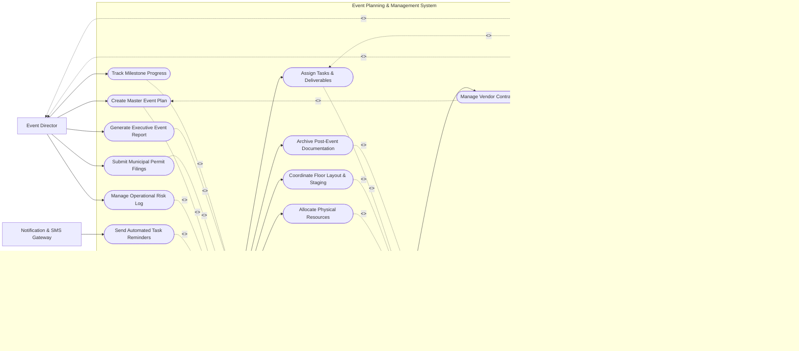

# Use Case Diagram — Event Planning & Management System

## Mermaid Code

## Actor Table | Bảng Actor

| # | Actor | Actor Type | Role Description | Related Use Cases |
|---|-------|------------|------------------|-------------------|
| 1 | Event Director | Primary | Oversees master event strategy, budget limits, and high-level milestones. | UC01, UC02, UC05, UC07, UC08, UC09, UC10 |
| 2 | Event Planner | Primary | Manages day-to-day task assignments, vendor schedules, and operational workflows. | UC01, UC03, UC06, UC08, UC11, UC12, UC14 |
| 3 | Vendor Manager | Primary | Sources suppliers, evaluates quotes, and monitors contract deliverables. | UC03, UC04, UC06, UC14 |
| 4 | Finance Controller | Primary | Audits expenses, tracks budget burn rates, and approves payment releases. | UC02, UC04, UC07, UC13 |
| 5 | Client / Sponsor | Primary | Reviews event concepts, approves major milestones, and monitors progress. | UC05, UC10 |
| 6 | Payment Gateway System | Supporting System | Processes vendor deposits, milestone payments, and client billings. | UC13 |
| 7 | Notification & SMS Gateway | Supporting System | Dispatches automated alerts, task reminders, and deadline notifications. | UC11 |
| 8 | Document Storage API | Supporting System | Stores contracts, floor plans, permit PDFs, and branding assets. | UC12 |
| 9 | Municipal Authority Portal | Regulatory System | Receives event permit applications and municipal compliance forms. | UC09 |

## Use Case Table | Bảng Use Case

| # | UC ID | Use Case Name | Primary Actor | Secondary Actor | Description | Priority |
|---|-------|---------------|---------------|-----------------|-------------|----------|
| 1 | UC01 | Create Master Event Plan | Event Director | Event Planner | Initialize event scope, master milestones, target budget, and core timeline. | High |
| 2 | UC02 | Manage Event Budget & Expenses | Finance Controller | Event Director | Set category allocations, track line-item expenses, and monitor budget variance. | High |
| 3 | UC03 | Assign Tasks & Deliverables | Event Planner | Vendor Manager | Create work breakdown structure, assign task leads, and establish due dates. | High |
| 4 | UC04 | Manage Vendor Contracts | Vendor Manager | Finance Controller | Upload proposals, execute digital contracts, and track milestone payment triggers. | High |
| 5 | UC05 | Track Milestone Progress | Event Director | Client / Sponsor | View interactive Gantt charts and real-time completion status of key phases. | Medium |
| 6 | UC06 | Coordinate Floor Layout & Staging | Event Planner | Vendor Manager | Design 2D stage/booth layouts and assign spatial specifications to vendors. | Medium |
| 7 | UC07 | Approve Expense Claims | Finance Controller | Event Director | Review vendor invoices and internal expense claims against allocated budget. | High |
| 8 | UC08 | Manage Operational Risk Log | Event Director | Event Planner | Identify potential event risks, set impact levels, and draft contingency plans. | Medium |
| 9 | UC09 | Submit Municipal Permit Filings | Event Director | Municipal Authority Portal | Submit safety compliance, noise permits, and venue usage filings. | High |
| 10 | UC10 | Generate Executive Event Report | Event Director | Client / Sponsor | Compile progress reports, financial health metrics, and deliverable summaries. | Medium |
| 11 | UC11 | Send Automated Task Reminders | Notification & SMS Gateway | Event Planner | Trigger automated email/SMS reminders for upcoming task deadlines. | Low |
| 12 | UC12 | Archive Post-Event Documentation | Event Planner | Document Storage API | Store final operational debriefs, financial reconciliations, and contract archives. | Low |
| 13 | UC13 | Process Vendor Payment Disbursement | Finance Controller | Payment Gateway System | Transfer funds to vendors upon successful milestone completion sign-off. | High |
| 14 | UC14 | Allocate Physical Resources | Event Planner | Vendor Manager | Reserve equipment, AV gear, staging assets, and on-site operational staff. | Medium |

## Use Case Specification | Đặc tả Use Case

---

### UC01 — Create Master Event Plan

| Field | Detail |
|-------|--------|
| **UC ID** | UC01 |
| **Use Case Name** | Create Master Event Plan |
| **Actor(s)** | Primary: Event Director \| Secondary: Event Planner |
| **Description** | Initialize event scope, master milestones, target budget, and core timeline. |
| **Precondition** | 1. User must be authenticated with appropriate role permissions in the system. 2. Core master data and system rules must be active. |
| **Main Flow** | 1. Event Director initiates 'Create Master Event Plan' from the management console. 2. System validates session state and displays operational input form. 3. Event Director fills required parameters and submits data. 4. System validates business constraints and processes transaction. 5. System interacts with Event Planner to log state changes or send notifications. 6. System displays success confirmation and updates audit ledger. |
| **Alternative Flow** | **AF1** — Batch Execution: Event Director imports data via structured file format. **AF2** — Draft Save: User saves incomplete entry in draft status for later processing. |
| **Exception Flow** | **EX1** — Data Validation Error: System alerts user to invalid inputs and prompts correction. **EX2** — System Timeout: System rolls back active transaction and logs error event. |
| **Postcondition** | System record state updated, audit logs recorded, and relevant stakeholders notified. |
| **Business Rule** | **BR1**: Operation must adhere to system security role restrictions. **BR2**: All data mutations must produce an immutable audit log. |
---

### UC02 — Manage Event Budget & Expenses

| Field | Detail |
|-------|--------|
| **UC ID** | UC02 |
| **Use Case Name** | Manage Event Budget & Expenses |
| **Actor(s)** | Primary: Finance Controller \| Secondary: Event Director |
| **Description** | Set category allocations, track line-item expenses, and monitor budget variance. |
| **Precondition** | 1. User must be authenticated with appropriate role permissions in the system. 2. Core master data and system rules must be active. |
| **Main Flow** | 1. Finance Controller initiates 'Manage Event Budget & Expenses' from the management console. 2. System validates session state and displays operational input form. 3. Finance Controller fills required parameters and submits data. 4. System validates business constraints and processes transaction. 5. System interacts with Event Director to log state changes or send notifications. 6. System displays success confirmation and updates audit ledger. |
| **Alternative Flow** | **AF1** — Batch Execution: Finance Controller imports data via structured file format. **AF2** — Draft Save: User saves incomplete entry in draft status for later processing. |
| **Exception Flow** | **EX1** — Data Validation Error: System alerts user to invalid inputs and prompts correction. **EX2** — System Timeout: System rolls back active transaction and logs error event. |
| **Postcondition** | System record state updated, audit logs recorded, and relevant stakeholders notified. |
| **Business Rule** | **BR1**: Operation must adhere to system security role restrictions. **BR2**: All data mutations must produce an immutable audit log. |
---

### UC03 — Assign Tasks & Deliverables

| Field | Detail |
|-------|--------|
| **UC ID** | UC03 |
| **Use Case Name** | Assign Tasks & Deliverables |
| **Actor(s)** | Primary: Event Planner \| Secondary: Vendor Manager |
| **Description** | Create work breakdown structure, assign task leads, and establish due dates. |
| **Precondition** | 1. User must be authenticated with appropriate role permissions in the system. 2. Core master data and system rules must be active. |
| **Main Flow** | 1. Event Planner initiates 'Assign Tasks & Deliverables' from the management console. 2. System validates session state and displays operational input form. 3. Event Planner fills required parameters and submits data. 4. System validates business constraints and processes transaction. 5. System interacts with Vendor Manager to log state changes or send notifications. 6. System displays success confirmation and updates audit ledger. |
| **Alternative Flow** | **AF1** — Batch Execution: Event Planner imports data via structured file format. **AF2** — Draft Save: User saves incomplete entry in draft status for later processing. |
| **Exception Flow** | **EX1** — Data Validation Error: System alerts user to invalid inputs and prompts correction. **EX2** — System Timeout: System rolls back active transaction and logs error event. |
| **Postcondition** | System record state updated, audit logs recorded, and relevant stakeholders notified. |
| **Business Rule** | **BR1**: Operation must adhere to system security role restrictions. **BR2**: All data mutations must produce an immutable audit log. |
---

### UC04 — Manage Vendor Contracts

| Field | Detail |
|-------|--------|
| **UC ID** | UC04 |
| **Use Case Name** | Manage Vendor Contracts |
| **Actor(s)** | Primary: Vendor Manager \| Secondary: Finance Controller |
| **Description** | Upload proposals, execute digital contracts, and track milestone payment triggers. |
| **Precondition** | 1. User must be authenticated with appropriate role permissions in the system. 2. Core master data and system rules must be active. |
| **Main Flow** | 1. Vendor Manager initiates 'Manage Vendor Contracts' from the management console. 2. System validates session state and displays operational input form. 3. Vendor Manager fills required parameters and submits data. 4. System validates business constraints and processes transaction. 5. System interacts with Finance Controller to log state changes or send notifications. 6. System displays success confirmation and updates audit ledger. |
| **Alternative Flow** | **AF1** — Batch Execution: Vendor Manager imports data via structured file format. **AF2** — Draft Save: User saves incomplete entry in draft status for later processing. |
| **Exception Flow** | **EX1** — Data Validation Error: System alerts user to invalid inputs and prompts correction. **EX2** — System Timeout: System rolls back active transaction and logs error event. |
| **Postcondition** | System record state updated, audit logs recorded, and relevant stakeholders notified. |
| **Business Rule** | **BR1**: Operation must adhere to system security role restrictions. **BR2**: All data mutations must produce an immutable audit log. |

