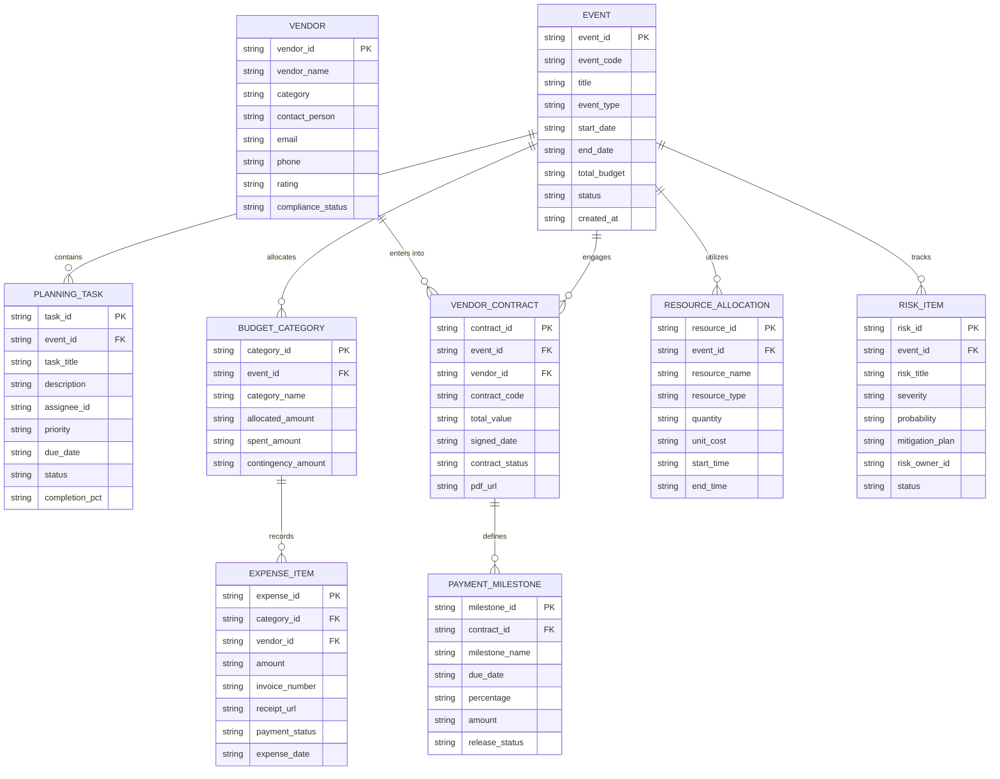

# Conceptual ERD — Event Planning & Management System

## Mermaid Code

## Entity Description Table | Bảng mô tả Entity

| # | Entity Name | Vietnamese Name | Description | Key Attributes | Main Relationships |
|---|-------------|-----------------|-------------|----------------|-------------------|
| 1 | EVENT | Sự kiện | Master event record storing high-level event details. | event_id PK, event_code, title, event_type, start_date, end_date, total_budget, status, created_at | contains tasks, allocates budget |
| 2 | PLANNING_TASK | Nhiệm vụ Lập kế hoạch | Actionable task items assigned to planners or vendors. | task_id PK, event_id FK, task_title, description, assignee_id, priority, due_date, status, completion_pct | belongs to EVENT |
| 3 | BUDGET_CATEGORY | Danh mục Ngân sách | Budget breakdown categories for the event. | category_id PK, event_id FK, category_name, allocated_amount, spent_amount, contingency_amount | belongs to EVENT, has expenses |
| 4 | EXPENSE_ITEM | Mục Chi phí | Incurred cost transaction or vendor invoice entry. | expense_id PK, category_id FK, vendor_id FK, amount, invoice_number, receipt_url, payment_status, expense_date | belongs to BUDGET_CATEGORY, belongs to VENDOR |
| 5 | VENDOR | Nhà cung cấp | External vendor providing staging, AV, catering, or logistics. | vendor_id PK, vendor_name, category, contact_person, email, phone, rating, compliance_status | has contracts, has expenses |
| 6 | VENDOR_CONTRACT | Hợp đồng Nhà cung cấp | Legal contract binding vendor to event deliverables. | contract_id PK, event_id FK, vendor_id FK, contract_code, total_value, signed_date, contract_status, pdf_url | belongs to EVENT, belongs to VENDOR |
| 7 | PAYMENT_MILESTONE | Mốc Thanh toán | Scheduled payment release point tied to deliverable completion. | milestone_id PK, contract_id FK, milestone_name, due_date, percentage, amount, release_status | belongs to VENDOR_CONTRACT |
| 8 | RESOURCE_ALLOCATION | Phân bổ Tài nguyên | Equipment, gear, or staffing assets allocated to event. | resource_id PK, event_id FK, resource_name, resource_type, quantity, unit_cost, start_time, end_time | belongs to EVENT |
| 9 | RISK_ITEM | Mục Rủi ro | Identified risk factor and associated contingency plan. | risk_id PK, event_id FK, risk_title, severity, probability, mitigation_plan, risk_owner_id, status | belongs to EVENT |

## Relationship Description | Mô tả Quan hệ

| # | From Entity | Cardinality | To Entity | Relationship Label | Business Explanation |
|---|-------------|-------------|-----------|-------------------|----------------------|
| 1 | EVENT | one-to-many | PLANNING_TASK | contains | Một sự kiện chứa nhiều nhiệm vụ lập kế hoạch. |
| 2 | EVENT | one-to-many | BUDGET_CATEGORY | allocates | Một sự kiện có nhiều danh mục ngân sách. |
| 3 | BUDGET_CATEGORY | one-to-many | EXPENSE_ITEM | records | Một danh mục ngân sách ghi nhận nhiều mục chi phí. |
| 4 | VENDOR | one-to-many | VENDOR_CONTRACT | enters into | Một nhà cung cấp giao kết nhiều hợp đồng. |
| 5 | EVENT | one-to-many | VENDOR_CONTRACT | engages | Một sự kiện ký hợp đồng với nhiều nhà cung cấp. |
| 6 | VENDOR_CONTRACT | one-to-many | PAYMENT_MILESTONE | defines | Một hợp đồng xác định nhiều mốc thanh toán. |
| 7 | EVENT | one-to-many | RESOURCE_ALLOCATION | utilizes | Một sự kiện phân bổ nhiều tài nguyên. |
| 8 | EVENT | one-to-many | RISK_ITEM | tracks | Một sự kiện theo dõi nhiều mục rủi ro. |

