# Action Tree — Event Planning & Management System

## Mermaid Code

```mermaid
graph TD
    Root["Event Planning & Management System"]

    Root --> M1["Event Master Setup"]
    Root --> M2["Task & Timeline Management"]
    Root --> M3["Budget & Expense Control"]
    Root --> M4["Vendor Procurement"]
    Root --> M5["Resource & Staging Allocation"]
    Root --> M6["Risk & Performance Reporting"]

    M1 --> A1_1["Create Event Record"]
    M1 --> A1_2["Set Target Dates & Venues"]
    M1 --> A1_3["Configure Category Parameters"]
    M1 --> A1_4["Define Milestone Gates"]
    M2 --> A2_1["Create Task Breakdown"]
    M2 --> A2_2["Assign Task Leads"]
    M2 --> A2_3["Set Dependencies & Critical Path"]
    M2 --> A2_4["Track Task Completion"]
    M3 --> A3_1["Allocate Category Budgets"]
    M3 --> A3_2["Log Invoices & Receipts"]
    M3 --> A3_3["Calculate Variance & Burn Rate"]
    M3 --> A3_4["Process Reimbursements"]
    M4 --> A4_1["Issue RFPs"]
    M4 --> A4_2["Evaluate Vendor Proposals"]
    M4 --> A4_3["Execute Digital Contracts"]
    M4 --> A4_4["Verify Deliverable Milestones"]
    M5 --> A5_1["Reserve Technical Equipment"]
    M5 --> A5_2["Schedule Operational Personnel"]
    M5 --> A5_3["Assign On-site Storage"]
    M5 --> A5_4["Track Asset Check-in/out"]
    M6 --> A6_1["Log Operational Risks"]
    M6 --> A6_2["Execute Contingency Steps"]
    M6 --> A6_3["Generate Progress Dashboards"]
    M6 --> A6_4["Compile Post-Event Debrief"]
```

## Module Description | Mô tả Module

| # | Module | Description | Actions |
|---|--------|-------------|---------|
| 1 | Event Master Setup | Initialize event scope, dates, and milestone templates. | Create Event Record, Set Target Dates & Venues, Configure Category Parameters, Define Milestone Gates |
| 2 | Task & Timeline Management | Break down tasks and track execution timeline. | Create Task Breakdown, Assign Task Leads, Set Dependencies & Critical Path, Track Task Completion |
| 3 | Budget & Expense Control | Manage financial allocations and monitor cost burn rates. | Allocate Category Budgets, Log Invoices & Receipts, Calculate Variance & Burn Rate, Process Reimbursements |
| 4 | Vendor Procurement | Manage RFPs, vendor bids, contracts, and milestone payouts. | Issue RFPs, Evaluate Vendor Proposals, Execute Digital Contracts, Verify Deliverable Milestones |
| 5 | Resource & Staging Allocation | Allocate equipment, AV gear, and staging headcount. | Reserve Technical Equipment, Schedule Operational Personnel, Assign On-site Storage, Track Asset Check-in/out |
| 6 | Risk & Performance Reporting | Track operational risk logs and generate executive debriefs. | Log Operational Risks, Execute Contingency Steps, Generate Progress Dashboards, Compile Post-Event Debrief |

