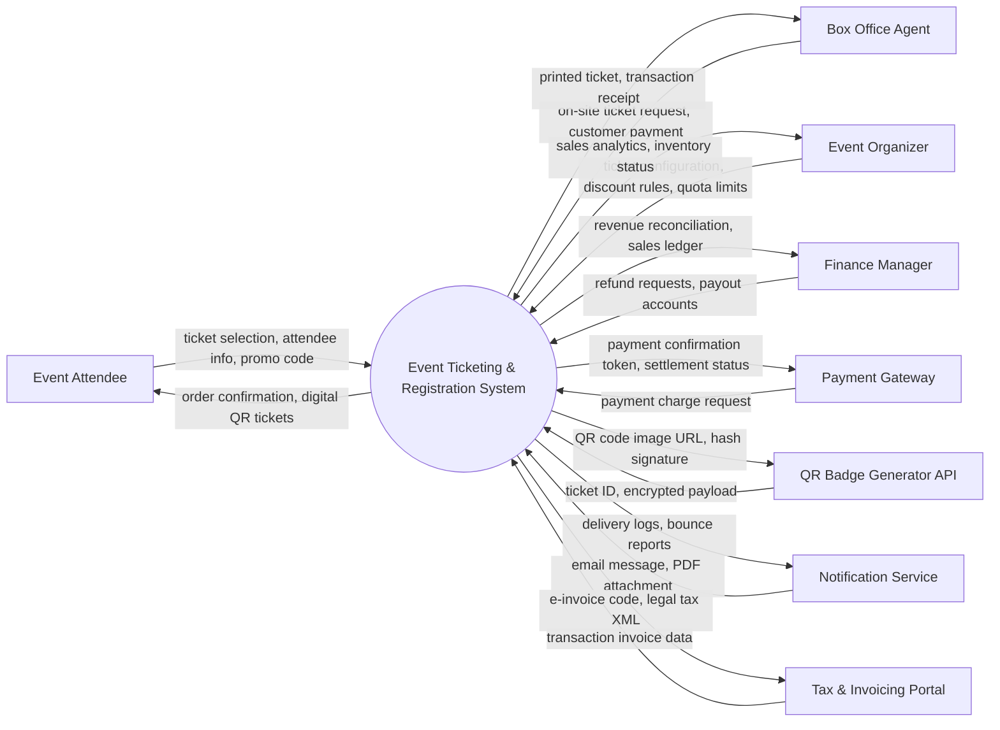

# Context Diagram — Event Ticketing & Registration System

## Mermaid Code

## Actor & Interaction Table | Bảng Actor & Tương tác

| # | Actor | Actor Type | Data Sent TO System | Data Received FROM System | Notes |
|---|-------|------------|---------------------|---------------------------|-------|
| 1 | Event Attendee | Primary | ticket selection, attendee info, promo code | order confirmation, digital QR tickets | Browses event sessions, selects ticket tiers, enters registrant details, and makes payments. |
| 2 | Box Office Agent | Primary | on-site ticket request, customer payment | printed ticket, transaction receipt | Sells tickets on-site, handles cash/card payments, and prints physical ticket badges. |
| 3 | Event Organizer | Primary | ticket configuration, discount rules, quota limits | sales analytics, inventory status | Configures ticket tiers, pricing rules, inventory quotas, and promotional discounts. |
| 4 | Finance Manager | Primary | refund requests, payout accounts | revenue reconciliation, sales ledger | Reconciles ticket revenue, processes refunds, and exports tax audit reports. |
| 5 | Payment Gateway | Supporting System | payment charge request | payment confirmation token, settlement status | Executes credit card, e-wallet, and bank transfer transactions. |
| 6 | QR Badge Generator API | Supporting System | ticket ID, encrypted payload | QR code image URL, hash signature | Generates secure encrypted QR code data payloads for digital tickets. |
| 7 | Notification Service | Supporting System | email message, PDF attachment | delivery logs, bounce reports | Delivers order confirmation emails, ticket PDFs, and event entry instructions. |
| 8 | Tax & Invoicing Portal | Regulatory System | transaction invoice data | e-invoice code, legal tax XML | Generates legally compliant e-invoices for ticket buyers upon request. |

## System Boundary Description | Mô tả Phạm vi Hệ thống

Hệ thống **Event Ticketing & Registration System** (Hệ thống Đăng ký và Bán vé Sự kiện) được thiết kế nhằm quản lý toàn diện các hoạt động nghiệp vụ tập trung bên trong ranh giới hệ thống. Ranh giới hệ thống bao gồm các mô-đun xử lý dữ liệu trung tâm, cơ sở dữ liệu tích hợp, công cụ tự động hóa quy trình và hệ thống phân tích báo cáo. Tất cả các tương tác với các nhân tố bên ngoài (Primary Actors, Supporting Systems, Regulatory Portals) đều được kiểm soát nghiêm ngặt thông qua giao diện lập trình ứng dụng (API) bảo mật, các cổng kết nối thanh toán và cổng tích hợp chính phủ. Các thành phần hạ tầng phần cứng bên ngoài như mạng viễn thông công cộng, thiết bị cá nhân của người dùng và cổng dịch vụ bên thứ ba nằm ngoài phạm vi trực tiếp của hệ thống nhưng được liên kết thông qua chuẩn kết nối an toàn.
