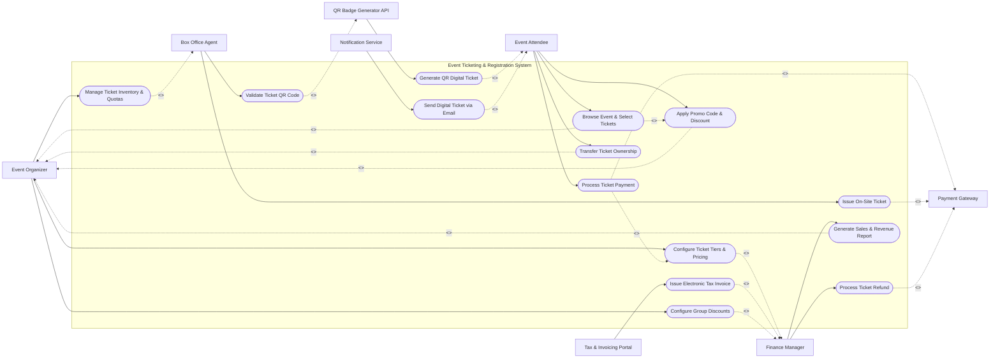

# Use Case Diagram — Event Ticketing & Registration System

## Mermaid Code

## Actor Table | Bảng Actor

| # | Actor | Actor Type | Role Description | Related Use Cases |
|---|-------|------------|------------------|-------------------|
| 1 | Event Attendee | Primary | Browses event sessions, selects ticket tiers, enters registrant details, and makes payments. | UC02, UC03, UC04, UC05, UC10, UC12 |
| 2 | Box Office Agent | Primary | Sells tickets on-site, handles cash/card payments, and prints physical ticket badges. | UC06, UC08, UC13 |
| 3 | Event Organizer | Primary | Configures ticket tiers, pricing rules, inventory quotas, and promotional discounts. | UC01, UC02, UC03, UC08, UC09, UC12, UC14 |
| 4 | Finance Manager | Primary | Reconciles ticket revenue, processes refunds, and exports tax audit reports. | UC01, UC07, UC09, UC11, UC14 |
| 5 | Payment Gateway | Supporting System | Executes credit card, e-wallet, and bank transfer transactions. | UC04, UC06, UC07 |
| 6 | QR Badge Generator API | Supporting System | Generates secure encrypted QR code data payloads for digital tickets. | UC05, UC13 |
| 7 | Notification Service | Supporting System | Delivers order confirmation emails, ticket PDFs, and event entry instructions. | UC10 |
| 8 | Tax & Invoicing Portal | Regulatory System | Generates legally compliant e-invoices for ticket buyers upon request. | UC11 |

## Use Case Table | Bảng Use Case

| # | UC ID | Use Case Name | Primary Actor | Secondary Actor | Description | Priority |
|---|-------|---------------|---------------|-----------------|-------------|----------|
| 1 | UC01 | Configure Ticket Tiers & Pricing | Event Organizer | Finance Manager | Define Early Bird, VIP, General Admission tiers, quotas, and release schedules. | High |
| 2 | UC02 | Browse Event & Select Tickets | Event Attendee | Event Organizer | Select ticket quantities, view venue seat map, and add items to cart. | High |
| 3 | UC03 | Apply Promo Code & Discount | Event Attendee | Event Organizer | Validate promotional code against business rules and update cart totals. | Medium |
| 4 | UC04 | Process Ticket Payment | Event Attendee | Payment Gateway | Submit payment details, process charge, and finalize ticket reservation. | High |
| 5 | UC05 | Generate QR Digital Ticket | QR Badge Generator API | Event Attendee | Encrypt ticket data and create scannable QR ticket payload. | High |
| 6 | UC06 | Issue On-Site Ticket | Box Office Agent | Payment Gateway | Sell tickets at venue entrance, accept cash/POS, and issue instant tickets. | Medium |
| 7 | UC07 | Process Ticket Refund | Finance Manager | Payment Gateway | Cancel ticket order, release inventory quota, and refund payment to customer. | High |
| 8 | UC08 | Manage Ticket Inventory & Quotas | Event Organizer | Box Office Agent | Adjust ticket limits dynamically based on demand and venue capacity. | Medium |
| 9 | UC09 | Generate Sales & Revenue Report | Finance Manager | Event Organizer | Export comprehensive breakdown of gross revenue, fees, discounts, and net payout. | High |
| 10 | UC10 | Send Digital Ticket via Email | Notification Service | Event Attendee | Send confirmation email with attached PDF tickets and calendar invite. | High |
| 11 | UC11 | Issue Electronic Tax Invoice | Tax & Invoicing Portal | Finance Manager | Transmit transaction data to official government invoicing portal. | Low |
| 12 | UC12 | Transfer Ticket Ownership | Event Attendee | Event Organizer | Reassign registered ticket details to another designated attendee. | Low |
| 13 | UC13 | Validate Ticket QR Code | Box Office Agent | QR Badge Generator API | Scan attendee QR badge at entry turnstile to verify validity. | High |
| 14 | UC14 | Configure Group Discounts | Event Organizer | Finance Manager | Set automatic tier discounts for bulk corporate ticket purchases. | Medium |

## Use Case Specification | Đặc tả Use Case

---

### UC01 — Configure Ticket Tiers & Pricing

| Field | Detail |
|-------|--------|
| **UC ID** | UC01 |
| **Use Case Name** | Configure Ticket Tiers & Pricing |
| **Actor(s)** | Primary: Event Organizer \| Secondary: Finance Manager |
| **Description** | Define Early Bird, VIP, General Admission tiers, quotas, and release schedules. |
| **Precondition** | 1. User must be authenticated with appropriate role permissions in the system. 2. Core master data and system rules must be active. |
| **Main Flow** | 1. Event Organizer initiates 'Configure Ticket Tiers & Pricing' from the management console. 2. System validates session state and displays operational input form. 3. Event Organizer fills required parameters and submits data. 4. System validates business constraints and processes transaction. 5. System interacts with Finance Manager to log state changes or send notifications. 6. System displays success confirmation and updates audit ledger. |
| **Alternative Flow** | **AF1** — Batch Execution: Event Organizer imports data via structured file format. **AF2** — Draft Save: User saves incomplete entry in draft status for later processing. |
| **Exception Flow** | **EX1** — Data Validation Error: System alerts user to invalid inputs and prompts correction. **EX2** — System Timeout: System rolls back active transaction and logs error event. |
| **Postcondition** | System record state updated, audit logs recorded, and relevant stakeholders notified. |
| **Business Rule** | **BR1**: Operation must adhere to system security role restrictions. **BR2**: All data mutations must produce an immutable audit log. |
---

### UC02 — Browse Event & Select Tickets

| Field | Detail |
|-------|--------|
| **UC ID** | UC02 |
| **Use Case Name** | Browse Event & Select Tickets |
| **Actor(s)** | Primary: Event Attendee \| Secondary: Event Organizer |
| **Description** | Select ticket quantities, view venue seat map, and add items to cart. |
| **Precondition** | 1. User must be authenticated with appropriate role permissions in the system. 2. Core master data and system rules must be active. |
| **Main Flow** | 1. Event Attendee initiates 'Browse Event & Select Tickets' from the management console. 2. System validates session state and displays operational input form. 3. Event Attendee fills required parameters and submits data. 4. System validates business constraints and processes transaction. 5. System interacts with Event Organizer to log state changes or send notifications. 6. System displays success confirmation and updates audit ledger. |
| **Alternative Flow** | **AF1** — Batch Execution: Event Attendee imports data via structured file format. **AF2** — Draft Save: User saves incomplete entry in draft status for later processing. |
| **Exception Flow** | **EX1** — Data Validation Error: System alerts user to invalid inputs and prompts correction. **EX2** — System Timeout: System rolls back active transaction and logs error event. |
| **Postcondition** | System record state updated, audit logs recorded, and relevant stakeholders notified. |
| **Business Rule** | **BR1**: Operation must adhere to system security role restrictions. **BR2**: All data mutations must produce an immutable audit log. |
---

### UC03 — Apply Promo Code & Discount

| Field | Detail |
|-------|--------|
| **UC ID** | UC03 |
| **Use Case Name** | Apply Promo Code & Discount |
| **Actor(s)** | Primary: Event Attendee \| Secondary: Event Organizer |
| **Description** | Validate promotional code against business rules and update cart totals. |
| **Precondition** | 1. User must be authenticated with appropriate role permissions in the system. 2. Core master data and system rules must be active. |
| **Main Flow** | 1. Event Attendee initiates 'Apply Promo Code & Discount' from the management console. 2. System validates session state and displays operational input form. 3. Event Attendee fills required parameters and submits data. 4. System validates business constraints and processes transaction. 5. System interacts with Event Organizer to log state changes or send notifications. 6. System displays success confirmation and updates audit ledger. |
| **Alternative Flow** | **AF1** — Batch Execution: Event Attendee imports data via structured file format. **AF2** — Draft Save: User saves incomplete entry in draft status for later processing. |
| **Exception Flow** | **EX1** — Data Validation Error: System alerts user to invalid inputs and prompts correction. **EX2** — System Timeout: System rolls back active transaction and logs error event. |
| **Postcondition** | System record state updated, audit logs recorded, and relevant stakeholders notified. |
| **Business Rule** | **BR1**: Operation must adhere to system security role restrictions. **BR2**: All data mutations must produce an immutable audit log. |
---

### UC04 — Process Ticket Payment

| Field | Detail |
|-------|--------|
| **UC ID** | UC04 |
| **Use Case Name** | Process Ticket Payment |
| **Actor(s)** | Primary: Event Attendee \| Secondary: Payment Gateway |
| **Description** | Submit payment details, process charge, and finalize ticket reservation. |
| **Precondition** | 1. User must be authenticated with appropriate role permissions in the system. 2. Core master data and system rules must be active. |
| **Main Flow** | 1. Event Attendee initiates 'Process Ticket Payment' from the management console. 2. System validates session state and displays operational input form. 3. Event Attendee fills required parameters and submits data. 4. System validates business constraints and processes transaction. 5. System interacts with Payment Gateway to log state changes or send notifications. 6. System displays success confirmation and updates audit ledger. |
| **Alternative Flow** | **AF1** — Batch Execution: Event Attendee imports data via structured file format. **AF2** — Draft Save: User saves incomplete entry in draft status for later processing. |
| **Exception Flow** | **EX1** — Data Validation Error: System alerts user to invalid inputs and prompts correction. **EX2** — System Timeout: System rolls back active transaction and logs error event. |
| **Postcondition** | System record state updated, audit logs recorded, and relevant stakeholders notified. |
| **Business Rule** | **BR1**: Operation must adhere to system security role restrictions. **BR2**: All data mutations must produce an immutable audit log. |

