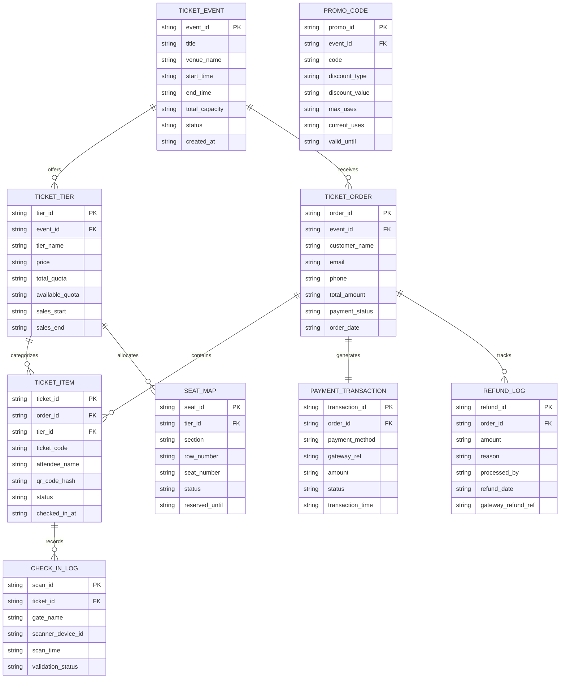

# Conceptual ERD — Event Ticketing & Registration System

## Mermaid Code

## Entity Description Table | Bảng mô tả Entity

| # | Entity Name | Vietnamese Name | Description | Key Attributes | Main Relationships |
|---|-------------|-----------------|-------------|----------------|-------------------|
| 1 | TICKET_EVENT | Sự kiện Bán vé | Master event record configured for ticketing. | event_id PK, title, venue_name, start_time, end_time, total_capacity, status, created_at | offers tiers, receives orders |
| 2 | TICKET_TIER | Hạng vé | Pricing tier defining price, quota, and benefits. | tier_id PK, event_id FK, tier_name, price, total_quota, available_quota, sales_start, sales_end | belongs to TICKET_EVENT |
| 3 | TICKET_ORDER | Đơn hàng Vé | Transaction record for purchased tickets. | order_id PK, event_id FK, customer_name, email, phone, total_amount, payment_status, order_date | belongs to TICKET_EVENT |
| 4 | TICKET_ITEM | Vé Cá thể | Individual scannable ticket issued to attendee. | ticket_id PK, order_id FK, tier_id FK, ticket_code, attendee_name, qr_code_hash, status, checked_in_at | belongs to TICKET_ORDER |
| 5 | PROMO_CODE | Mã Giảm giá | Discount coupon code with validity conditions. | promo_id PK, event_id FK, code, discount_type, discount_value, max_uses, current_uses, valid_until | belongs to TICKET_EVENT |
| 6 | PAYMENT_TRANSACTION | Giao dịch Thanh toán | Financial transaction log from payment gateway. | transaction_id PK, order_id FK, payment_method, gateway_ref, amount, status, transaction_time | belongs to TICKET_ORDER |
| 7 | REFUND_LOG | Nhật ký Hoàn tiền | Audit log of refunded ticket orders. | refund_id PK, order_id FK, amount, reason, processed_by, refund_date, gateway_refund_ref | belongs to TICKET_ORDER |
| 8 | CHECK_IN_LOG | Nhật ký Check-in | Entry scan log recorded at venue turnstile. | scan_id PK, ticket_id FK, gate_name, scanner_device_id, scan_time, validation_status | belongs to TICKET_ITEM |
| 9 | SEAT_MAP | Sơ đồ Chỗ ngồi | Seating map for reserved seating events. | seat_id PK, tier_id FK, section, row_number, seat_number, status, reserved_until | belongs to TICKET_TIER |

## Relationship Description | Mô tả Quan hệ

| # | From Entity | Cardinality | To Entity | Relationship Label | Business Explanation |
|---|-------------|-------------|-----------|-------------------|----------------------|
| 1 | TICKET_EVENT | one-to-many | TICKET_TIER | offers | Một sự kiện cung cấp nhiều hạng vé. |
| 2 | TICKET_EVENT | one-to-many | TICKET_ORDER | receives | Một sự kiện nhận nhiều đơn hàng vé. |
| 3 | TICKET_ORDER | one-to-many | TICKET_ITEM | contains | Một đơn hàng chứa nhiều vé cá thể. |
| 4 | TICKET_TIER | one-to-many | TICKET_ITEM | categorizes | Một hạng vé phân loại nhiều vé cá thể. |
| 5 | TICKET_ORDER | one-to-one | PAYMENT_TRANSACTION | generates | Một đơn hàng tạo ra một giao dịch thanh toán. |
| 6 | TICKET_ORDER | one-to-many | REFUND_LOG | tracks | Một đơn hàng theo dõi các lần hoàn tiền. |
| 7 | TICKET_ITEM | one-to-many | CHECK_IN_LOG | records | Một vé ghi nhận nhiều lần quét check-in. |
| 8 | TICKET_TIER | one-to-many | SEAT_MAP | allocates | Một hạng vé phân bổ các chỗ ngồi. |

