# Action Tree — Event Ticketing & Registration System

## Mermaid Code

```mermaid
graph TD
    Root["Event Ticketing & Registration System"]

    Root --> M1["Ticket Tier Setup"]
    Root --> M2["Registration & Checkout"]
    Root --> M3["On-Site Box Office"]
    Root --> M4["QR Generation & Delivery"]
    Root --> M5["Turnstile Scanning"]
    Root --> M6["Revenue & Refund Control"]

    M1 --> A1_1["Create Ticket Tiers"]
    M1 --> A1_2["Set Tier Quotas & Limits"]
    M1 --> A1_3["Configure Seat Maps"]
    M1 --> A1_4["Setup Promo Codes"]
    M2 --> A2_1["Browse Event Catalog"]
    M2 --> A2_2["Select Ticket Quantities"]
    M2 --> A2_3["Apply Promo Discounts"]
    M2 --> A2_4["Process Payment Gateway"]
    M3 --> A3_1["Sell Counter Tickets"]
    M3 --> A3_2["Accept POS Payments"]
    M3 --> A3_3["Print Physical Badges"]
    M3 --> A3_4["Validate On-Site Purchases"]
    M4 --> A4_1["Generate QR Code Hashes"]
    M4 --> A4_2["Compile PDF Tickets"]
    M4 --> A4_3["Send Confirmation Emails"]
    M4 --> A4_4["Resend Lost Tickets"]
    M5 --> A5_1["Scan QR Code"]
    M5 --> A5_2["Verify Gate Access Rules"]
    M5 --> A5_3["Record Check-in Timestamp"]
    M5 --> A5_4["Flag Duplicate Scans"]
    M6 --> A6_1["Audit Ticket Sales Ledger"]
    M6 --> A6_2["Process Order Refund"]
    M6 --> A6_3["Release Ticket Quotas"]
    M6 --> A6_4["Export Tax Invoices"]
```

## Module Description | Mô tả Module

| # | Module | Description | Actions |
|---|--------|-------------|---------|
| 1 | Ticket Tier Setup | Configure ticket pricing, quotas, and release schedules. | Create Ticket Tiers, Set Tier Quotas & Limits, Configure Seat Maps, Setup Promo Codes |
| 2 | Registration & Checkout | Process online ticket registration and cart payments. | Browse Event Catalog, Select Ticket Quantities, Apply Promo Discounts, Process Payment Gateway |
| 3 | On-Site Box Office | Handle counter ticket sales and instant badge printing. | Sell Counter Tickets, Accept POS Payments, Print Physical Badges, Validate On-Site Purchases |
| 4 | QR Generation & Delivery | Encrypt ticket payloads and dispatch PDF badges. | Generate QR Code Hashes, Compile PDF Tickets, Send Confirmation Emails, Resend Lost Tickets |
| 5 | Turnstile Scanning | Validate attendee ticket entry at venue gates. | Scan QR Code, Verify Gate Access Rules, Record Check-in Timestamp, Flag Duplicate Scans |
| 6 | Revenue & Refund Control | Reconcile daily ticket revenue and process refunds. | Audit Ticket Sales Ledger, Process Order Refund, Release Ticket Quotas, Export Tax Invoices |

