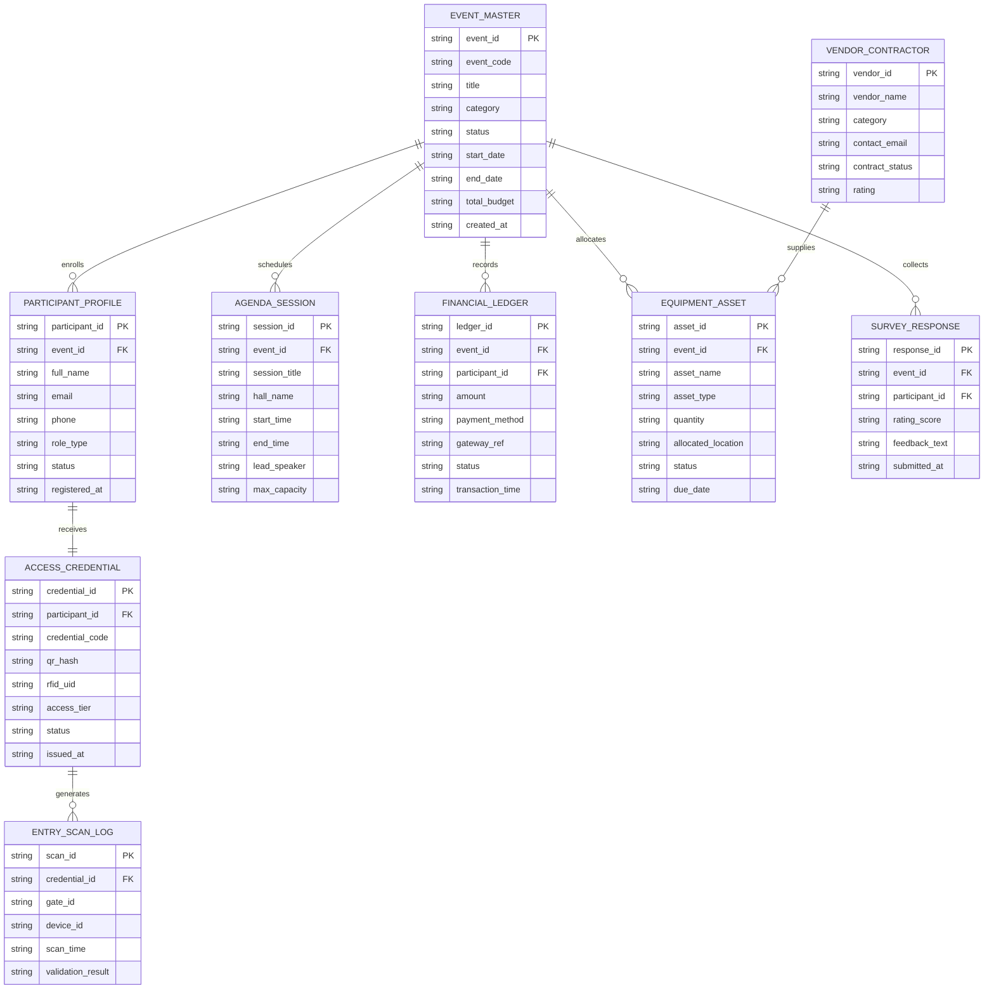

# Conceptual ERD — Product Launch Event Management System

## Mermaid Code

## Entity Description Table | Bảng mô tả Entity

| # | Entity Name | Vietnamese Name | Description | Key Attributes | Main Relationships |
|---|-------------|-----------------|-------------|----------------|-------------------|
| 1 | EVENT_MASTER | Bản ghi Sự kiện | Core master record representing Product Launch Event Management System. | event_id PK, event_code, title, category, status, start_date, end_date, total_budget, created_at | contains sessions, has participants |
| 2 | PARTICIPANT_PROFILE | Hồ sơ Người tham gia | Profile of registered participant or attendee. | participant_id PK, event_id FK, full_name, email, phone, role_type, status, registered_at | belongs to EVENT_MASTER |
| 3 | AGENDA_SESSION | Phiên Chương trình | Individual agenda item or session schedule. | session_id PK, event_id FK, session_title, hall_name, start_time, end_time, lead_speaker, max_capacity | belongs to EVENT_MASTER |
| 4 | ACCESS_CREDENTIAL | Thẻ Truy cập | Digital QR/RFID pass issued to participant. | credential_id PK, participant_id FK, credential_code, qr_hash, rfid_uid, access_tier, status, issued_at | belongs to PARTICIPANT_PROFILE |
| 5 | FINANCIAL_LEDGER | Sổ sách Tài chính | Transaction log for registrations, tickets, or services. | ledger_id PK, event_id FK, participant_id FK, amount, payment_method, gateway_ref, status, transaction_time | belongs to EVENT_MASTER |
| 6 | EQUIPMENT_ASSET | Tài sản Thiết bị | Technical gear or physical asset deployed at venue. | asset_id PK, event_id FK, asset_name, asset_type, quantity, allocated_location, status, due_date | belongs to EVENT_MASTER |
| 7 | VENDOR_CONTRACTOR | Nhà thầu Cung cấp | External vendor providing staging, catering, or logistics. | vendor_id PK, vendor_name, category, contact_email, contract_status, rating | has deliverables |
| 8 | ENTRY_SCAN_LOG | Nhật ký Quét Cổng | Verification scan recorded at entry gate. | scan_id PK, credential_id FK, gate_id, device_id, scan_time, validation_result | belongs to ACCESS_CREDENTIAL |
| 9 | SURVEY_RESPONSE | Phản hồi Đánh giá | Survey ratings collected post-event. | response_id PK, event_id FK, participant_id FK, rating_score, feedback_text, submitted_at | belongs to EVENT_MASTER |

## Relationship Description | Mô tả Quan hệ

| # | From Entity | Cardinality | To Entity | Relationship Label | Business Explanation |
|---|-------------|-------------|-----------|-------------------|----------------------|
| 1 | EVENT_MASTER | one-to-many | PARTICIPANT_PROFILE | enrolls | Một sự kiện chính đăng ký nhiều người tham gia. |
| 2 | EVENT_MASTER | one-to-many | AGENDA_SESSION | schedules | Một sự kiện chính lên lịch nhiều phiên chương trình. |
| 3 | PARTICIPANT_PROFILE | one-to-one | ACCESS_CREDENTIAL | receives | Một người tham gia nhận một thẻ truy cập. |
| 4 | EVENT_MASTER | one-to-many | FINANCIAL_LEDGER | records | Một sự kiện chính ghi nhận nhiều giao dịch tài chính. |
| 5 | EVENT_MASTER | one-to-many | EQUIPMENT_ASSET | allocates | Một sự kiện chính phân bổ nhiều tài sản thiết bị. |
| 6 | ACCESS_CREDENTIAL | one-to-many | ENTRY_SCAN_LOG | generates | Một thẻ truy cập tạo ra nhiều nhật ký quét cổng. |
| 7 | EVENT_MASTER | one-to-many | SURVEY_RESPONSE | collects | Một sự kiện chính thu thập nhiều phản hồi đánh giá. |
| 8 | VENDOR_CONTRACTOR | one-to-many | EQUIPMENT_ASSET | supplies | Một nhà thầu cung cấp nhiều tài sản thiết bị. |

