# Action Tree — Public Festival & Holiday Event System

## Mermaid Code

```mermaid
graph TD
    Root["Public Festival & Holiday Event System"]

    Root --> M1["Master Setup & Configuration"]
    Root --> M2["Participant Registration"]
    Root --> M3["Agenda & Track Management"]
    Root --> M4["Access Control & Check-in"]
    Root --> M5["Logistics & Vendor Management"]
    Root --> M6["Analytics & Financial Debrief"]

    M1 --> A1_1["Create Event Record"]
    M1 --> A1_2["Set Access Levels"]
    M1 --> A1_3["Configure Parameters"]
    M1 --> A1_4["Define Milestone Gates"]
    M2 --> A2_1["Register Profile"]
    M2 --> A2_2["Verify Bio Details"]
    M2 --> A2_3["Select Participation Tier"]
    M2 --> A2_4["Process Online Payment"]
    M3 --> A3_1["Create Session Matrix"]
    M3 --> A3_2["Assign Leads & Speakers"]
    M3 --> A3_3["Allocate Venue Halls"]
    M3 --> A3_4["Publish Agenda Timeline"]
    M4 --> A4_1["Generate Access Credentials"]
    M4 --> A4_2["Configure Gate Turnstiles"]
    M4 --> A4_3["Scan QR/RFID Badges"]
    M4 --> A4_4["Track Real-Time Attendance"]
    M5 --> A5_1["Allocate Technical Gear"]
    M5 --> A5_2["Assign Staff Tasks"]
    M5 --> A5_3["Monitor Vendor Deliverables"]
    M5 --> A5_4["Audit Equipment Return"]
    M6 --> A6_1["Reconcile Revenue Ledger"]
    M6 --> A6_2["Generate Attendance Analytics"]
    M6 --> A6_3["Export Survey Ratings"]
    M6 --> A6_4["Archive Post-Event Data"]
```

## Module Description | Mô tả Module

| # | Module | Description | Actions |
|---|--------|-------------|---------|
| 1 | Master Setup & Configuration | Configure core parameters, rules, and system scope. | Create Event Record, Set Access Levels, Configure Parameters, Define Milestone Gates |
| 2 | Participant Registration | Manage user registration, profiles, and fee payments. | Register Profile, Verify Bio Details, Select Participation Tier, Process Online Payment |
| 3 | Agenda & Track Management | Schedule sessions, allocate halls, and publish agenda. | Create Session Matrix, Assign Leads & Speakers, Allocate Venue Halls, Publish Agenda Timeline |
| 4 | Access Control & Check-in | Issue scannable credentials and manage entry gates. | Generate Access Credentials, Configure Gate Turnstiles, Scan QR/RFID Badges, Track Real-Time Attendance |
| 5 | Logistics & Vendor Management | Coordinate equipment deployment and vendor deliverables. | Allocate Technical Gear, Assign Staff Tasks, Monitor Vendor Deliverables, Audit Equipment Return |
| 6 | Analytics & Financial Debrief | Reconcile transaction ledgers and compile debriefs. | Reconcile Revenue Ledger, Generate Attendance Analytics, Export Survey Ratings, Archive Post-Event Data |

