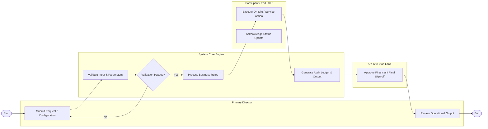

# Swimlane Diagram — Social & Networking Event Platform

## Mermaid Code

## Flow Description | Mô tả luồng

| Lane | Actor / System | Role in Operational Flow |
|------|----------------|--------------------------|
| 1 | Primary Director | Initiates process requests, configures parameters, and reviews final results. |
| 2 | System Core Engine | Validates business constraints, executes core logic, and produces output artifacts. |
| 3 | Participant / End User | Performs physical/service interactions and confirms status updates. |
| 4 | On-Site Staff Lead | Audits compliance, approves financial transactions, and locks completed records. |

