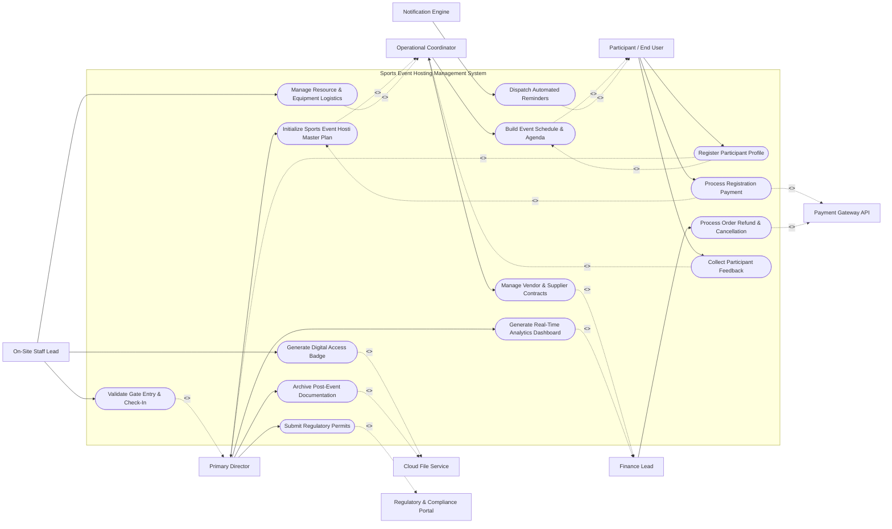

# Use Case Diagram — Sports Event Hosting Management System

## Mermaid Code

## Actor Table | Bảng Actor

| # | Actor | Actor Type | Role Description | Related Use Cases |
|---|-------|------------|------------------|-------------------|
| 1 | Primary Director | Primary | Oversees master strategy, policy settings, and executive outcomes for Sports Event Hosting Management System. | UC01, UC02, UC06, UC10, UC11, UC14 |
| 2 | Operational Coordinator | Primary | Manages day-to-day scheduling, task delegation, and execution of athlete registration, tournament brackets, referee assignment, anti-doping log, arena scheduling, live scoreboard feed.. | UC01, UC03, UC07, UC09, UC13 |
| 3 | Participant / End User | Primary | Registers, accesses services, and participates in Sports Event Hosting Management System. | UC02, UC03, UC04, UC08, UC13 |
| 4 | On-Site Staff Lead | Primary | Handles physical venue entry, equipment setup, and participant assistance. | UC05, UC06, UC07 |
| 5 | Finance Lead | Primary | Audits fee payments, vendor invoices, budget burn rates, and financial reports. | UC09, UC10, UC12 |
| 6 | Payment Gateway API | Supporting System | Processes online payment charges, registration fees, and payouts. | UC04, UC12 |
| 7 | Notification Engine | Supporting System | Dispatches automated email, SMS, and push notifications to stakeholders. | UC08 |
| 8 | Cloud File Service | Supporting System | Stores digital documents, badge PDFs, media assets, and contract files. | UC05, UC14 |
| 9 | Regulatory & Compliance Portal | Regulatory System | Receives safety permits, tax declarations, and municipal compliance filings. | UC11 |

## Use Case Table | Bảng Use Case

| # | UC ID | Use Case Name | Primary Actor | Secondary Actor | Description | Priority |
|---|-------|---------------|---------------|-----------------|-------------|----------|
| 1 | UC01 | Initialize Sports Event Hosti Master Plan | Primary Director | Operational Coordinator | Set up system scope, target dates, venue parameters, and master rules. | High |
| 2 | UC02 | Register Participant Profile | Participant / End User | Primary Director | Create user account, capture bio details, and select participation tiers. | High |
| 3 | UC03 | Build Event Schedule & Agenda | Operational Coordinator | Participant / End User | Define timeline sessions, assign speakers/leads, and allocate hall spaces. | High |
| 4 | UC04 | Process Registration Payment | Participant / End User | Payment Gateway API | Execute credit card or digital wallet transaction for registration. | High |
| 5 | UC05 | Generate Digital Access Badge | On-Site Staff Lead | Cloud File Service | Create scannable QR/RFID access badge for registered participants. | High |
| 6 | UC06 | Validate Gate Entry & Check-In | On-Site Staff Lead | Primary Director | Scan attendee badge at entry turnstiles and record attendance timestamp. | High |
| 7 | UC07 | Manage Resource & Equipment Logistics | On-Site Staff Lead | Operational Coordinator | Track allocation, deployment, and return of technical equipment. | Medium |
| 8 | UC08 | Dispatch Automated Reminders | Notification Engine | Participant / End User | Send automated SMS and email reminders for upcoming agenda items. | Medium |
| 9 | UC09 | Manage Vendor & Supplier Contracts | Operational Coordinator | Finance Lead | Store vendor quotes, execute contracts, and authorize milestone payments. | Medium |
| 10 | UC10 | Generate Real-Time Analytics Dashboard | Primary Director | Finance Lead | Compile real-time footfall metrics, revenue figures, and completion rates. | High |
| 11 | UC11 | Submit Regulatory Permits | Primary Director | Regulatory & Compliance Portal | Transmit safety compliance filings and municipal event permits. | Low |
| 12 | UC12 | Process Order Refund & Cancellation | Finance Lead | Payment Gateway API | Cancel participant registration and disburse partial/full refunds. | Medium |
| 13 | UC13 | Collect Participant Feedback | Participant / End User | Operational Coordinator | Distribute post-event surveys and synthesize satisfaction ratings. | Low |
| 14 | UC14 | Archive Post-Event Documentation | Primary Director | Cloud File Service | Store final operational debriefs, financial ledgers, and asset archives. | Low |

## Use Case Specification | Đặc tả Use Case

---

### UC01 — Initialize Sports Event Hosti Master Plan

| Field | Detail |
|-------|--------|
| **UC ID** | UC01 |
| **Use Case Name** | Initialize Sports Event Hosti Master Plan |
| **Actor(s)** | Primary: Primary Director \| Secondary: Operational Coordinator |
| **Description** | Set up system scope, target dates, venue parameters, and master rules. |
| **Precondition** | 1. User must be authenticated with appropriate role permissions in the system. 2. Core master data and system rules must be active. |
| **Main Flow** | 1. Primary Director initiates 'Initialize Sports Event Hosti Master Plan' from the management console. 2. System validates session state and displays operational input form. 3. Primary Director fills required parameters and submits data. 4. System validates business constraints and processes transaction. 5. System interacts with Operational Coordinator to log state changes or send notifications. 6. System displays success confirmation and updates audit ledger. |
| **Alternative Flow** | **AF1** — Batch Execution: Primary Director imports data via structured file format. **AF2** — Draft Save: User saves incomplete entry in draft status for later processing. |
| **Exception Flow** | **EX1** — Data Validation Error: System alerts user to invalid inputs and prompts correction. **EX2** — System Timeout: System rolls back active transaction and logs error event. |
| **Postcondition** | System record state updated, audit logs recorded, and relevant stakeholders notified. |
| **Business Rule** | **BR1**: Operation must adhere to system security role restrictions. **BR2**: All data mutations must produce an immutable audit log. |
---

### UC02 — Register Participant Profile

| Field | Detail |
|-------|--------|
| **UC ID** | UC02 |
| **Use Case Name** | Register Participant Profile |
| **Actor(s)** | Primary: Participant / End User \| Secondary: Primary Director |
| **Description** | Create user account, capture bio details, and select participation tiers. |
| **Precondition** | 1. User must be authenticated with appropriate role permissions in the system. 2. Core master data and system rules must be active. |
| **Main Flow** | 1. Participant / End User initiates 'Register Participant Profile' from the management console. 2. System validates session state and displays operational input form. 3. Participant / End User fills required parameters and submits data. 4. System validates business constraints and processes transaction. 5. System interacts with Primary Director to log state changes or send notifications. 6. System displays success confirmation and updates audit ledger. |
| **Alternative Flow** | **AF1** — Batch Execution: Participant / End User imports data via structured file format. **AF2** — Draft Save: User saves incomplete entry in draft status for later processing. |
| **Exception Flow** | **EX1** — Data Validation Error: System alerts user to invalid inputs and prompts correction. **EX2** — System Timeout: System rolls back active transaction and logs error event. |
| **Postcondition** | System record state updated, audit logs recorded, and relevant stakeholders notified. |
| **Business Rule** | **BR1**: Operation must adhere to system security role restrictions. **BR2**: All data mutations must produce an immutable audit log. |
---

### UC03 — Build Event Schedule & Agenda

| Field | Detail |
|-------|--------|
| **UC ID** | UC03 |
| **Use Case Name** | Build Event Schedule & Agenda |
| **Actor(s)** | Primary: Operational Coordinator \| Secondary: Participant / End User |
| **Description** | Define timeline sessions, assign speakers/leads, and allocate hall spaces. |
| **Precondition** | 1. User must be authenticated with appropriate role permissions in the system. 2. Core master data and system rules must be active. |
| **Main Flow** | 1. Operational Coordinator initiates 'Build Event Schedule & Agenda' from the management console. 2. System validates session state and displays operational input form. 3. Operational Coordinator fills required parameters and submits data. 4. System validates business constraints and processes transaction. 5. System interacts with Participant / End User to log state changes or send notifications. 6. System displays success confirmation and updates audit ledger. |
| **Alternative Flow** | **AF1** — Batch Execution: Operational Coordinator imports data via structured file format. **AF2** — Draft Save: User saves incomplete entry in draft status for later processing. |
| **Exception Flow** | **EX1** — Data Validation Error: System alerts user to invalid inputs and prompts correction. **EX2** — System Timeout: System rolls back active transaction and logs error event. |
| **Postcondition** | System record state updated, audit logs recorded, and relevant stakeholders notified. |
| **Business Rule** | **BR1**: Operation must adhere to system security role restrictions. **BR2**: All data mutations must produce an immutable audit log. |
---

### UC04 — Process Registration Payment

| Field | Detail |
|-------|--------|
| **UC ID** | UC04 |
| **Use Case Name** | Process Registration Payment |
| **Actor(s)** | Primary: Participant / End User \| Secondary: Payment Gateway API |
| **Description** | Execute credit card or digital wallet transaction for registration. |
| **Precondition** | 1. User must be authenticated with appropriate role permissions in the system. 2. Core master data and system rules must be active. |
| **Main Flow** | 1. Participant / End User initiates 'Process Registration Payment' from the management console. 2. System validates session state and displays operational input form. 3. Participant / End User fills required parameters and submits data. 4. System validates business constraints and processes transaction. 5. System interacts with Payment Gateway API to log state changes or send notifications. 6. System displays success confirmation and updates audit ledger. |
| **Alternative Flow** | **AF1** — Batch Execution: Participant / End User imports data via structured file format. **AF2** — Draft Save: User saves incomplete entry in draft status for later processing. |
| **Exception Flow** | **EX1** — Data Validation Error: System alerts user to invalid inputs and prompts correction. **EX2** — System Timeout: System rolls back active transaction and logs error event. |
| **Postcondition** | System record state updated, audit logs recorded, and relevant stakeholders notified. |
| **Business Rule** | **BR1**: Operation must adhere to system security role restrictions. **BR2**: All data mutations must produce an immutable audit log. |

