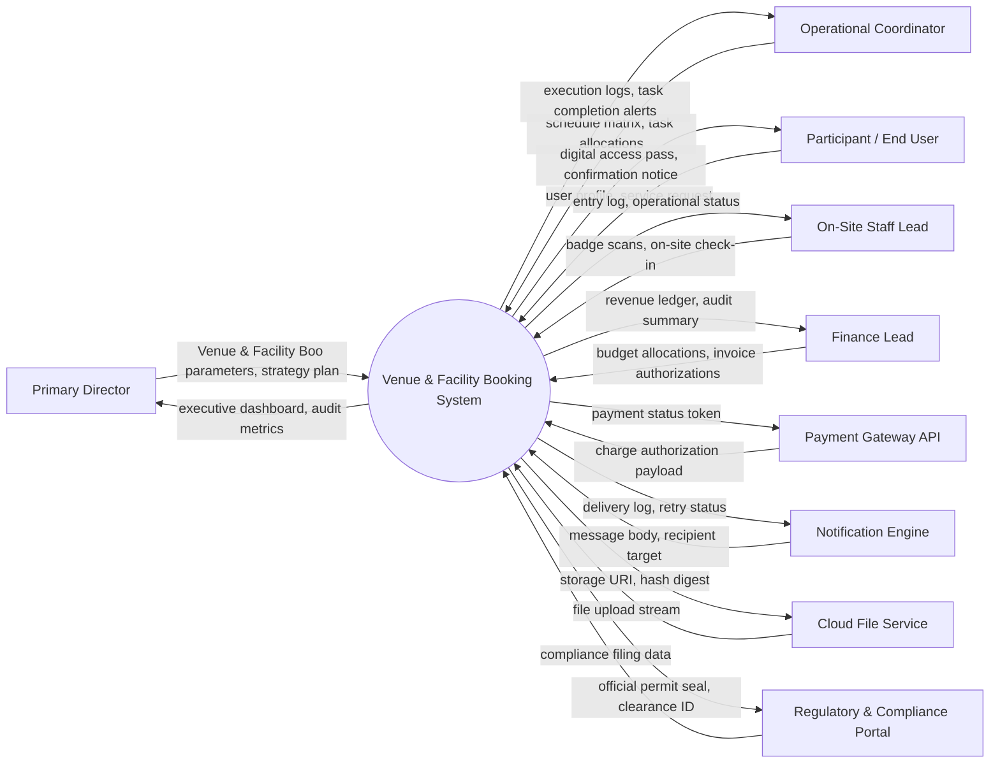

# Context Diagram — Venue & Facility Booking System

## Mermaid Code

## Actor & Interaction Table | Bảng Actor & Tương tác

| # | Actor | Actor Type | Data Sent TO System | Data Received FROM System | Notes |
|---|-------|------------|---------------------|---------------------------|-------|
| 1 | Primary Director | Primary | Venue & Facility Boo parameters, strategy plan | executive dashboard, audit metrics | Oversees master strategy, policy settings, and executive outcomes for Venue & Facility Booking System. |
| 2 | Operational Coordinator | Primary | schedule matrix, task allocations | execution logs, task completion alerts | Manages day-to-day scheduling, task delegation, and execution of venue hall rental, availability calendar, hall layout customization, equipment rental, security deposit, booking contracts.. |
| 3 | Participant / End User | Primary | user profile, service request | digital access pass, confirmation notice | Registers, accesses services, and participates in Venue & Facility Booking System. |
| 4 | On-Site Staff Lead | Primary | badge scans, on-site check-in | entry log, operational status | Handles physical venue entry, equipment setup, and participant assistance. |
| 5 | Finance Lead | Primary | budget allocations, invoice authorizations | revenue ledger, audit summary | Audits fee payments, vendor invoices, budget burn rates, and financial reports. |
| 6 | Payment Gateway API | Supporting System | charge authorization payload | payment status token | Processes online payment charges, registration fees, and payouts. |
| 7 | Notification Engine | Supporting System | message body, recipient target | delivery log, retry status | Dispatches automated email, SMS, and push notifications to stakeholders. |
| 8 | Cloud File Service | Supporting System | file upload stream | storage URI, hash digest | Stores digital documents, badge PDFs, media assets, and contract files. |
| 9 | Regulatory & Compliance Portal | Regulatory System | compliance filing data | official permit seal, clearance ID | Receives safety permits, tax declarations, and municipal compliance filings. |

## System Boundary Description | Mô tả Phạm vi Hệ thống

Hệ thống **Venue & Facility Booking System** (Hệ thống Đặt Địa điểm và Cơ sở Vật chất) được thiết kế nhằm quản lý toàn diện các hoạt động nghiệp vụ tập trung bên trong ranh giới hệ thống. Ranh giới hệ thống bao gồm các mô-đun xử lý dữ liệu trung tâm, cơ sở dữ liệu tích hợp, công cụ tự động hóa quy trình và hệ thống phân tích báo cáo. Tất cả các tương tác với các nhân tố bên ngoài (Primary Actors, Supporting Systems, Regulatory Portals) đều được kiểm soát nghiêm ngặt thông qua giao diện lập trình ứng dụng (API) bảo mật, các cổng kết nối thanh toán và cổng tích hợp chính phủ. Các thành phần hạ tầng phần cứng bên ngoài như mạng viễn thông công cộng, thiết bị cá nhân của người dùng và cổng dịch vụ bên thứ ba nằm ngoài phạm vi trực tiếp của hệ thống nhưng được liên kết thông qua chuẩn kết nối an toàn.
