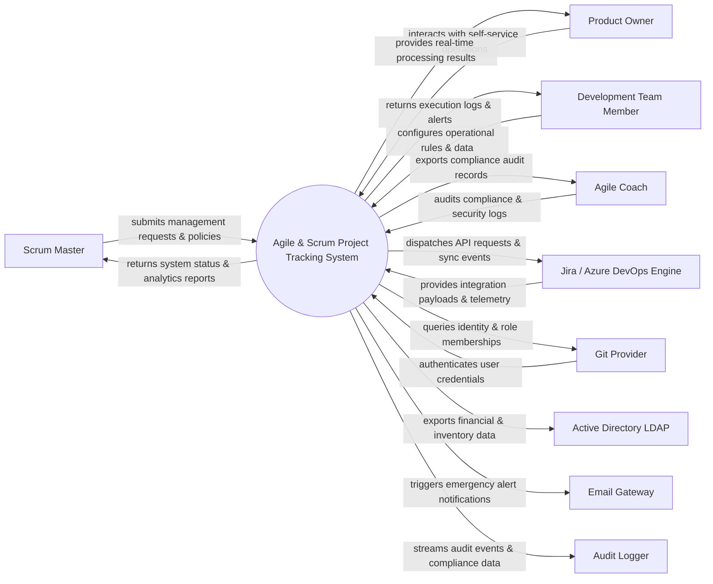

# Context Diagram — Agile & Scrum Project Tracking System

## Mermaid Code

## Actor & Interaction Table | Bảng Actor & Tương tác

| # | Actor | Actor Type | Data Sent TO System | Data Received FROM System | Notes |
|---|-------|------------|---------------------|---------------------------|-------|
| 1 | Scrum Master | Primary | Operational requests, policy configurations, audit queries | Status updates, performance reports, audit results | Scrum Master role |
| 2 | Product Owner | Primary | Operational requests, policy configurations, audit queries | Status updates, performance reports, audit results | Product Owner role |
| 3 | Development Team Member | Primary | Operational requests, policy configurations, audit queries | Status updates, performance reports, audit results | Development Team Member role |
| 4 | Agile Coach | Primary | Operational requests, policy configurations, audit queries | Status updates, performance reports, audit results | Agile Coach role |
| 5 | Jira / Azure DevOps Engine | Supporting | Integration payloads, auth claims, event logs | API sync responses, verification tokens | Jira / Azure DevOps Engine role |
| 6 | Git Provider | Supporting | Integration payloads, auth claims, event logs | API sync responses, verification tokens | Git Provider role |
| 7 | Active Directory LDAP | Supporting | Integration payloads, auth claims, event logs | API sync responses, verification tokens | Active Directory LDAP role |
| 8 | Email Gateway | Supporting | Integration payloads, auth claims, event logs | API sync responses, verification tokens | Email Gateway role |
| 9 | Audit Logger | Supporting | Integration payloads, auth claims, event logs | API sync responses, verification tokens | Audit Logger role |

## System Boundary Description | Mô tả Scope Hệ thống

Hệ thống **Agile & Scrum Project Tracking System** (Hệ thống Theo dõi Dự án Agile và Scrum) được thiết kế nhằm quản lý tập trung và tự động hóa các quy trình vận hành CNTT cốt lõi trong doanh nghiệp.

- **Phạm vi bên trong hệ thống (In-Scope)**:
  - Quản lý dữ liệu nghiệp vụ trung tâm, tự động hóa quy trình theo chính sách doanh nghiệp.
  - Phân quyền người dùng chi tiết, theo dõi lịch sử thao tác và xuất báo cáo tuân thủ (ISO/SOC2).
  - Tích hợp phát hiện sự cố, gửi cảnh báo tức thì và kết nối dữ liệu hai chiều.

- **Bên ngoài phạm vi hệ thống (Out-of-Scope)**:
  - Trực tiếp quản lý hạ tầng phần cứng máy chủ vật lý.
  - Trực tiếp xử lý xác thực mật khẩu người dùng gốc (do Identity Provider đảm nhận).
