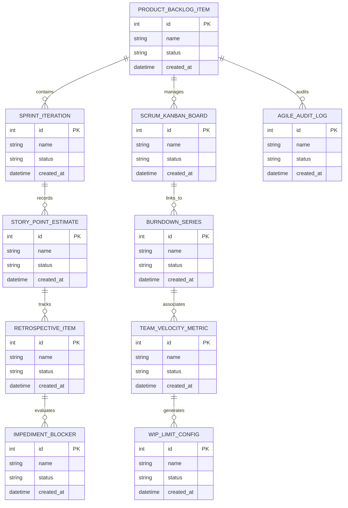

# Conceptual ERD — Agile & Scrum Project Tracking System

## Mermaid Code

## Entity Description Table | Bảng mô tả Entity

| # | Entity Name | Vietnamese Name | Description | Key Attributes | Main Relationships |
|---|-------------|-----------------|-------------|----------------|-------------------|
| 1 | PRODUCT_BACKLOG_ITEM | Thực thể PRODUCT_BACKLOG_ITEM | Quản lý thông tin chi tiết cho product_backlog_item | id (PK), name, status, created_at | Links with related entities |
| 2 | SPRINT_ITERATION | Thực thể SPRINT_ITERATION | Quản lý thông tin chi tiết cho sprint_iteration | id (PK), name, status, created_at | Links with related entities |
| 3 | SCRUM_KANBAN_BOARD | Thực thể SCRUM_KANBAN_BOARD | Quản lý thông tin chi tiết cho scrum_kanban_board | id (PK), name, status, created_at | Links with related entities |
| 4 | STORY_POINT_ESTIMATE | Thực thể STORY_POINT_ESTIMATE | Quản lý thông tin chi tiết cho story_point_estimate | id (PK), name, status, created_at | Links with related entities |
| 5 | BURNDOWN_SERIES | Thực thể BURNDOWN_SERIES | Quản lý thông tin chi tiết cho burndown_series | id (PK), name, status, created_at | Links with related entities |
| 6 | RETROSPECTIVE_ITEM | Thực thể RETROSPECTIVE_ITEM | Quản lý thông tin chi tiết cho retrospective_item | id (PK), name, status, created_at | Links with related entities |
| 7 | TEAM_VELOCITY_METRIC | Thực thể TEAM_VELOCITY_METRIC | Quản lý thông tin chi tiết cho team_velocity_metric | id (PK), name, status, created_at | Links with related entities |
| 8 | IMPEDIMENT_BLOCKER | Thực thể IMPEDIMENT_BLOCKER | Quản lý thông tin chi tiết cho impediment_blocker | id (PK), name, status, created_at | Links with related entities |
| 9 | WIP_LIMIT_CONFIG | Thực thể WIP_LIMIT_CONFIG | Quản lý thông tin chi tiết cho wip_limit_config | id (PK), name, status, created_at | Links with related entities |
| 10 | AGILE_AUDIT_LOG | Thực thể AGILE_AUDIT_LOG | Quản lý thông tin chi tiết cho agile_audit_log | id (PK), name, status, created_at | Links with related entities |

## Relationship Description | Mô tả Quan hệ

| # | From Entity | Cardinality | To Entity | Relationship Label | Business Explanation |
|---|-------------|-------------|-----------|-------------------|----------------------|
| 1 | PRODUCT_BACKLOG_ITEM | 1 to Many | SPRINT_ITERATION | relates_to | Quản lý mối quan hệ giữa PRODUCT_BACKLOG_ITEM và SPRINT_ITERATION |
| 2 | SPRINT_ITERATION | 1 to Many | SCRUM_KANBAN_BOARD | relates_to | Quản lý mối quan hệ giữa SPRINT_ITERATION và SCRUM_KANBAN_BOARD |
| 3 | SCRUM_KANBAN_BOARD | 1 to Many | STORY_POINT_ESTIMATE | relates_to | Quản lý mối quan hệ giữa SCRUM_KANBAN_BOARD và STORY_POINT_ESTIMATE |
| 4 | STORY_POINT_ESTIMATE | 1 to Many | BURNDOWN_SERIES | relates_to | Quản lý mối quan hệ giữa STORY_POINT_ESTIMATE và BURNDOWN_SERIES |
| 5 | BURNDOWN_SERIES | 1 to Many | RETROSPECTIVE_ITEM | relates_to | Quản lý mối quan hệ giữa BURNDOWN_SERIES và RETROSPECTIVE_ITEM |
| 6 | RETROSPECTIVE_ITEM | 1 to Many | TEAM_VELOCITY_METRIC | relates_to | Quản lý mối quan hệ giữa RETROSPECTIVE_ITEM và TEAM_VELOCITY_METRIC |
| 7 | TEAM_VELOCITY_METRIC | 1 to Many | IMPEDIMENT_BLOCKER | relates_to | Quản lý mối quan hệ giữa TEAM_VELOCITY_METRIC và IMPEDIMENT_BLOCKER |
| 8 | IMPEDIMENT_BLOCKER | 1 to Many | WIP_LIMIT_CONFIG | relates_to | Quản lý mối quan hệ giữa IMPEDIMENT_BLOCKER và WIP_LIMIT_CONFIG |
| 9 | WIP_LIMIT_CONFIG | 1 to Many | AGILE_AUDIT_LOG | relates_to | Quản lý mối quan hệ giữa WIP_LIMIT_CONFIG và AGILE_AUDIT_LOG |
