# Action Tree — Agile & Scrum Project Tracking System

## Mermaid Code

```mermaid
graph TD
    Root["Agile & Scrum Project Tracking System"]

    Root --> M1["Product Backlog & Epic Management"]
    Root --> M2["Sprint Planning & Capacity Allocation"]
    Root --> M3["Interactive Scrum & Kanban Board"]
    Root --> M4["Story Point Estimation & Velocity Tracking"]
    Root --> M5["Sprint Retrospective & Blocker List"]
    Root --> M6["Agile Process Analytics & Reporting"]

    M1 --> A11["Configure Product Backlog & Epic Management Policies"]
    M1 --> A12["Execute Product Backlog & Epic Management Tasks"]
    M1 --> A13["Monitor Product Backlog & Epic Management Telemetry"]
    M1 --> A14["Export Product Backlog & Epic Management Audit Logs"]

    M2 --> A21["Configure Sprint Planning & Capacity Allocation Policies"]
    M2 --> A22["Execute Sprint Planning & Capacity Allocation Tasks"]
    M2 --> A23["Monitor Sprint Planning & Capacity Allocation Telemetry"]
    M2 --> A24["Export Sprint Planning & Capacity Allocation Audit Logs"]

    M3 --> A31["Configure Interactive Scrum & Kanban Board Policies"]
    M3 --> A32["Execute Interactive Scrum & Kanban Board Tasks"]
    M3 --> A33["Monitor Interactive Scrum & Kanban Board Telemetry"]
    M3 --> A34["Export Interactive Scrum & Kanban Board Audit Logs"]

    M4 --> A41["Configure Story Point Estimation & Velocity Tracking Policies"]
    M4 --> A42["Execute Story Point Estimation & Velocity Tracking Tasks"]
    M4 --> A43["Monitor Story Point Estimation & Velocity Tracking Telemetry"]
    M4 --> A44["Export Story Point Estimation & Velocity Tracking Audit Logs"]

    M5 --> A51["Configure Sprint Retrospective & Blocker List Policies"]
    M5 --> A52["Execute Sprint Retrospective & Blocker List Tasks"]
    M5 --> A53["Monitor Sprint Retrospective & Blocker List Telemetry"]
    M5 --> A54["Export Sprint Retrospective & Blocker List Audit Logs"]

    M6 --> A61["Configure Agile Process Analytics & Reporting Policies"]
    M6 --> A62["Execute Agile Process Analytics & Reporting Tasks"]
    M6 --> A63["Monitor Agile Process Analytics & Reporting Telemetry"]
    M6 --> A64["Export Agile Process Analytics & Reporting Audit Logs"]
```

## Module Description | Mô tả Module

| # | Module | Description | Actions |
|---|--------|-------------|---------|
| 1 | Product Backlog & Epic Management | Quản lý các chức năng cốt lõi thuộc phân hệ product backlog & epic management. | Configure Product Backlog & Epic Management Policies, Execute Product Backlog & Epic Management Tasks, Monitor Product Backlog & Epic Management Telemetry, Export Product Backlog & Epic Management Audit Logs |
| 2 | Sprint Planning & Capacity Allocation | Quản lý các chức năng cốt lõi thuộc phân hệ sprint planning & capacity allocation. | Configure Sprint Planning & Capacity Allocation Policies, Execute Sprint Planning & Capacity Allocation Tasks, Monitor Sprint Planning & Capacity Allocation Telemetry, Export Sprint Planning & Capacity Allocation Audit Logs |
| 3 | Interactive Scrum & Kanban Board | Quản lý các chức năng cốt lõi thuộc phân hệ interactive scrum & kanban board. | Configure Interactive Scrum & Kanban Board Policies, Execute Interactive Scrum & Kanban Board Tasks, Monitor Interactive Scrum & Kanban Board Telemetry, Export Interactive Scrum & Kanban Board Audit Logs |
| 4 | Story Point Estimation & Velocity Tracking | Quản lý các chức năng cốt lõi thuộc phân hệ story point estimation & velocity tracking. | Configure Story Point Estimation & Velocity Tracking Policies, Execute Story Point Estimation & Velocity Tracking Tasks, Monitor Story Point Estimation & Velocity Tracking Telemetry, Export Story Point Estimation & Velocity Tracking Audit Logs |
| 5 | Sprint Retrospective & Blocker List | Quản lý các chức năng cốt lõi thuộc phân hệ sprint retrospective & blocker list. | Configure Sprint Retrospective & Blocker List Policies, Execute Sprint Retrospective & Blocker List Tasks, Monitor Sprint Retrospective & Blocker List Telemetry, Export Sprint Retrospective & Blocker List Audit Logs |
| 6 | Agile Process Analytics & Reporting | Quản lý các chức năng cốt lõi thuộc phân hệ agile process analytics & reporting. | Configure Agile Process Analytics & Reporting Policies, Execute Agile Process Analytics & Reporting Tasks, Monitor Agile Process Analytics & Reporting Telemetry, Export Agile Process Analytics & Reporting Audit Logs |
