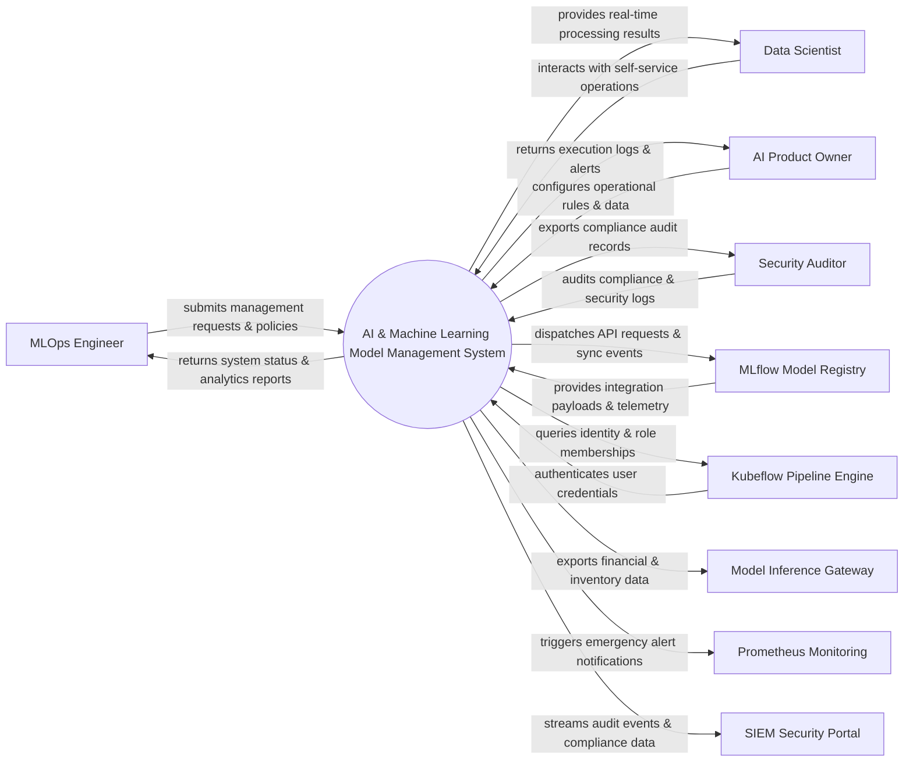

# Context Diagram — AI & Machine Learning Model Management System

## Mermaid Code

## Actor & Interaction Table | Bảng Actor & Tương tác

| # | Actor | Actor Type | Data Sent TO System | Data Received FROM System | Notes |
|---|-------|------------|---------------------|---------------------------|-------|
| 1 | MLOps Engineer | Primary | Operational requests, policy configurations, audit queries | Status updates, performance reports, audit results | MLOps Engineer role |
| 2 | Data Scientist | Primary | Operational requests, policy configurations, audit queries | Status updates, performance reports, audit results | Data Scientist role |
| 3 | AI Product Owner | Primary | Operational requests, policy configurations, audit queries | Status updates, performance reports, audit results | AI Product Owner role |
| 4 | Security Auditor | Primary | Operational requests, policy configurations, audit queries | Status updates, performance reports, audit results | Security Auditor role |
| 5 | MLflow Model Registry | Supporting | Integration payloads, auth claims, event logs | API sync responses, verification tokens | MLflow Model Registry role |
| 6 | Kubeflow Pipeline Engine | Supporting | Integration payloads, auth claims, event logs | API sync responses, verification tokens | Kubeflow Pipeline Engine role |
| 7 | Model Inference Gateway | Supporting | Integration payloads, auth claims, event logs | API sync responses, verification tokens | Model Inference Gateway role |
| 8 | Prometheus Monitoring | Supporting | Integration payloads, auth claims, event logs | API sync responses, verification tokens | Prometheus Monitoring role |
| 9 | SIEM Security Portal | Supporting | Integration payloads, auth claims, event logs | API sync responses, verification tokens | SIEM Security Portal role |

## System Boundary Description | Mô tả Scope Hệ thống

Hệ thống **AI & Machine Learning Model Management System** (Hệ thống Quản lý Mô hình AI và Machine Learning) được thiết kế nhằm quản lý tập trung và tự động hóa các quy trình vận hành CNTT cốt lõi trong doanh nghiệp.

- **Phạm vi bên trong hệ thống (In-Scope)**:
  - Quản lý dữ liệu nghiệp vụ trung tâm, tự động hóa quy trình theo chính sách doanh nghiệp.
  - Phân quyền người dùng chi tiết, theo dõi lịch sử thao tác và xuất báo cáo tuân thủ (ISO/SOC2).
  - Tích hợp phát hiện sự cố, gửi cảnh báo tức thì và kết nối dữ liệu hai chiều.

- **Bên ngoài phạm vi hệ thống (Out-of-Scope)**:
  - Trực tiếp quản lý hạ tầng phần cứng máy chủ vật lý.
  - Trực tiếp xử lý xác thực mật khẩu người dùng gốc (do Identity Provider đảm nhận).
