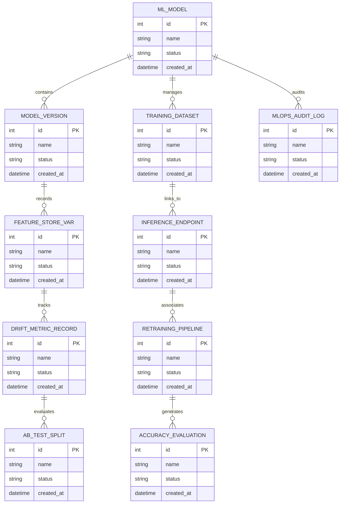

# Conceptual ERD — AI & Machine Learning Model Management System

## Mermaid Code

## Entity Description Table | Bảng mô tả Entity

| # | Entity Name | Vietnamese Name | Description | Key Attributes | Main Relationships |
|---|-------------|-----------------|-------------|----------------|-------------------|
| 1 | ML_MODEL | Thực thể ML_MODEL | Quản lý thông tin chi tiết cho ml_model | id (PK), name, status, created_at | Links with related entities |
| 2 | MODEL_VERSION | Thực thể MODEL_VERSION | Quản lý thông tin chi tiết cho model_version | id (PK), name, status, created_at | Links with related entities |
| 3 | TRAINING_DATASET | Thực thể TRAINING_DATASET | Quản lý thông tin chi tiết cho training_dataset | id (PK), name, status, created_at | Links with related entities |
| 4 | FEATURE_STORE_VAR | Thực thể FEATURE_STORE_VAR | Quản lý thông tin chi tiết cho feature_store_var | id (PK), name, status, created_at | Links with related entities |
| 5 | INFERENCE_ENDPOINT | Thực thể INFERENCE_ENDPOINT | Quản lý thông tin chi tiết cho inference_endpoint | id (PK), name, status, created_at | Links with related entities |
| 6 | DRIFT_METRIC_RECORD | Thực thể DRIFT_METRIC_RECORD | Quản lý thông tin chi tiết cho drift_metric_record | id (PK), name, status, created_at | Links with related entities |
| 7 | RETRAINING_PIPELINE | Thực thể RETRAINING_PIPELINE | Quản lý thông tin chi tiết cho retraining_pipeline | id (PK), name, status, created_at | Links with related entities |
| 8 | AB_TEST_SPLIT | Thực thể AB_TEST_SPLIT | Quản lý thông tin chi tiết cho ab_test_split | id (PK), name, status, created_at | Links with related entities |
| 9 | ACCURACY_EVALUATION | Thực thể ACCURACY_EVALUATION | Quản lý thông tin chi tiết cho accuracy_evaluation | id (PK), name, status, created_at | Links with related entities |
| 10 | MLOPS_AUDIT_LOG | Thực thể MLOPS_AUDIT_LOG | Quản lý thông tin chi tiết cho mlops_audit_log | id (PK), name, status, created_at | Links with related entities |

## Relationship Description | Mô tả Quan hệ

| # | From Entity | Cardinality | To Entity | Relationship Label | Business Explanation |
|---|-------------|-------------|-----------|-------------------|----------------------|
| 1 | ML_MODEL | 1 to Many | MODEL_VERSION | relates_to | Quản lý mối quan hệ giữa ML_MODEL và MODEL_VERSION |
| 2 | MODEL_VERSION | 1 to Many | TRAINING_DATASET | relates_to | Quản lý mối quan hệ giữa MODEL_VERSION và TRAINING_DATASET |
| 3 | TRAINING_DATASET | 1 to Many | FEATURE_STORE_VAR | relates_to | Quản lý mối quan hệ giữa TRAINING_DATASET và FEATURE_STORE_VAR |
| 4 | FEATURE_STORE_VAR | 1 to Many | INFERENCE_ENDPOINT | relates_to | Quản lý mối quan hệ giữa FEATURE_STORE_VAR và INFERENCE_ENDPOINT |
| 5 | INFERENCE_ENDPOINT | 1 to Many | DRIFT_METRIC_RECORD | relates_to | Quản lý mối quan hệ giữa INFERENCE_ENDPOINT và DRIFT_METRIC_RECORD |
| 6 | DRIFT_METRIC_RECORD | 1 to Many | RETRAINING_PIPELINE | relates_to | Quản lý mối quan hệ giữa DRIFT_METRIC_RECORD và RETRAINING_PIPELINE |
| 7 | RETRAINING_PIPELINE | 1 to Many | AB_TEST_SPLIT | relates_to | Quản lý mối quan hệ giữa RETRAINING_PIPELINE và AB_TEST_SPLIT |
| 8 | AB_TEST_SPLIT | 1 to Many | ACCURACY_EVALUATION | relates_to | Quản lý mối quan hệ giữa AB_TEST_SPLIT và ACCURACY_EVALUATION |
| 9 | ACCURACY_EVALUATION | 1 to Many | MLOPS_AUDIT_LOG | relates_to | Quản lý mối quan hệ giữa ACCURACY_EVALUATION và MLOPS_AUDIT_LOG |
