# Action Tree — AI & Machine Learning Model Management System

## Mermaid Code

```mermaid
graph TD
    Root["AI & Machine Learning Model Management System"]

    Root --> M1["Model Registry & Version Tracking"]
    Root --> M2["Feature Store & Dataset Lineage"]
    Root --> M3["Model Deployment & Inference Gateway"]
    Root --> M4["Data Drift & Accuracy Monitoring"]
    Root --> M5["Automated Retraining & A/B Testing"]
    Root --> M6["AI Governance & Ethical Compliance"]

    M1 --> A11["Configure Model Registry & Version Tracking Policies"]
    M1 --> A12["Execute Model Registry & Version Tracking Tasks"]
    M1 --> A13["Monitor Model Registry & Version Tracking Telemetry"]
    M1 --> A14["Export Model Registry & Version Tracking Audit Logs"]

    M2 --> A21["Configure Feature Store & Dataset Lineage Policies"]
    M2 --> A22["Execute Feature Store & Dataset Lineage Tasks"]
    M2 --> A23["Monitor Feature Store & Dataset Lineage Telemetry"]
    M2 --> A24["Export Feature Store & Dataset Lineage Audit Logs"]

    M3 --> A31["Configure Model Deployment & Inference Gateway Policies"]
    M3 --> A32["Execute Model Deployment & Inference Gateway Tasks"]
    M3 --> A33["Monitor Model Deployment & Inference Gateway Telemetry"]
    M3 --> A34["Export Model Deployment & Inference Gateway Audit Logs"]

    M4 --> A41["Configure Data Drift & Accuracy Monitoring Policies"]
    M4 --> A42["Execute Data Drift & Accuracy Monitoring Tasks"]
    M4 --> A43["Monitor Data Drift & Accuracy Monitoring Telemetry"]
    M4 --> A44["Export Data Drift & Accuracy Monitoring Audit Logs"]

    M5 --> A51["Configure Automated Retraining & A/B Testing Policies"]
    M5 --> A52["Execute Automated Retraining & A/B Testing Tasks"]
    M5 --> A53["Monitor Automated Retraining & A/B Testing Telemetry"]
    M5 --> A54["Export Automated Retraining & A/B Testing Audit Logs"]

    M6 --> A61["Configure AI Governance & Ethical Compliance Policies"]
    M6 --> A62["Execute AI Governance & Ethical Compliance Tasks"]
    M6 --> A63["Monitor AI Governance & Ethical Compliance Telemetry"]
    M6 --> A64["Export AI Governance & Ethical Compliance Audit Logs"]
```

## Module Description | Mô tả Module

| # | Module | Description | Actions |
|---|--------|-------------|---------|
| 1 | Model Registry & Version Tracking | Quản lý các chức năng cốt lõi thuộc phân hệ model registry & version tracking. | Configure Model Registry & Version Tracking Policies, Execute Model Registry & Version Tracking Tasks, Monitor Model Registry & Version Tracking Telemetry, Export Model Registry & Version Tracking Audit Logs |
| 2 | Feature Store & Dataset Lineage | Quản lý các chức năng cốt lõi thuộc phân hệ feature store & dataset lineage. | Configure Feature Store & Dataset Lineage Policies, Execute Feature Store & Dataset Lineage Tasks, Monitor Feature Store & Dataset Lineage Telemetry, Export Feature Store & Dataset Lineage Audit Logs |
| 3 | Model Deployment & Inference Gateway | Quản lý các chức năng cốt lõi thuộc phân hệ model deployment & inference gateway. | Configure Model Deployment & Inference Gateway Policies, Execute Model Deployment & Inference Gateway Tasks, Monitor Model Deployment & Inference Gateway Telemetry, Export Model Deployment & Inference Gateway Audit Logs |
| 4 | Data Drift & Accuracy Monitoring | Quản lý các chức năng cốt lõi thuộc phân hệ data drift & accuracy monitoring. | Configure Data Drift & Accuracy Monitoring Policies, Execute Data Drift & Accuracy Monitoring Tasks, Monitor Data Drift & Accuracy Monitoring Telemetry, Export Data Drift & Accuracy Monitoring Audit Logs |
| 5 | Automated Retraining & A/B Testing | Quản lý các chức năng cốt lõi thuộc phân hệ automated retraining & a/b testing. | Configure Automated Retraining & A/B Testing Policies, Execute Automated Retraining & A/B Testing Tasks, Monitor Automated Retraining & A/B Testing Telemetry, Export Automated Retraining & A/B Testing Audit Logs |
| 6 | AI Governance & Ethical Compliance | Quản lý các chức năng cốt lõi thuộc phân hệ ai governance & ethical compliance. | Configure AI Governance & Ethical Compliance Policies, Execute AI Governance & Ethical Compliance Tasks, Monitor AI Governance & Ethical Compliance Telemetry, Export AI Governance & Ethical Compliance Audit Logs |
