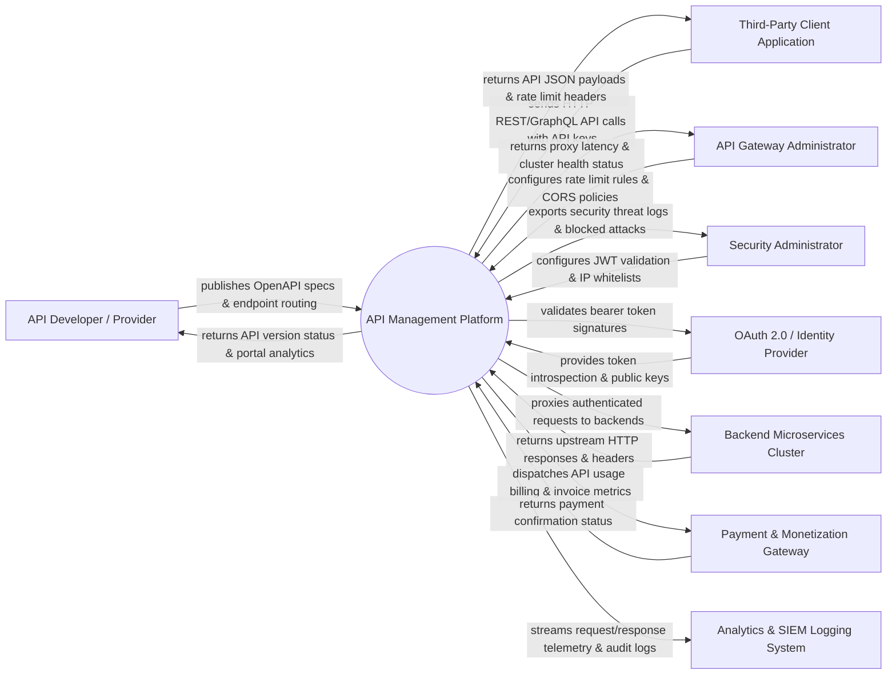

# Context Diagram — API Management Platform

## Mermaid Code

## Actor & Interaction Table | Bảng Actor & Tương tác

| # | Actor | Actor Type | Data Sent TO System | Data Received FROM System | Notes |
|---|-------|------------|---------------------|---------------------------|-------|
| 1 | API Developer / Provider | Primary | OpenAPI (Swagger) specs, endpoint definitions, SLA tiers | API usage statistics, error rates, version publication status | Internal developers publishing APIs |
| 2 | Third-Party Client Application | Primary | HTTP REST/GraphQL requests, API keys, OAuth tokens, JSON payloads | HTTP REST responses, error codes (401/429), rate-limit headers | External apps consuming APIs |
| 3 | API Gateway Administrator | Primary | Rate-limiting policies, caching rules, routing definitions | Gateway cluster latency, throughput metrics, proxy health | Manages API proxy infrastructure |
| 4 | Security Administrator | Primary | JWT validation rules, IP whitelists, WAF rules, CORS policies | Security threat logs, DDoS mitigation reports, attack alerts | Oversees API security and compliance |
| 5 | OAuth 2.0 / Identity Provider | Supporting | Public key certificates (JWKS), token introspection responses | Token verification requests, OAuth validation queries | External IdP (Auth0, Okta, Keycloak) |
| 6 | Backend Microservices Cluster | Supporting | HTTP response payloads, status codes, upstream latency headers | Proxied HTTP requests, transformed headers, client context | Internal upstream services providing data |
| 7 | Payment & Monetization Gateway | Supporting | Subscription plan payment confirmations, billing receipts | API call quotas, usage line items, invoice data | Monetization services (Stripe, Chargebee) |
| 8 | Analytics & SIEM Logging System | Supporting | Audit policies, SIEM threat ingestion rules | Real-time API telemetry, request logs, latency metrics | Observability systems (Splunk, Datadog, ELK) |

## System Boundary Description | Mô tả Scope Hệ thống

Hệ thống **API Management Platform** đóng vai trò là một API Gateway và cồng thông tin nhà phát triển (Developer Portal) tập trung cho toàn bộ các API của doanh nghiệp.

- **Phạm vi bên trong hệ thống (In-Scope)**:
  - Cung cấp API Gateway Proxy để định tuyến (Routing), biến đổi dữ liệu (Transformation) và lưu bộ nhớ đệm (Caching).
  - Quản lý xác thực và phân quyền (API Key, OAuth2 JWT, Mutual TLS) cùng với chính sách kiểm soát lưu lượng (Rate Limiting, Throttling).
  - Cung cấp cổng Developer Portal cho nhà phát triển tự đăng ký, tra cứu tài liệu OpenAPI và đăng ký API Key.
  - Phân tích chỉ số lưu lượng theo thời gian thực (Analytics), giám sát độ trễ (Latency) và thương mại hóa API (Monetization).

- **Bên ngoài phạm vi hệ thống (Out-of-Scope)**:
  - Trực tiếp xử lý logic nghiệp vụ cốt lõi (nhiệm vụ của Backend Microservices).
  - Trực tiếp phát hành tài khoản người dùng gốc (sử dụng OAuth2 / Identity Provider ngoài).
  - Trực tiếp lưu trữ lâu dài nhật ký SIEM quy mô lớn (do Splunk/Datadog đảm nhận).
