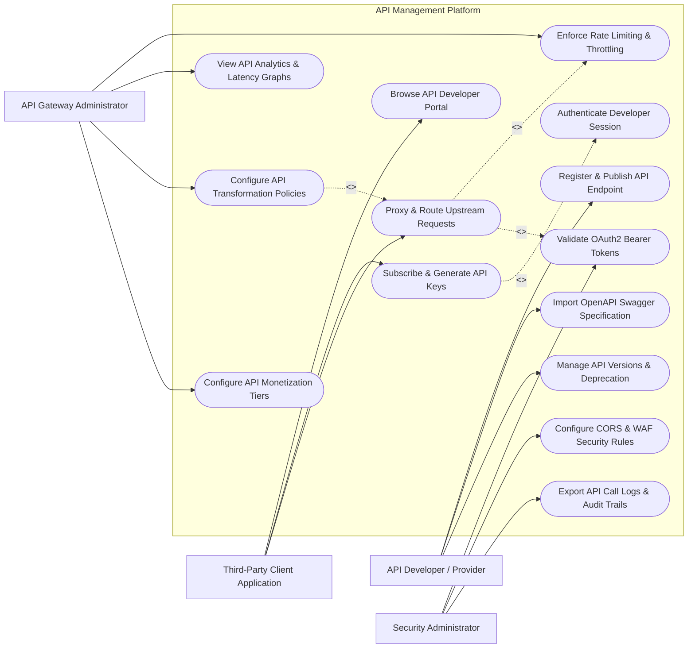

# Use Case Diagram — API Management Platform

## Mermaid Code

## Actor Table | Bảng Actor

| # | Actor | Actor Type | Role Description | Related Use Cases |
|---|-------|------------|------------------|-------------------|
| 1 | API Developer / Provider | Primary | Authors and publishes APIs, imports OpenAPI specs, manages version deprecation | UC01, UC02, UC04, UC12 |
| 2 | Third-Party Client Application | Primary | Consumes published APIs, registers developer applications, requests API keys, sends HTTP requests | UC03, UC05, UC08 |
| 3 | API Gateway Administrator | Primary | Configures rate limiting, routing proxy rules, transformation policies, and monetization tiers | UC06, UC09, UC10, UC13 |
| 4 | Security Administrator | Primary | Configures OAuth2 token verification, WAF policies, CORS rules, and exports security audit logs | UC07, UC11, UC14 |

## Use Case Table | Bảng Use Case

| # | UC ID | Use Case Name | Primary Actor | Secondary Actor | Description | Priority |
|---|-------|---------------|---------------|-----------------|-------------|----------|
| 1 | UC01 | Register & Publish API Endpoint | API Developer | Backend Microservices | Configures a new API path, HTTP methods, and upstream service target URL | High |
| 2 | UC02 | Import OpenAPI Swagger Specification | API Developer | None | Automatically populates API endpoint definitions from an OpenAPI JSON/YAML file | Medium |
| 3 | UC03 | Browse API Developer Portal | Third-Party Client | None | Explores interactive API documentation, try-it-out consoles, and SLA plans | High |
| 4 | UC04 | Authenticate Developer Session | System | Identity Provider | Verifies developer credentials for accessing portal management | High |
| 5 | UC05 | Subscribe & Generate API Keys | Third-Party Client | Payment Gateway | Registers consumer application, selects plan, and receives API Client ID & Secret | High |
| 6 | UC06 | Enforce Rate Limiting & Throttling | API Gateway Admin | System | Restricts requests per second (RPS) per API Key or IP address to prevent overload | High |
| 7 | UC07 | Validate OAuth2 Bearer Tokens | Security Admin | OAuth Provider | Verifies incoming JWT signatures, expiration, and scope authorizations | High |
| 8 | UC08 | Proxy & Route Upstream Requests | Third-Party Client | Backend Microservices | Receives incoming HTTP requests, validates credentials, and forwards to upstream backends | High |
| 9 | UC09 | View API Analytics & Latency Graphs | API Gateway Admin | SIEM Logger | Displays real-time API call volumes, HTTP 4xx/5xx error rates, and p99 latency | High |
| 10 | UC10 | Configure API Transformation Policies | API Gateway Admin | None | Transforms JSON payload structures, adds headers, or converts XML to JSON on-the-fly | Medium |
| 11 | UC11 | Configure CORS & WAF Security Rules | Security Admin | None | Defines Cross-Origin Resource Sharing rules and SQLi/XSS web application firewall protection | High |
| 12 | UC12 | Manage API Versions & Deprecation | API Developer | None | Manages API lifecycle (v1, v2), deprecation notices, and sunset dates | Medium |
| 13 | UC13 | Configure API Monetization Tiers | API Gateway Admin | Payment Gateway | Sets up Freemium, Pay-as-you-go, and Enterprise pricing subscription plans | Medium |
| 14 | UC14 | Export API Call Logs & Audit Trails | Security Admin | SIEM Logger | Streams transaction logs, client IP records, and access history for compliance | Low |

## Use Case Specification | Đặc tả Use Case

---

### UC01 — Register & Publish API Endpoint

| Field | Detail |
|-------|--------|
| **UC ID** | UC01 |
| **Use Case Name** | Register & Publish API Endpoint |
| **Actor(s)** | Primary: API Developer / Provider   Secondary: Backend Microservices |
| **Description** | Allows API developers to register a new API proxy route, configure public URI paths, and link to upstream microservice backend URLs. |
| **Precondition** | 1. API Developer must have API Publisher role.   2. The target backend microservice URL must be accessible to the gateway. |
| **Main Flow** | 1. API Developer opens "API Publisher Dashboard" and clicks "Create New API".   2. Developer enters API Name (e.g., `Payment Service API`), Version (e.g., `v1`), and Base Context Path (e.g., `/api/v1/payments`).   3. Developer inputs Target Upstream URL (e.g., `https://internal-payment-service.mesh/v1`).   4. Developer defines HTTP Methods allowed (GET, POST, PUT) and authentication requirement (OAuth2 / API Key).   5. Developer clicks "Publish to Gateway & Portal".   6. System validates URL routes, updates API Gateway routing table, renders interactive documentation on Developer Portal, and changes status to "Published". |
| **Alternative Flow** | **AF1** — Import OpenAPI File: Developer uploads `swagger.json` file; System auto-extracts all routes, parameters, and schema definitions.   **AF2** — Mock Response Mode: Developer enables Mock Response with sample JSON output before backend service is built. |
| **Exception Flow** | **EX1** — Route Path Conflict: If `/api/v1/payments` is already published by another team, System alerts "Context path already registered".   **EX2** — Invalid Upstream URL: If upstream URL fails health probe test, System flags warning "Upstream endpoint unreachable". |
| **Postcondition** | API Proxy is active on the Gateway engine, ready to process incoming consumer traffic. |
| **Business Rule** | **BR1**: All public API endpoints must enforce HTTPS encryption. |

---

### UC05 — Subscribe & Generate API Keys

| Field | Detail |
|-------|--------|
| **UC ID** | UC05 |
| **Use Case Name** | Subscribe & Generate API Keys |
| **Actor(s)** | Primary: Third-Party Client Application   Secondary: Payment Gateway |
| **Description** | Allows third-party developers to register an application on the portal, select a subscription plan, and obtain API credentials. |
| **Precondition** | 1. Developer must be logged into the API Developer Portal.   2. Target API must be published in status "Active". |
| **Main Flow** | 1. Third-Party Developer browses Developer Portal catalog and selects target API (e.g., `Logistics Tracking API`).   2. Developer selects a Subscription Plan (e.g., Free Tier: 1,000 calls/day vs Commercial Tier: $50/month).   3. Developer inputs Application Name (e.g., `Mobile Tracking App`) and OAuth Redirect URI.   4. Developer submits subscription request.   5. System validates payment/plan requirements, generates unique `Client ID` and `Client Secret / API Key`.   6. System displays the API Key once, stores hashed secret in database, and binds subscription quota to the app. |
| **Alternative Flow** | **AF1** — Paid Subscription Plan: System redirects developer to Stripe Checkout before releasing Commercial API Key.   **AF2** — Manual Approval Plan: Subscription request enters "Pending Approval" queue for API Manager manual sign-off. |
| **Exception Flow** | **EX1** — Max App Limit Reached: If developer account exceeds limit of 5 applications, System alerts "Max application quota reached".   **EX2** — Payment Authorization Failure: If credit card fails validation, System denies paid subscription. |
| **Postcondition** | API Key / Client Credentials are generated, and consumer app can make authorized API calls within plan quotas. |
| **Business Rule** | **BR1**: Plaintext Client Secrets are displayed only once upon generation and must be stored in hashed format. |

---

### UC06 — Enforce Rate Limiting & Throttling

| Field | Detail |
|-------|--------|
| **UC ID** | UC06 |
| **Use Case Name** | Enforce Rate Limiting & Throttling |
| **Actor(s)** | Primary: API Gateway Administrator   Secondary: System Engine |
| **Description** | Evaluates incoming request rates per API key/IP and throttles traffic exceeding allowed limits to protect backend servers. |
| **Precondition** | 1. Rate limiting policy rules must be configured in gateway settings.   2. Redis/In-memory rate limiter cache must be online. |
| **Main Flow** | 1. Gateway receives an HTTP request from a Client Application.   2. System extracts API Key / Client ID or Client IP address.   3. System queries Redis sliding-window counter for the identifier (e.g., 100 requests / minute limit).   4. If current count < limit (e.g., 42/100), System increments counter by 1, appends Rate Limit headers (`X-RateLimit-Limit`, `X-RateLimit-Remaining`), and forwards request to upstream backend.   5. Upstream backend responds, Gateway proxies response back to Client. |
| **Alternative Flow** | **AF1** — Burst Capacity Allowance: Gateway allows temporary burst traffic up to 120% of limit for 10 seconds.   **AF2** — IP Auto-Blacklisting: If an IP exceeds 500 requests/sec, Gateway auto-adds IP to temporary 1-hour blacklist. |
| **Exception Flow** | **EX1** — Rate Limit Exceeded (HTTP 429): If request count > limit (e.g., 101/100), Gateway rejects request immediately with HTTP 429 Too Many Requests and header `Retry-After: 18`.   **EX2** — Redis Cache Down: Gateway falls back to local memory rate limiting if Redis cluster fails. |
| **Postcondition** | High-volume traffic is throttled, preventing upstream microservice starvation or denial-of-service. |
| **Business Rule** | **BR1**: Rate-limited requests (HTTP 429) must not be counted against paid customer billing quotas. |

---

### UC07 — Validate OAuth2 Bearer Tokens

| Field | Detail |
|-------|--------|
| **UC ID** | UC07 |
| **Use Case Name** | Validate OAuth2 Bearer Tokens |
| **Actor(s)** | Primary: Security Administrator   Secondary: OAuth 2.0 / Identity Provider |
| **Description** | Intercepts HTTP requests carrying OAuth2 Authorization Bearer tokens, verifies cryptographic JWT signatures, and checks scope permissions. |
| **Precondition** | 1. Target API must be configured with OAuth2 Security Scheme.   2. Public JWKS keys from Identity Provider must be cached. |
| **Main Flow** | 1. Gateway receives HTTP request containing header `Authorization: Bearer <JWT_Token>`.   2. Gateway extracts JWT token string.   3. Gateway verifies cryptographic signature using cached JWKS public keys.   4. Gateway checks token claims: `exp` (expiration time), `nbf` (not before), and `iss` (issuer URL).   5. Gateway verifies required scope (e.g., `scope: read:orders`) matches endpoint requirement.   6. Upon successful validation, Gateway injects sanitized headers (`X-User-ID`, `X-User-Roles`) into request and forwards to upstream microservice. |
| **Alternative Flow** | **AF1** — Token Introspection: Gateway sends HTTP API call to OAuth server introspection endpoint for opaque (non-JWT) tokens.   **AF2** — Mutual TLS (mTLS) Authentication: Gateway validates client X.509 certificate for high-security enterprise APIs. |
| **Exception Flow** | **EX1** — Token Expired (HTTP 401): If `exp` timestamp is in the past, Gateway returns `HTTP 401 Unauthorized` with `WWW-Authenticate: error="invalid_token"`.   **EX2** — Insufficient Scope (HTTP 403): If token lacks required scope, Gateway returns `HTTP 403 Forbidden`. |
| **Postcondition** | Request is cryptographically verified, user claims are injected, and downstream service receives validated context. |
| **Business Rule** | **BR1**: JWKS public key certificates must be cached locally and refreshed every 24 hours or on verification failure. |

---

### UC10 — Configure API Transformation Policies

| Field | Detail |
|-------|--------|
| **UC ID** | UC10 |
| **Use Case Name** | Configure API Transformation Policies |
| **Actor(s)** | Primary: API Gateway Administrator |
| **Description** | Configures request/response mapping rules to convert data formats (XML to JSON), rewrite headers, or inject security tokens. |
| **Precondition** | 1. Target API proxy route must be created.   2. Administrator must have Gateway Policy Manager permissions. |
| **Main Flow** | 1. Administrator selects target API and opens "Policy Manager" tab.   2. Administrator adds a Request Transformation Policy (Inbound Stage).   3. Administrator defines Transformation Rules: (a) Rewrite URL path from `/v1/users/{id}` to `/internal/v2/user-query?uid={id}`, (b) Remove header `X-Debug-Token`, (c) Add header `X-Gateway-Trace-ID`.   4. Administrator adds Response Transformation Policy (Outbound Stage) to strip internal backend stack trace fields.   5. Administrator clicks "Apply Transformation Policy".   6. System compiles transformation logic (using JSLT/Groovy/JSONPath engine) and deploys policy to Gateway proxy runtime. |
| **Alternative Flow** | **AF1** — SOAP to REST XML-JSON Mapping: Policy converts legacy SOAP XML request body into REST JSON payload before sending to backend.   **AF2** — Payload Masking: Policy masks sensitive PII fields (e.g., credit card numbers) in API response JSON. |
| **Exception Flow** | **EX1** — Malformed JSON Transformation: If inbound payload fails JSONPath mapping, Gateway returns `HTTP 400 Bad Request`.   **EX2** — Policy Script Timeout: If Groovy transformation script exceeds 50ms execution limit, Gateway aborts request. |
| **Postcondition** | Transformation policy is active, automatically modifying inbound/outbound payloads without changing backend code. |
| **Business Rule** | **BR1**: Transformation policies must add less than 5ms of additional latency to total proxy processing time. |
