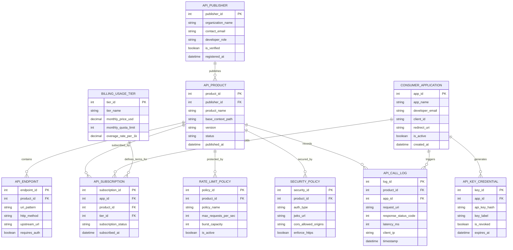

# Conceptual ERD — API Management Platform

## Mermaid Code

## Entity Description Table | Bảng mô tả Entity

| # | Entity Name | Vietnamese Name | Description | Key Attributes | Main Relationships |
|---|-------------|-----------------|-------------|----------------|-------------------|
| 1 | API_PUBLISHER | Nhà Xuất bản API | Thông tin tổ chức hoặc nhà phát triển nội bộ phát hành API | publisher_id (PK), organization_name, contact_email, developer_role | Publishes API_PRODUCT |
| 2 | API_PRODUCT | Gói Sản phẩm API | Tập hợp các API endpoint được đóng gói thành một sản phẩm có phiên bản | product_id (PK), publisher_id (FK), product_name, base_context_path, version | Belongs to API_PUBLISHER, contains API_ENDPOINT, protected by RATE_LIMIT |
| 3 | API_ENDPOINT | Đường dẫn API | Chi tiết đường dẫn URI, phương thức HTTP và URL dịch vụ upstream backend | endpoint_id (PK), product_id (FK), uri_pattern, http_method, upstream_url | Belongs to API_PRODUCT |
| 4 | CONSUMER_APPLICATION | Ứng dụng Tiêu dùng | Ứng dụng của bên thứ ba đăng ký sử dụng API (Web/Mobile app) | app_id (PK), app_name, developer_email, client_id, redirect_uri | Holds API_SUBSCRIPTION, generates API_KEY_CREDENTIAL, triggers API_CALL_LOG |
| 5 | API_SUBSCRIPTION | Đăng ký Sử dụng API | Bản ghi liên kết giữa ứng dụng tiêu dùng, sản phẩm API và gói giá cước | subscription_id (PK), app_id (FK), product_id (FK), tier_id (FK) | Links CONSUMER_APPLICATION, API_PRODUCT, and BILLING_USAGE_TIER |
| 6 | API_KEY_CREDENTIAL | Khóa API Credential | Khóa API Key hoặc Client Secret dùng để xác thực các yêu cầu gửi đến Gateway | key_id (PK), app_id (FK), api_key_hash, key_label, expires_at | Generated by CONSUMER_APPLICATION |
| 7 | RATE_LIMIT_POLICY | Chính sách Giới hạn Lưu lượng | Quy tắc giới hạn số lượng yêu cầu theo giây (RPS) và dung lượng burst | policy_id (PK), product_id (FK), policy_name, max_requests_per_sec | Protects API_PRODUCT |
| 8 | SECURITY_POLICY | Chính sách An ninh API | Cấu hình phương thức xác thực (OAuth2, API Key), JWKS URL và quy tắc CORS | security_id (PK), product_id (FK), auth_type, jwks_url, cors_allowed_origins | Secures API_PRODUCT |
| 9 | API_CALL_LOG | Nhật ký Yêu cầu API | Ghi nhận chi tiết từng lượt gọi API (HTTP status, độ trễ, IP khách hàng) | log_id (PK), product_id (FK), app_id (FK), response_status_code, latency_ms | Recorded for API_PRODUCT, triggered by CONSUMER_APPLICATION |
| 10 | BILLING_USAGE_TIER | Gói Hạn mức & Cước phí | Định nghĩa giá cước hàng tháng và hạn mức số lượt gọi API cho từng subscription | tier_id (PK), tier_name, monthly_price_usd, monthly_quota_limit | Defines terms for API_SUBSCRIPTION |

## Relationship Description | Mô tả Quan hệ

| # | From Entity | Cardinality | To Entity | Relationship Label | Business Explanation |
|---|-------------|-------------|-----------|-------------------|----------------------|
| 1 | API_PUBLISHER | 1 to Many | API_PRODUCT | publishes | Một nhà xuất bản có thể phát hành nhiều sản phẩm API. |
| 2 | API_PRODUCT | 1 to Many | API_ENDPOINT | contains | Một sản phẩm API chứa nhiều đường dẫn endpoint chi tiết. |
| 3 | API_PRODUCT | 1 to Many | API_SUBSCRIPTION | subscribed_by | Một sản phẩm API được đăng ký bởi nhiều ứng dụng khách. |
| 4 | CONSUMER_APPLICATION | 1 to Many | API_SUBSCRIPTION | holds | Một ứng dụng khách có thể đăng ký nhiều sản phẩm API khác nhau. |
| 5 | CONSUMER_APPLICATION | 1 to Many | API_KEY_CREDENTIAL | generates | Một ứng dụng khách sở hữu nhiều khóa API Key credentials. |
| 6 | BILLING_USAGE_TIER | 1 to Many | API_SUBSCRIPTION | defines_terms_for | Một gói cước quy định điều khoản giá và hạn mức cho nhiều bản đăng ký. |
| 7 | API_PRODUCT | 1 to Many | RATE_LIMIT_POLICY | protected_by | Một sản phẩm API áp dụng các quy tắc giới hạn lưu lượng (Rate Limit). |
| 8 | API_PRODUCT | 1 to 1 | SECURITY_POLICY | secured_by | Mỗi sản phẩm API được bảo vệ bởi 1 chính sách an ninh (OAuth2/CORS). |
| 9 | API_PRODUCT | 1 to Many | API_CALL_LOG | records | Một sản phẩm API ghi nhận lịch sử lưu lượng của nhiều đợt gọi. |
| 10 | CONSUMER_APPLICATION | 1 to Many | API_CALL_LOG | triggers | Một ứng dụng khách khởi tạo các lượt gọi API trong nhật ký. |
