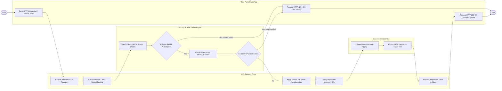

# Swimlane Diagram — API Management Platform

## Mermaid Code

## Flow Description | Mô tả luồng xử lý

| Lane | Actor | Role in Flow |
|------|-------|-------------|
| 1 | Third-Party Client App | Khởi tạo yêu cầu HTTP đính kèm mã Token, nhận phản hồi kết quả JSON thành công hoặc xử lý thử lại nếu bị chối do quá cước/hết hạn. |
| 2 | API Gateway Proxy | Tiếp nhận lưu lượng HTTP đầu vào, khớp tuyến đường (Routing), thực hiện biến đổi header/dữ liệu và chuyển tiếp (Proxy) yêu cầu tới ứng dụng Backend. |
| 3 | Security & Rate Limiter Engine | Xác thực chữ ký số JWT và quyền hạn Scope, kiểm tra hạn mức tần suất truy cập (RPS) trên cache Redis và từ chối truy cập nếu vi phạm. |
| 4 | Backend Microservice | Tiếp nhận các yêu cầu đã qua kiểm duyệt an ninh từ Gateway, thực thi logic nghiệp vụ và trả về kết quả JSON cho Gateway. |
