# Action Tree — API Management Platform

## Mermaid Code

```mermaid
graph TD
    Root["API Management Platform"]

    Root --> M1["API Portal & Publishing"]
    Root --> M2["Developer Onboarding & Subscriptions"]
    Root --> M3["Security & Authentication Policy"]
    Root --> M4["Traffic Control & Rate Limiting"]
    Root --> M5["API Analytics & Telemetry"]
    Root --> M6["API Monetization & Billing"]

    M1 --> A11["Register Upstream API Endpoint"]
    M1 --> A12["Import OpenAPI / Swagger Spec"]
    M1 --> A13["Manage API Lifecycle Versions"]
    M1 --> A14["Render Interactive Developer Docs"]

    M2 --> A21["Register Developer Account"]
    M2 --> A22["Create Consumer Application"]
    M2 --> A23["Subscribe to API Product Tier"]
    M2 --> A24["Generate Client Credentials & API Keys"]

    M3 --> A31["Configure OAuth2 JWT Validation"]
    M3 --> A32["Enforce Mutual TLS mTLS Security"]
    M3 --> A33["Configure CORS & WAF Protection"]
    M3 --> A34["Set Up IP Whitelisting Rules"]

    M4 --> A41["Set Requests Per Second RPS Limits"]
    M4 --> A42["Configure Burst Capacity Spikes"]
    M4 --> A43["Enable Inbound Payload Caching"]
    M4 --> A44["Apply Header Transformation Rules"]

    M5 --> A51["Monitor Real-time Gateway Latency"]
    M5 --> A52["Track HTTP Error Rate Metrics"]
    M5 --> A53["View Top API Consumer Rankings"]
    M5 --> A54["Export SIEM Security Audit Logs"]

    M6 --> A61["Define Subscription Pricing Plans"]
    M6 --> A62["Track API Call Quota Usage"]
    M6 --> A63["Generate Monthly Usage Invoices"]
```

## Module Description | Mô tả Module

| # | Module | Description | Actions |
|---|--------|-------------|---------|
| 1 | API Portal & Publishing | Quản lý việc đăng ký route API, nhập tài liệu chuẩn OpenAPI, quản lý các phiên bản API và hiển thị cổng tra cứu cho nhà phát triển. | Register Upstream API Endpoint, Import OpenAPI / Swagger Spec, Manage API Lifecycle Versions, Render Interactive Developer Docs |
| 2 | Developer Onboarding & Subscriptions | Quản lý quy trình đăng ký tài khoản nhà phát triển, tạo ứng dụng tiêu dùng và sinh khóa xác thực API Key / Client Secret. | Register Developer Account, Create Consumer Application, Subscribe to API Product Tier, Generate Client Credentials & API Keys |
| 3 | Security & Authentication Policy | Cấu hình các quy tắc xác thực an ninh (OAuth2 JWT, mTLS), thiết lập bảo mật CORS và tường lửa ứng dụng web (WAF). | Configure OAuth2 JWT Validation, Enforce Mutual TLS mTLS Security, Configure CORS & WAF Protection, Set Up IP Whitelisting Rules |
| 4 | Traffic Control & Rate Limiting | Kiểm soát tần suất lưu lượng (Rate Limiting), cấu hình dung lượng burst, lưu bộ nhớ đệm cache và biến đổi dữ liệu truyền tải. | Set Requests Per Second RPS Limits, Configure Burst Capacity Spikes, Enable Inbound Payload Caching, Apply Header Transformation Rules |
| 5 | API Analytics & Telemetry | Phân tích lưu lượng gọi API theo thời gian thực, đo lường độ trễ (Latency), tỷ lệ lỗi và trích xuất nhật ký bảo mật cho SIEM. | Monitor Real-time Gateway Latency, Track HTTP Error Rate Metrics, View Top API Consumer Rankings, Export SIEM Security Audit Logs |
| 6 | API Monetization & Billing | Cấu hình các gói cước thương mại hóa API (Freemium, Pay-as-you-go), theo dõi hạn mức sử dụng và xuất hóa đơn thanh toán. | Define Subscription Pricing Plans, Track API Call Quota Usage, Generate Monthly Usage Invoices |
