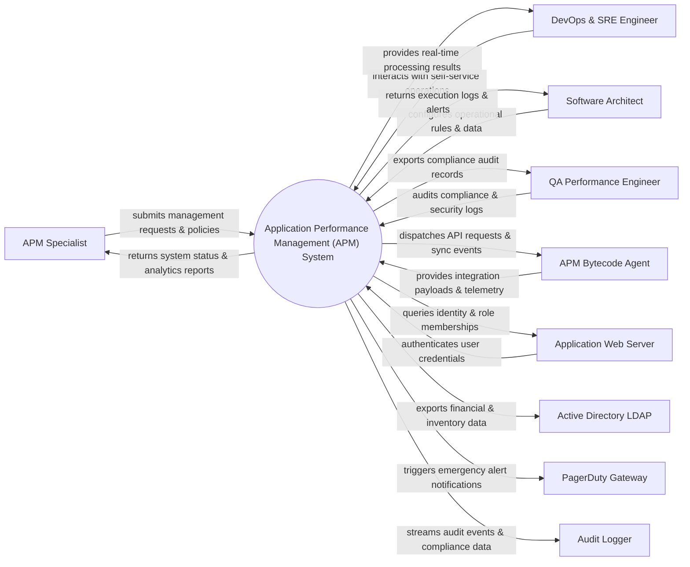

# Context Diagram — Application Performance Management (APM) System

## Mermaid Code

## Actor & Interaction Table | Bảng Actor & Tương tác

| # | Actor | Actor Type | Data Sent TO System | Data Received FROM System | Notes |
|---|-------|------------|---------------------|---------------------------|-------|
| 1 | APM Specialist | Primary | Operational requests, policy configurations, audit queries | Status updates, performance reports, audit results | APM Specialist role |
| 2 | DevOps & SRE Engineer | Primary | Operational requests, policy configurations, audit queries | Status updates, performance reports, audit results | DevOps & SRE Engineer role |
| 3 | Software Architect | Primary | Operational requests, policy configurations, audit queries | Status updates, performance reports, audit results | Software Architect role |
| 4 | QA Performance Engineer | Primary | Operational requests, policy configurations, audit queries | Status updates, performance reports, audit results | QA Performance Engineer role |
| 5 | APM Bytecode Agent | Supporting | Integration payloads, auth claims, event logs | API sync responses, verification tokens | APM Bytecode Agent role |
| 6 | Application Web Server | Supporting | Integration payloads, auth claims, event logs | API sync responses, verification tokens | Application Web Server role |
| 7 | Active Directory LDAP | Supporting | Integration payloads, auth claims, event logs | API sync responses, verification tokens | Active Directory LDAP role |
| 8 | PagerDuty Gateway | Supporting | Integration payloads, auth claims, event logs | API sync responses, verification tokens | PagerDuty Gateway role |
| 9 | Audit Logger | Supporting | Integration payloads, auth claims, event logs | API sync responses, verification tokens | Audit Logger role |

## System Boundary Description | Mô tả Scope Hệ thống

Hệ thống **Application Performance Management (APM) System** (Hệ thống Quản lý Hiệu năng Ứng dụng (APM)) được thiết kế nhằm quản lý tập trung và tự động hóa các quy trình vận hành CNTT cốt lõi trong doanh nghiệp.

- **Phạm vi bên trong hệ thống (In-Scope)**:
  - Quản lý dữ liệu nghiệp vụ trung tâm, tự động hóa quy trình theo chính sách doanh nghiệp.
  - Phân quyền người dùng chi tiết, theo dõi lịch sử thao tác và xuất báo cáo tuân thủ (ISO/SOC2).
  - Tích hợp phát hiện sự cố, gửi cảnh báo tức thì và kết nối dữ liệu hai chiều.

- **Bên ngoài phạm vi hệ thống (Out-of-Scope)**:
  - Trực tiếp quản lý hạ tầng phần cứng máy chủ vật lý.
  - Trực tiếp xử lý xác thực mật khẩu người dùng gốc (do Identity Provider đảm nhận).
