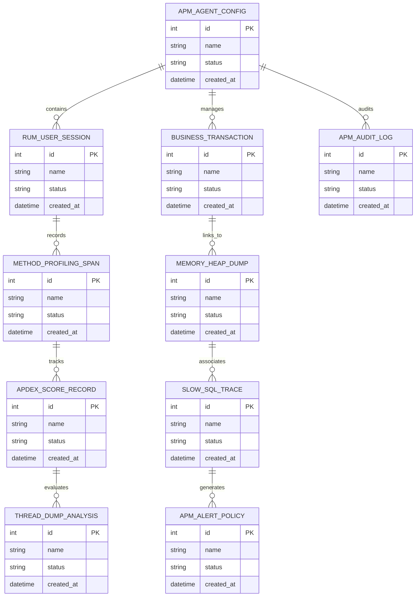

# Conceptual ERD — Application Performance Management (APM) System

## Mermaid Code

## Entity Description Table | Bảng mô tả Entity

| # | Entity Name | Vietnamese Name | Description | Key Attributes | Main Relationships |
|---|-------------|-----------------|-------------|----------------|-------------------|
| 1 | APM_AGENT_CONFIG | Thực thể APM_AGENT_CONFIG | Quản lý thông tin chi tiết cho apm_agent_config | id (PK), name, status, created_at | Links with related entities |
| 2 | RUM_USER_SESSION | Thực thể RUM_USER_SESSION | Quản lý thông tin chi tiết cho rum_user_session | id (PK), name, status, created_at | Links with related entities |
| 3 | BUSINESS_TRANSACTION | Thực thể BUSINESS_TRANSACTION | Quản lý thông tin chi tiết cho business_transaction | id (PK), name, status, created_at | Links with related entities |
| 4 | METHOD_PROFILING_SPAN | Thực thể METHOD_PROFILING_SPAN | Quản lý thông tin chi tiết cho method_profiling_span | id (PK), name, status, created_at | Links with related entities |
| 5 | MEMORY_HEAP_DUMP | Thực thể MEMORY_HEAP_DUMP | Quản lý thông tin chi tiết cho memory_heap_dump | id (PK), name, status, created_at | Links with related entities |
| 6 | APDEX_SCORE_RECORD | Thực thể APDEX_SCORE_RECORD | Quản lý thông tin chi tiết cho apdex_score_record | id (PK), name, status, created_at | Links with related entities |
| 7 | SLOW_SQL_TRACE | Thực thể SLOW_SQL_TRACE | Quản lý thông tin chi tiết cho slow_sql_trace | id (PK), name, status, created_at | Links with related entities |
| 8 | THREAD_DUMP_ANALYSIS | Thực thể THREAD_DUMP_ANALYSIS | Quản lý thông tin chi tiết cho thread_dump_analysis | id (PK), name, status, created_at | Links with related entities |
| 9 | APM_ALERT_POLICY | Thực thể APM_ALERT_POLICY | Quản lý thông tin chi tiết cho apm_alert_policy | id (PK), name, status, created_at | Links with related entities |
| 10 | APM_AUDIT_LOG | Thực thể APM_AUDIT_LOG | Quản lý thông tin chi tiết cho apm_audit_log | id (PK), name, status, created_at | Links with related entities |

## Relationship Description | Mô tả Quan hệ

| # | From Entity | Cardinality | To Entity | Relationship Label | Business Explanation |
|---|-------------|-------------|-----------|-------------------|----------------------|
| 1 | APM_AGENT_CONFIG | 1 to Many | RUM_USER_SESSION | relates_to | Quản lý mối quan hệ giữa APM_AGENT_CONFIG và RUM_USER_SESSION |
| 2 | RUM_USER_SESSION | 1 to Many | BUSINESS_TRANSACTION | relates_to | Quản lý mối quan hệ giữa RUM_USER_SESSION và BUSINESS_TRANSACTION |
| 3 | BUSINESS_TRANSACTION | 1 to Many | METHOD_PROFILING_SPAN | relates_to | Quản lý mối quan hệ giữa BUSINESS_TRANSACTION và METHOD_PROFILING_SPAN |
| 4 | METHOD_PROFILING_SPAN | 1 to Many | MEMORY_HEAP_DUMP | relates_to | Quản lý mối quan hệ giữa METHOD_PROFILING_SPAN và MEMORY_HEAP_DUMP |
| 5 | MEMORY_HEAP_DUMP | 1 to Many | APDEX_SCORE_RECORD | relates_to | Quản lý mối quan hệ giữa MEMORY_HEAP_DUMP và APDEX_SCORE_RECORD |
| 6 | APDEX_SCORE_RECORD | 1 to Many | SLOW_SQL_TRACE | relates_to | Quản lý mối quan hệ giữa APDEX_SCORE_RECORD và SLOW_SQL_TRACE |
| 7 | SLOW_SQL_TRACE | 1 to Many | THREAD_DUMP_ANALYSIS | relates_to | Quản lý mối quan hệ giữa SLOW_SQL_TRACE và THREAD_DUMP_ANALYSIS |
| 8 | THREAD_DUMP_ANALYSIS | 1 to Many | APM_ALERT_POLICY | relates_to | Quản lý mối quan hệ giữa THREAD_DUMP_ANALYSIS và APM_ALERT_POLICY |
| 9 | APM_ALERT_POLICY | 1 to Many | APM_AUDIT_LOG | relates_to | Quản lý mối quan hệ giữa APM_ALERT_POLICY và APM_AUDIT_LOG |
