# Action Tree — Application Performance Management (APM) System

## Mermaid Code

```mermaid
graph TD
    Root["Application Performance Management (APM) System"]

    Root --> M1["Bytecode Agent & RUM Monitoring"]
    Root --> M2["Business Transaction Tracing"]
    Root --> M3["Code-Level Method & SQL Profiling"]
    Root --> M4["Memory Leak & Diagnostic Heap Dump Engine"]
    Root --> M5["Apdex Score & Threshold Alerting"]
    Root --> M6["Application Performance Analytics & Reporting"]

    M1 --> A11["Configure Bytecode Agent & RUM Monitoring Policies"]
    M1 --> A12["Execute Bytecode Agent & RUM Monitoring Tasks"]
    M1 --> A13["Monitor Bytecode Agent & RUM Monitoring Telemetry"]
    M1 --> A14["Export Bytecode Agent & RUM Monitoring Audit Logs"]

    M2 --> A21["Configure Business Transaction Tracing Policies"]
    M2 --> A22["Execute Business Transaction Tracing Tasks"]
    M2 --> A23["Monitor Business Transaction Tracing Telemetry"]
    M2 --> A24["Export Business Transaction Tracing Audit Logs"]

    M3 --> A31["Configure Code-Level Method & SQL Profiling Policies"]
    M3 --> A32["Execute Code-Level Method & SQL Profiling Tasks"]
    M3 --> A33["Monitor Code-Level Method & SQL Profiling Telemetry"]
    M3 --> A34["Export Code-Level Method & SQL Profiling Audit Logs"]

    M4 --> A41["Configure Memory Leak & Diagnostic Heap Dump Engine Policies"]
    M4 --> A42["Execute Memory Leak & Diagnostic Heap Dump Engine Tasks"]
    M4 --> A43["Monitor Memory Leak & Diagnostic Heap Dump Engine Telemetry"]
    M4 --> A44["Export Memory Leak & Diagnostic Heap Dump Engine Audit Logs"]

    M5 --> A51["Configure Apdex Score & Threshold Alerting Policies"]
    M5 --> A52["Execute Apdex Score & Threshold Alerting Tasks"]
    M5 --> A53["Monitor Apdex Score & Threshold Alerting Telemetry"]
    M5 --> A54["Export Apdex Score & Threshold Alerting Audit Logs"]

    M6 --> A61["Configure Application Performance Analytics & Reporting Policies"]
    M6 --> A62["Execute Application Performance Analytics & Reporting Tasks"]
    M6 --> A63["Monitor Application Performance Analytics & Reporting Telemetry"]
    M6 --> A64["Export Application Performance Analytics & Reporting Audit Logs"]
```

## Module Description | Mô tả Module

| # | Module | Description | Actions |
|---|--------|-------------|---------|
| 1 | Bytecode Agent & RUM Monitoring | Quản lý các chức năng cốt lõi thuộc phân hệ bytecode agent & rum monitoring. | Configure Bytecode Agent & RUM Monitoring Policies, Execute Bytecode Agent & RUM Monitoring Tasks, Monitor Bytecode Agent & RUM Monitoring Telemetry, Export Bytecode Agent & RUM Monitoring Audit Logs |
| 2 | Business Transaction Tracing | Quản lý các chức năng cốt lõi thuộc phân hệ business transaction tracing. | Configure Business Transaction Tracing Policies, Execute Business Transaction Tracing Tasks, Monitor Business Transaction Tracing Telemetry, Export Business Transaction Tracing Audit Logs |
| 3 | Code-Level Method & SQL Profiling | Quản lý các chức năng cốt lõi thuộc phân hệ code-level method & sql profiling. | Configure Code-Level Method & SQL Profiling Policies, Execute Code-Level Method & SQL Profiling Tasks, Monitor Code-Level Method & SQL Profiling Telemetry, Export Code-Level Method & SQL Profiling Audit Logs |
| 4 | Memory Leak & Diagnostic Heap Dump Engine | Quản lý các chức năng cốt lõi thuộc phân hệ memory leak & diagnostic heap dump engine. | Configure Memory Leak & Diagnostic Heap Dump Engine Policies, Execute Memory Leak & Diagnostic Heap Dump Engine Tasks, Monitor Memory Leak & Diagnostic Heap Dump Engine Telemetry, Export Memory Leak & Diagnostic Heap Dump Engine Audit Logs |
| 5 | Apdex Score & Threshold Alerting | Quản lý các chức năng cốt lõi thuộc phân hệ apdex score & threshold alerting. | Configure Apdex Score & Threshold Alerting Policies, Execute Apdex Score & Threshold Alerting Tasks, Monitor Apdex Score & Threshold Alerting Telemetry, Export Apdex Score & Threshold Alerting Audit Logs |
| 6 | Application Performance Analytics & Reporting | Quản lý các chức năng cốt lõi thuộc phân hệ application performance analytics & reporting. | Configure Application Performance Analytics & Reporting Policies, Execute Application Performance Analytics & Reporting Tasks, Monitor Application Performance Analytics & Reporting Telemetry, Export Application Performance Analytics & Reporting Audit Logs |
