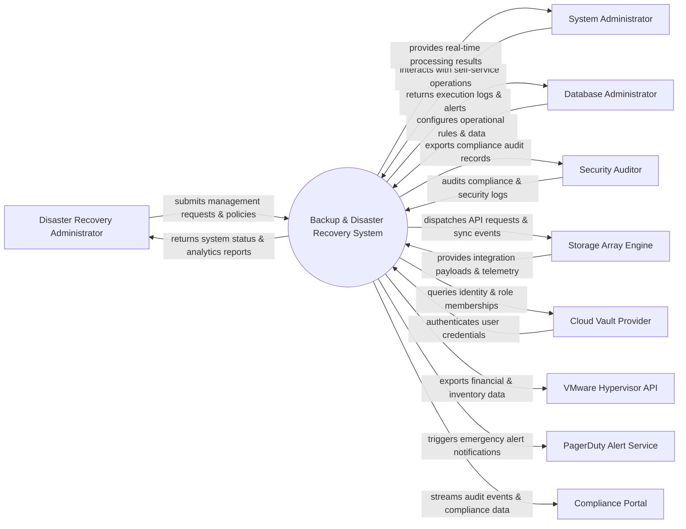

# Context Diagram — Backup & Disaster Recovery System

## Mermaid Code

## Actor & Interaction Table | Bảng Actor & Tương tác

| # | Actor | Actor Type | Data Sent TO System | Data Received FROM System | Notes |
|---|-------|------------|---------------------|---------------------------|-------|
| 1 | Disaster Recovery Administrator | Primary | Operational requests, policy configurations, audit queries | Status updates, performance reports, audit results | Disaster Recovery Administrator role |
| 2 | System Administrator | Primary | Operational requests, policy configurations, audit queries | Status updates, performance reports, audit results | System Administrator role |
| 3 | Database Administrator | Primary | Operational requests, policy configurations, audit queries | Status updates, performance reports, audit results | Database Administrator role |
| 4 | Security Auditor | Primary | Operational requests, policy configurations, audit queries | Status updates, performance reports, audit results | Security Auditor role |
| 5 | Storage Array Engine | Supporting | Integration payloads, auth claims, event logs | API sync responses, verification tokens | Storage Array Engine role |
| 6 | Cloud Vault Provider | Supporting | Integration payloads, auth claims, event logs | API sync responses, verification tokens | Cloud Vault Provider role |
| 7 | VMware Hypervisor API | Supporting | Integration payloads, auth claims, event logs | API sync responses, verification tokens | VMware Hypervisor API role |
| 8 | PagerDuty Alert Service | Supporting | Integration payloads, auth claims, event logs | API sync responses, verification tokens | PagerDuty Alert Service role |
| 9 | Compliance Portal | Supporting | Integration payloads, auth claims, event logs | API sync responses, verification tokens | Compliance Portal role |

## System Boundary Description | Mô tả Scope Hệ thống

Hệ thống **Backup & Disaster Recovery System** (Hệ thống Sao lưu và Khôi phục Sau Thiên tài) được thiết kế nhằm quản lý tập trung và tự động hóa các quy trình vận hành CNTT cốt lõi trong doanh nghiệp.

- **Phạm vi bên trong hệ thống (In-Scope)**:
  - Quản lý dữ liệu nghiệp vụ trung tâm, tự động hóa quy trình theo chính sách doanh nghiệp.
  - Phân quyền người dùng chi tiết, theo dõi lịch sử thao tác và xuất báo cáo tuân thủ (ISO/SOC2).
  - Tích hợp phát hiện sự cố, gửi cảnh báo tức thì và kết nối dữ liệu hai chiều.

- **Bên ngoài phạm vi hệ thống (Out-of-Scope)**:
  - Trực tiếp quản lý hạ tầng phần cứng máy chủ vật lý.
  - Trực tiếp xử lý xác thực mật khẩu người dùng gốc (do Identity Provider đảm nhận).
