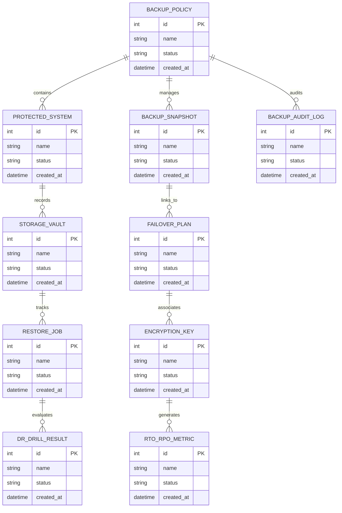

# Conceptual ERD — Backup & Disaster Recovery System

## Mermaid Code

## Entity Description Table | Bảng mô tả Entity

| # | Entity Name | Vietnamese Name | Description | Key Attributes | Main Relationships |
|---|-------------|-----------------|-------------|----------------|-------------------|
| 1 | BACKUP_POLICY | Thực thể BACKUP_POLICY | Quản lý thông tin chi tiết cho backup_policy | id (PK), name, status, created_at | Links with related entities |
| 2 | PROTECTED_SYSTEM | Thực thể PROTECTED_SYSTEM | Quản lý thông tin chi tiết cho protected_system | id (PK), name, status, created_at | Links with related entities |
| 3 | BACKUP_SNAPSHOT | Thực thể BACKUP_SNAPSHOT | Quản lý thông tin chi tiết cho backup_snapshot | id (PK), name, status, created_at | Links with related entities |
| 4 | STORAGE_VAULT | Thực thể STORAGE_VAULT | Quản lý thông tin chi tiết cho storage_vault | id (PK), name, status, created_at | Links with related entities |
| 5 | FAILOVER_PLAN | Thực thể FAILOVER_PLAN | Quản lý thông tin chi tiết cho failover_plan | id (PK), name, status, created_at | Links with related entities |
| 6 | RESTORE_JOB | Thực thể RESTORE_JOB | Quản lý thông tin chi tiết cho restore_job | id (PK), name, status, created_at | Links with related entities |
| 7 | ENCRYPTION_KEY | Thực thể ENCRYPTION_KEY | Quản lý thông tin chi tiết cho encryption_key | id (PK), name, status, created_at | Links with related entities |
| 8 | DR_DRILL_RESULT | Thực thể DR_DRILL_RESULT | Quản lý thông tin chi tiết cho dr_drill_result | id (PK), name, status, created_at | Links with related entities |
| 9 | RTO_RPO_METRIC | Thực thể RTO_RPO_METRIC | Quản lý thông tin chi tiết cho rto_rpo_metric | id (PK), name, status, created_at | Links with related entities |
| 10 | BACKUP_AUDIT_LOG | Thực thể BACKUP_AUDIT_LOG | Quản lý thông tin chi tiết cho backup_audit_log | id (PK), name, status, created_at | Links with related entities |

## Relationship Description | Mô tả Quan hệ

| # | From Entity | Cardinality | To Entity | Relationship Label | Business Explanation |
|---|-------------|-------------|-----------|-------------------|----------------------|
| 1 | BACKUP_POLICY | 1 to Many | PROTECTED_SYSTEM | relates_to | Quản lý mối quan hệ giữa BACKUP_POLICY và PROTECTED_SYSTEM |
| 2 | PROTECTED_SYSTEM | 1 to Many | BACKUP_SNAPSHOT | relates_to | Quản lý mối quan hệ giữa PROTECTED_SYSTEM và BACKUP_SNAPSHOT |
| 3 | BACKUP_SNAPSHOT | 1 to Many | STORAGE_VAULT | relates_to | Quản lý mối quan hệ giữa BACKUP_SNAPSHOT và STORAGE_VAULT |
| 4 | STORAGE_VAULT | 1 to Many | FAILOVER_PLAN | relates_to | Quản lý mối quan hệ giữa STORAGE_VAULT và FAILOVER_PLAN |
| 5 | FAILOVER_PLAN | 1 to Many | RESTORE_JOB | relates_to | Quản lý mối quan hệ giữa FAILOVER_PLAN và RESTORE_JOB |
| 6 | RESTORE_JOB | 1 to Many | ENCRYPTION_KEY | relates_to | Quản lý mối quan hệ giữa RESTORE_JOB và ENCRYPTION_KEY |
| 7 | ENCRYPTION_KEY | 1 to Many | DR_DRILL_RESULT | relates_to | Quản lý mối quan hệ giữa ENCRYPTION_KEY và DR_DRILL_RESULT |
| 8 | DR_DRILL_RESULT | 1 to Many | RTO_RPO_METRIC | relates_to | Quản lý mối quan hệ giữa DR_DRILL_RESULT và RTO_RPO_METRIC |
| 9 | RTO_RPO_METRIC | 1 to Many | BACKUP_AUDIT_LOG | relates_to | Quản lý mối quan hệ giữa RTO_RPO_METRIC và BACKUP_AUDIT_LOG |
