# Action Tree — Backup & Disaster Recovery System

## Mermaid Code

```mermaid
graph TD
    Root["Backup & Disaster Recovery System"]

    Root --> M1["Backup Policy & Schedule Management"]
    Root --> M2["Snapshot & Image Creation Engine"]
    Root --> M3["Cross-Region Vault Replication"]
    Root --> M4["Disaster Recovery Failover & Restore"]
    Root --> M5["Backup Integrity & Encryption Control"]
    Root --> M6["RTO RPO Analytics & Audit Compliance"]

    M1 --> A11["Configure Backup Policy & Schedule Management Policies"]
    M1 --> A12["Execute Backup Policy & Schedule Management Tasks"]
    M1 --> A13["Monitor Backup Policy & Schedule Management Telemetry"]
    M1 --> A14["Export Backup Policy & Schedule Management Audit Logs"]

    M2 --> A21["Configure Snapshot & Image Creation Engine Policies"]
    M2 --> A22["Execute Snapshot & Image Creation Engine Tasks"]
    M2 --> A23["Monitor Snapshot & Image Creation Engine Telemetry"]
    M2 --> A24["Export Snapshot & Image Creation Engine Audit Logs"]

    M3 --> A31["Configure Cross-Region Vault Replication Policies"]
    M3 --> A32["Execute Cross-Region Vault Replication Tasks"]
    M3 --> A33["Monitor Cross-Region Vault Replication Telemetry"]
    M3 --> A34["Export Cross-Region Vault Replication Audit Logs"]

    M4 --> A41["Configure Disaster Recovery Failover & Restore Policies"]
    M4 --> A42["Execute Disaster Recovery Failover & Restore Tasks"]
    M4 --> A43["Monitor Disaster Recovery Failover & Restore Telemetry"]
    M4 --> A44["Export Disaster Recovery Failover & Restore Audit Logs"]

    M5 --> A51["Configure Backup Integrity & Encryption Control Policies"]
    M5 --> A52["Execute Backup Integrity & Encryption Control Tasks"]
    M5 --> A53["Monitor Backup Integrity & Encryption Control Telemetry"]
    M5 --> A54["Export Backup Integrity & Encryption Control Audit Logs"]

    M6 --> A61["Configure RTO RPO Analytics & Audit Compliance Policies"]
    M6 --> A62["Execute RTO RPO Analytics & Audit Compliance Tasks"]
    M6 --> A63["Monitor RTO RPO Analytics & Audit Compliance Telemetry"]
    M6 --> A64["Export RTO RPO Analytics & Audit Compliance Audit Logs"]
```

## Module Description | Mô tả Module

| # | Module | Description | Actions |
|---|--------|-------------|---------|
| 1 | Backup Policy & Schedule Management | Quản lý các chức năng cốt lõi thuộc phân hệ backup policy & schedule management. | Configure Backup Policy & Schedule Management Policies, Execute Backup Policy & Schedule Management Tasks, Monitor Backup Policy & Schedule Management Telemetry, Export Backup Policy & Schedule Management Audit Logs |
| 2 | Snapshot & Image Creation Engine | Quản lý các chức năng cốt lõi thuộc phân hệ snapshot & image creation engine. | Configure Snapshot & Image Creation Engine Policies, Execute Snapshot & Image Creation Engine Tasks, Monitor Snapshot & Image Creation Engine Telemetry, Export Snapshot & Image Creation Engine Audit Logs |
| 3 | Cross-Region Vault Replication | Quản lý các chức năng cốt lõi thuộc phân hệ cross-region vault replication. | Configure Cross-Region Vault Replication Policies, Execute Cross-Region Vault Replication Tasks, Monitor Cross-Region Vault Replication Telemetry, Export Cross-Region Vault Replication Audit Logs |
| 4 | Disaster Recovery Failover & Restore | Quản lý các chức năng cốt lõi thuộc phân hệ disaster recovery failover & restore. | Configure Disaster Recovery Failover & Restore Policies, Execute Disaster Recovery Failover & Restore Tasks, Monitor Disaster Recovery Failover & Restore Telemetry, Export Disaster Recovery Failover & Restore Audit Logs |
| 5 | Backup Integrity & Encryption Control | Quản lý các chức năng cốt lõi thuộc phân hệ backup integrity & encryption control. | Configure Backup Integrity & Encryption Control Policies, Execute Backup Integrity & Encryption Control Tasks, Monitor Backup Integrity & Encryption Control Telemetry, Export Backup Integrity & Encryption Control Audit Logs |
| 6 | RTO RPO Analytics & Audit Compliance | Quản lý các chức năng cốt lõi thuộc phân hệ rto rpo analytics & audit compliance. | Configure RTO RPO Analytics & Audit Compliance Policies, Execute RTO RPO Analytics & Audit Compliance Tasks, Monitor RTO RPO Analytics & Audit Compliance Telemetry, Export RTO RPO Analytics & Audit Compliance Audit Logs |
