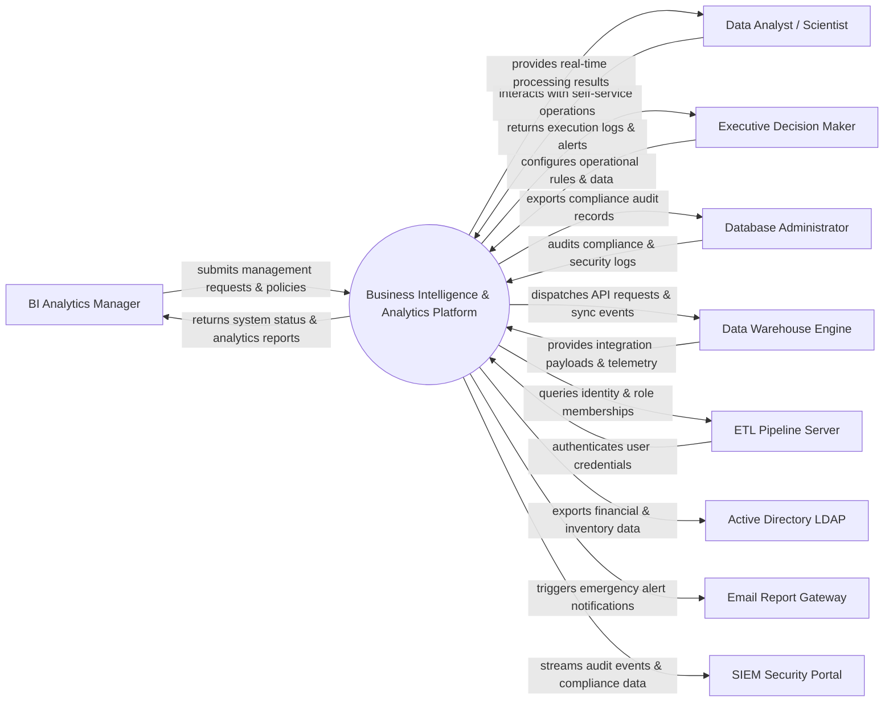

# Context Diagram — Business Intelligence & Analytics Platform

## Mermaid Code

## Actor & Interaction Table | Bảng Actor & Tương tác

| # | Actor | Actor Type | Data Sent TO System | Data Received FROM System | Notes |
|---|-------|------------|---------------------|---------------------------|-------|
| 1 | BI Analytics Manager | Primary | Operational requests, policy configurations, audit queries | Status updates, performance reports, audit results | BI Analytics Manager role |
| 2 | Data Analyst / Scientist | Primary | Operational requests, policy configurations, audit queries | Status updates, performance reports, audit results | Data Analyst / Scientist role |
| 3 | Executive Decision Maker | Primary | Operational requests, policy configurations, audit queries | Status updates, performance reports, audit results | Executive Decision Maker role |
| 4 | Database Administrator | Primary | Operational requests, policy configurations, audit queries | Status updates, performance reports, audit results | Database Administrator role |
| 5 | Data Warehouse Engine | Supporting | Integration payloads, auth claims, event logs | API sync responses, verification tokens | Data Warehouse Engine role |
| 6 | ETL Pipeline Server | Supporting | Integration payloads, auth claims, event logs | API sync responses, verification tokens | ETL Pipeline Server role |
| 7 | Active Directory LDAP | Supporting | Integration payloads, auth claims, event logs | API sync responses, verification tokens | Active Directory LDAP role |
| 8 | Email Report Gateway | Supporting | Integration payloads, auth claims, event logs | API sync responses, verification tokens | Email Report Gateway role |
| 9 | SIEM Security Portal | Supporting | Integration payloads, auth claims, event logs | API sync responses, verification tokens | SIEM Security Portal role |

## System Boundary Description | Mô tả Scope Hệ thống

Hệ thống **Business Intelligence & Analytics Platform** (Nền tảng Phân tích và Trí tuệ Kinh doanh (BI)) được thiết kế nhằm quản lý tập trung và tự động hóa các quy trình vận hành CNTT cốt lõi trong doanh nghiệp.

- **Phạm vi bên trong hệ thống (In-Scope)**:
  - Quản lý dữ liệu nghiệp vụ trung tâm, tự động hóa quy trình theo chính sách doanh nghiệp.
  - Phân quyền người dùng chi tiết, theo dõi lịch sử thao tác và xuất báo cáo tuân thủ (ISO/SOC2).
  - Tích hợp phát hiện sự cố, gửi cảnh báo tức thì và kết nối dữ liệu hai chiều.

- **Bên ngoài phạm vi hệ thống (Out-of-Scope)**:
  - Trực tiếp quản lý hạ tầng phần cứng máy chủ vật lý.
  - Trực tiếp xử lý xác thực mật khẩu người dùng gốc (do Identity Provider đảm nhận).
