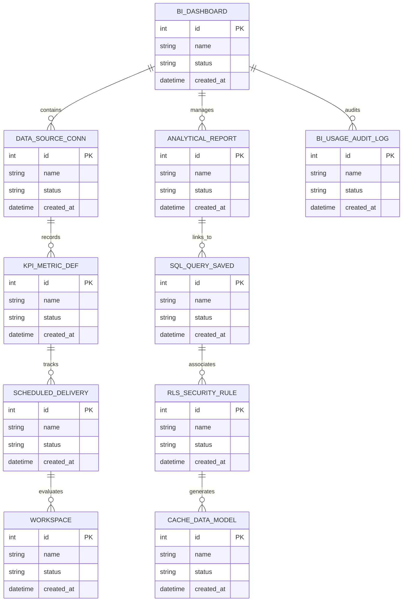

# Conceptual ERD — Business Intelligence & Analytics Platform

## Mermaid Code

## Entity Description Table | Bảng mô tả Entity

| # | Entity Name | Vietnamese Name | Description | Key Attributes | Main Relationships |
|---|-------------|-----------------|-------------|----------------|-------------------|
| 1 | BI_DASHBOARD | Thực thể BI_DASHBOARD | Quản lý thông tin chi tiết cho bi_dashboard | id (PK), name, status, created_at | Links with related entities |
| 2 | DATA_SOURCE_CONN | Thực thể DATA_SOURCE_CONN | Quản lý thông tin chi tiết cho data_source_conn | id (PK), name, status, created_at | Links with related entities |
| 3 | ANALYTICAL_REPORT | Thực thể ANALYTICAL_REPORT | Quản lý thông tin chi tiết cho analytical_report | id (PK), name, status, created_at | Links with related entities |
| 4 | KPI_METRIC_DEF | Thực thể KPI_METRIC_DEF | Quản lý thông tin chi tiết cho kpi_metric_def | id (PK), name, status, created_at | Links with related entities |
| 5 | SQL_QUERY_SAVED | Thực thể SQL_QUERY_SAVED | Quản lý thông tin chi tiết cho sql_query_saved | id (PK), name, status, created_at | Links with related entities |
| 6 | SCHEDULED_DELIVERY | Thực thể SCHEDULED_DELIVERY | Quản lý thông tin chi tiết cho scheduled_delivery | id (PK), name, status, created_at | Links with related entities |
| 7 | RLS_SECURITY_RULE | Thực thể RLS_SECURITY_RULE | Quản lý thông tin chi tiết cho rls_security_rule | id (PK), name, status, created_at | Links with related entities |
| 8 | WORKSPACE | Thực thể WORKSPACE | Quản lý thông tin chi tiết cho workspace | id (PK), name, status, created_at | Links with related entities |
| 9 | CACHE_DATA_MODEL | Thực thể CACHE_DATA_MODEL | Quản lý thông tin chi tiết cho cache_data_model | id (PK), name, status, created_at | Links with related entities |
| 10 | BI_USAGE_AUDIT_LOG | Thực thể BI_USAGE_AUDIT_LOG | Quản lý thông tin chi tiết cho bi_usage_audit_log | id (PK), name, status, created_at | Links with related entities |

## Relationship Description | Mô tả Quan hệ

| # | From Entity | Cardinality | To Entity | Relationship Label | Business Explanation |
|---|-------------|-------------|-----------|-------------------|----------------------|
| 1 | BI_DASHBOARD | 1 to Many | DATA_SOURCE_CONN | relates_to | Quản lý mối quan hệ giữa BI_DASHBOARD và DATA_SOURCE_CONN |
| 2 | DATA_SOURCE_CONN | 1 to Many | ANALYTICAL_REPORT | relates_to | Quản lý mối quan hệ giữa DATA_SOURCE_CONN và ANALYTICAL_REPORT |
| 3 | ANALYTICAL_REPORT | 1 to Many | KPI_METRIC_DEF | relates_to | Quản lý mối quan hệ giữa ANALYTICAL_REPORT và KPI_METRIC_DEF |
| 4 | KPI_METRIC_DEF | 1 to Many | SQL_QUERY_SAVED | relates_to | Quản lý mối quan hệ giữa KPI_METRIC_DEF và SQL_QUERY_SAVED |
| 5 | SQL_QUERY_SAVED | 1 to Many | SCHEDULED_DELIVERY | relates_to | Quản lý mối quan hệ giữa SQL_QUERY_SAVED và SCHEDULED_DELIVERY |
| 6 | SCHEDULED_DELIVERY | 1 to Many | RLS_SECURITY_RULE | relates_to | Quản lý mối quan hệ giữa SCHEDULED_DELIVERY và RLS_SECURITY_RULE |
| 7 | RLS_SECURITY_RULE | 1 to Many | WORKSPACE | relates_to | Quản lý mối quan hệ giữa RLS_SECURITY_RULE và WORKSPACE |
| 8 | WORKSPACE | 1 to Many | CACHE_DATA_MODEL | relates_to | Quản lý mối quan hệ giữa WORKSPACE và CACHE_DATA_MODEL |
| 9 | CACHE_DATA_MODEL | 1 to Many | BI_USAGE_AUDIT_LOG | relates_to | Quản lý mối quan hệ giữa CACHE_DATA_MODEL và BI_USAGE_AUDIT_LOG |
