# Action Tree — Business Intelligence & Analytics Platform

## Mermaid Code

```mermaid
graph TD
    Root["Business Intelligence & Analytics Platform"]

    Root --> M1["Data Connection & Semantic Modeling"]
    Root --> M2["Interactive Dashboard & Visualization"]
    Root --> M3["Ad-hoc SQL Query & Data Discovery"]
    Root --> M4["Row-Level Security & Access Control"]
    Root --> M5["Automated Report Delivery & Scheduling"]
    Root --> M6["BI Performance & Usage Analytics"]

    M1 --> A11["Configure Data Connection & Semantic Modeling Policies"]
    M1 --> A12["Execute Data Connection & Semantic Modeling Tasks"]
    M1 --> A13["Monitor Data Connection & Semantic Modeling Telemetry"]
    M1 --> A14["Export Data Connection & Semantic Modeling Audit Logs"]

    M2 --> A21["Configure Interactive Dashboard & Visualization Policies"]
    M2 --> A22["Execute Interactive Dashboard & Visualization Tasks"]
    M2 --> A23["Monitor Interactive Dashboard & Visualization Telemetry"]
    M2 --> A24["Export Interactive Dashboard & Visualization Audit Logs"]

    M3 --> A31["Configure Ad-hoc SQL Query & Data Discovery Policies"]
    M3 --> A32["Execute Ad-hoc SQL Query & Data Discovery Tasks"]
    M3 --> A33["Monitor Ad-hoc SQL Query & Data Discovery Telemetry"]
    M3 --> A34["Export Ad-hoc SQL Query & Data Discovery Audit Logs"]

    M4 --> A41["Configure Row-Level Security & Access Control Policies"]
    M4 --> A42["Execute Row-Level Security & Access Control Tasks"]
    M4 --> A43["Monitor Row-Level Security & Access Control Telemetry"]
    M4 --> A44["Export Row-Level Security & Access Control Audit Logs"]

    M5 --> A51["Configure Automated Report Delivery & Scheduling Policies"]
    M5 --> A52["Execute Automated Report Delivery & Scheduling Tasks"]
    M5 --> A53["Monitor Automated Report Delivery & Scheduling Telemetry"]
    M5 --> A54["Export Automated Report Delivery & Scheduling Audit Logs"]

    M6 --> A61["Configure BI Performance & Usage Analytics Policies"]
    M6 --> A62["Execute BI Performance & Usage Analytics Tasks"]
    M6 --> A63["Monitor BI Performance & Usage Analytics Telemetry"]
    M6 --> A64["Export BI Performance & Usage Analytics Audit Logs"]
```

## Module Description | Mô tả Module

| # | Module | Description | Actions |
|---|--------|-------------|---------|
| 1 | Data Connection & Semantic Modeling | Quản lý các chức năng cốt lõi thuộc phân hệ data connection & semantic modeling. | Configure Data Connection & Semantic Modeling Policies, Execute Data Connection & Semantic Modeling Tasks, Monitor Data Connection & Semantic Modeling Telemetry, Export Data Connection & Semantic Modeling Audit Logs |
| 2 | Interactive Dashboard & Visualization | Quản lý các chức năng cốt lõi thuộc phân hệ interactive dashboard & visualization. | Configure Interactive Dashboard & Visualization Policies, Execute Interactive Dashboard & Visualization Tasks, Monitor Interactive Dashboard & Visualization Telemetry, Export Interactive Dashboard & Visualization Audit Logs |
| 3 | Ad-hoc SQL Query & Data Discovery | Quản lý các chức năng cốt lõi thuộc phân hệ ad-hoc sql query & data discovery. | Configure Ad-hoc SQL Query & Data Discovery Policies, Execute Ad-hoc SQL Query & Data Discovery Tasks, Monitor Ad-hoc SQL Query & Data Discovery Telemetry, Export Ad-hoc SQL Query & Data Discovery Audit Logs |
| 4 | Row-Level Security & Access Control | Quản lý các chức năng cốt lõi thuộc phân hệ row-level security & access control. | Configure Row-Level Security & Access Control Policies, Execute Row-Level Security & Access Control Tasks, Monitor Row-Level Security & Access Control Telemetry, Export Row-Level Security & Access Control Audit Logs |
| 5 | Automated Report Delivery & Scheduling | Quản lý các chức năng cốt lõi thuộc phân hệ automated report delivery & scheduling. | Configure Automated Report Delivery & Scheduling Policies, Execute Automated Report Delivery & Scheduling Tasks, Monitor Automated Report Delivery & Scheduling Telemetry, Export Automated Report Delivery & Scheduling Audit Logs |
| 6 | BI Performance & Usage Analytics | Quản lý các chức năng cốt lõi thuộc phân hệ bi performance & usage analytics. | Configure BI Performance & Usage Analytics Policies, Execute BI Performance & Usage Analytics Tasks, Monitor BI Performance & Usage Analytics Telemetry, Export BI Performance & Usage Analytics Audit Logs |
