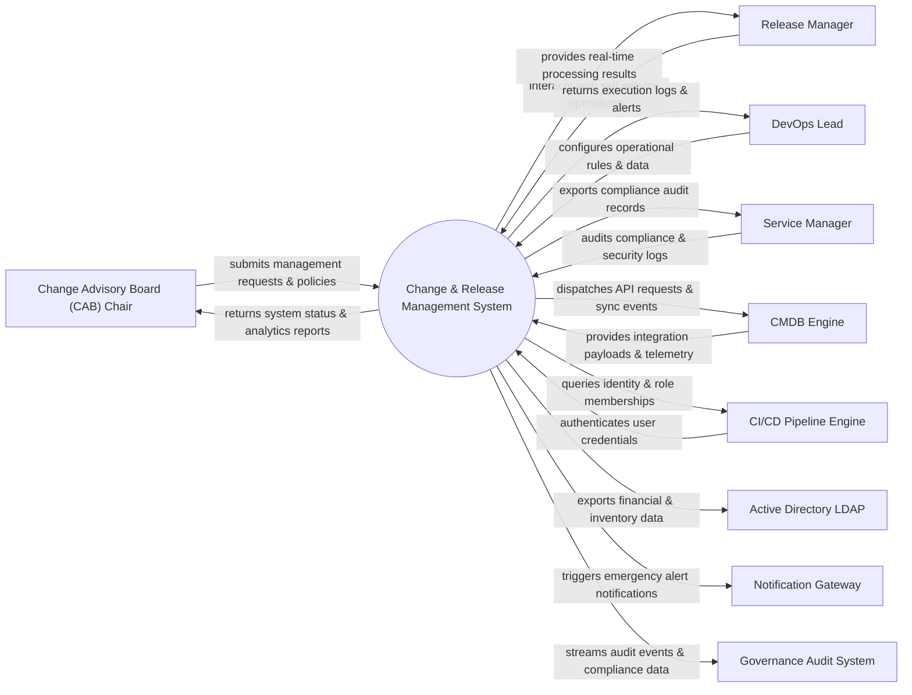

# Context Diagram — Change & Release Management System

## Mermaid Code

## Actor & Interaction Table | Bảng Actor & Tương tác

| # | Actor | Actor Type | Data Sent TO System | Data Received FROM System | Notes |
|---|-------|------------|---------------------|---------------------------|-------|
| 1 | Change Advisory Board (CAB) Chair | Primary | Operational requests, policy configurations, audit queries | Status updates, performance reports, audit results | Change Advisory Board (CAB) Chair role |
| 2 | Release Manager | Primary | Operational requests, policy configurations, audit queries | Status updates, performance reports, audit results | Release Manager role |
| 3 | DevOps Lead | Primary | Operational requests, policy configurations, audit queries | Status updates, performance reports, audit results | DevOps Lead role |
| 4 | Service Manager | Primary | Operational requests, policy configurations, audit queries | Status updates, performance reports, audit results | Service Manager role |
| 5 | CMDB Engine | Supporting | Integration payloads, auth claims, event logs | API sync responses, verification tokens | CMDB Engine role |
| 6 | CI/CD Pipeline Engine | Supporting | Integration payloads, auth claims, event logs | API sync responses, verification tokens | CI/CD Pipeline Engine role |
| 7 | Active Directory LDAP | Supporting | Integration payloads, auth claims, event logs | API sync responses, verification tokens | Active Directory LDAP role |
| 8 | Notification Gateway | Supporting | Integration payloads, auth claims, event logs | API sync responses, verification tokens | Notification Gateway role |
| 9 | Governance Audit System | Supporting | Integration payloads, auth claims, event logs | API sync responses, verification tokens | Governance Audit System role |

## System Boundary Description | Mô tả Scope Hệ thống

Hệ thống **Change & Release Management System** (Hệ thống Quản lý Thay đổi và Phát hành) được thiết kế nhằm quản lý tập trung và tự động hóa các quy trình vận hành CNTT cốt lõi trong doanh nghiệp.

- **Phạm vi bên trong hệ thống (In-Scope)**:
  - Quản lý dữ liệu nghiệp vụ trung tâm, tự động hóa quy trình theo chính sách doanh nghiệp.
  - Phân quyền người dùng chi tiết, theo dõi lịch sử thao tác và xuất báo cáo tuân thủ (ISO/SOC2).
  - Tích hợp phát hiện sự cố, gửi cảnh báo tức thì và kết nối dữ liệu hai chiều.

- **Bên ngoài phạm vi hệ thống (Out-of-Scope)**:
  - Trực tiếp quản lý hạ tầng phần cứng máy chủ vật lý.
  - Trực tiếp xử lý xác thực mật khẩu người dùng gốc (do Identity Provider đảm nhận).
