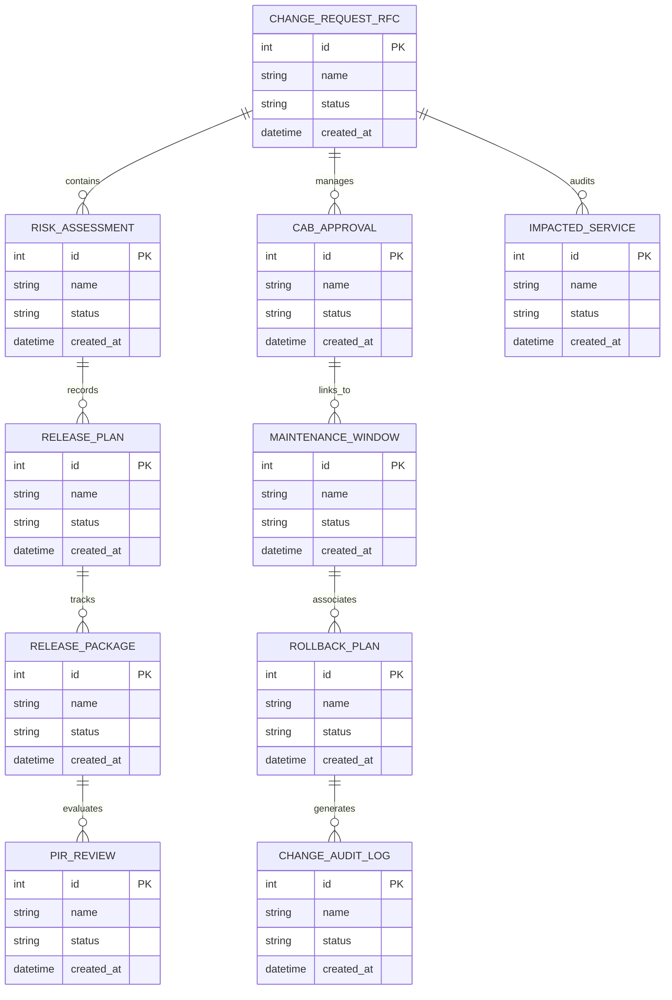

# Conceptual ERD — Change & Release Management System

## Mermaid Code

## Entity Description Table | Bảng mô tả Entity

| # | Entity Name | Vietnamese Name | Description | Key Attributes | Main Relationships |
|---|-------------|-----------------|-------------|----------------|-------------------|
| 1 | CHANGE_REQUEST_RFC | Thực thể CHANGE_REQUEST_RFC | Quản lý thông tin chi tiết cho change_request_rfc | id (PK), name, status, created_at | Links with related entities |
| 2 | RISK_ASSESSMENT | Thực thể RISK_ASSESSMENT | Quản lý thông tin chi tiết cho risk_assessment | id (PK), name, status, created_at | Links with related entities |
| 3 | CAB_APPROVAL | Thực thể CAB_APPROVAL | Quản lý thông tin chi tiết cho cab_approval | id (PK), name, status, created_at | Links with related entities |
| 4 | RELEASE_PLAN | Thực thể RELEASE_PLAN | Quản lý thông tin chi tiết cho release_plan | id (PK), name, status, created_at | Links with related entities |
| 5 | MAINTENANCE_WINDOW | Thực thể MAINTENANCE_WINDOW | Quản lý thông tin chi tiết cho maintenance_window | id (PK), name, status, created_at | Links with related entities |
| 6 | RELEASE_PACKAGE | Thực thể RELEASE_PACKAGE | Quản lý thông tin chi tiết cho release_package | id (PK), name, status, created_at | Links with related entities |
| 7 | ROLLBACK_PLAN | Thực thể ROLLBACK_PLAN | Quản lý thông tin chi tiết cho rollback_plan | id (PK), name, status, created_at | Links with related entities |
| 8 | PIR_REVIEW | Thực thể PIR_REVIEW | Quản lý thông tin chi tiết cho pir_review | id (PK), name, status, created_at | Links with related entities |
| 9 | CHANGE_AUDIT_LOG | Thực thể CHANGE_AUDIT_LOG | Quản lý thông tin chi tiết cho change_audit_log | id (PK), name, status, created_at | Links with related entities |
| 10 | IMPACTED_SERVICE | Thực thể IMPACTED_SERVICE | Quản lý thông tin chi tiết cho impacted_service | id (PK), name, status, created_at | Links with related entities |

## Relationship Description | Mô tả Quan hệ

| # | From Entity | Cardinality | To Entity | Relationship Label | Business Explanation |
|---|-------------|-------------|-----------|-------------------|----------------------|
| 1 | CHANGE_REQUEST_RFC | 1 to Many | RISK_ASSESSMENT | relates_to | Quản lý mối quan hệ giữa CHANGE_REQUEST_RFC và RISK_ASSESSMENT |
| 2 | RISK_ASSESSMENT | 1 to Many | CAB_APPROVAL | relates_to | Quản lý mối quan hệ giữa RISK_ASSESSMENT và CAB_APPROVAL |
| 3 | CAB_APPROVAL | 1 to Many | RELEASE_PLAN | relates_to | Quản lý mối quan hệ giữa CAB_APPROVAL và RELEASE_PLAN |
| 4 | RELEASE_PLAN | 1 to Many | MAINTENANCE_WINDOW | relates_to | Quản lý mối quan hệ giữa RELEASE_PLAN và MAINTENANCE_WINDOW |
| 5 | MAINTENANCE_WINDOW | 1 to Many | RELEASE_PACKAGE | relates_to | Quản lý mối quan hệ giữa MAINTENANCE_WINDOW và RELEASE_PACKAGE |
| 6 | RELEASE_PACKAGE | 1 to Many | ROLLBACK_PLAN | relates_to | Quản lý mối quan hệ giữa RELEASE_PACKAGE và ROLLBACK_PLAN |
| 7 | ROLLBACK_PLAN | 1 to Many | PIR_REVIEW | relates_to | Quản lý mối quan hệ giữa ROLLBACK_PLAN và PIR_REVIEW |
| 8 | PIR_REVIEW | 1 to Many | CHANGE_AUDIT_LOG | relates_to | Quản lý mối quan hệ giữa PIR_REVIEW và CHANGE_AUDIT_LOG |
| 9 | CHANGE_AUDIT_LOG | 1 to Many | IMPACTED_SERVICE | relates_to | Quản lý mối quan hệ giữa CHANGE_AUDIT_LOG và IMPACTED_SERVICE |
