# Action Tree — Change & Release Management System

## Mermaid Code

```mermaid
graph TD
    Root["Change & Release Management System"]

    Root --> M1["Request for Change (RFC) Submission"]
    Root --> M2["Risk Assessment & Blast Radius Analysis"]
    Root --> M3["CAB Approval & Workflow Management"]
    Root --> M4["Release Scheduling & Maintenance Windows"]
    Root --> M5["Rollback Execution & PIR Review"]
    Root --> M6["ITIL Compliance & Release Analytics"]

    M1 --> A11["Configure Request for Change (RFC) Submission Policies"]
    M1 --> A12["Execute Request for Change (RFC) Submission Tasks"]
    M1 --> A13["Monitor Request for Change (RFC) Submission Telemetry"]
    M1 --> A14["Export Request for Change (RFC) Submission Audit Logs"]

    M2 --> A21["Configure Risk Assessment & Blast Radius Analysis Policies"]
    M2 --> A22["Execute Risk Assessment & Blast Radius Analysis Tasks"]
    M2 --> A23["Monitor Risk Assessment & Blast Radius Analysis Telemetry"]
    M2 --> A24["Export Risk Assessment & Blast Radius Analysis Audit Logs"]

    M3 --> A31["Configure CAB Approval & Workflow Management Policies"]
    M3 --> A32["Execute CAB Approval & Workflow Management Tasks"]
    M3 --> A33["Monitor CAB Approval & Workflow Management Telemetry"]
    M3 --> A34["Export CAB Approval & Workflow Management Audit Logs"]

    M4 --> A41["Configure Release Scheduling & Maintenance Windows Policies"]
    M4 --> A42["Execute Release Scheduling & Maintenance Windows Tasks"]
    M4 --> A43["Monitor Release Scheduling & Maintenance Windows Telemetry"]
    M4 --> A44["Export Release Scheduling & Maintenance Windows Audit Logs"]

    M5 --> A51["Configure Rollback Execution & PIR Review Policies"]
    M5 --> A52["Execute Rollback Execution & PIR Review Tasks"]
    M5 --> A53["Monitor Rollback Execution & PIR Review Telemetry"]
    M5 --> A54["Export Rollback Execution & PIR Review Audit Logs"]

    M6 --> A61["Configure ITIL Compliance & Release Analytics Policies"]
    M6 --> A62["Execute ITIL Compliance & Release Analytics Tasks"]
    M6 --> A63["Monitor ITIL Compliance & Release Analytics Telemetry"]
    M6 --> A64["Export ITIL Compliance & Release Analytics Audit Logs"]
```

## Module Description | Mô tả Module

| # | Module | Description | Actions |
|---|--------|-------------|---------|
| 1 | Request for Change (RFC) Submission | Quản lý các chức năng cốt lõi thuộc phân hệ request for change (rfc) submission. | Configure Request for Change (RFC) Submission Policies, Execute Request for Change (RFC) Submission Tasks, Monitor Request for Change (RFC) Submission Telemetry, Export Request for Change (RFC) Submission Audit Logs |
| 2 | Risk Assessment & Blast Radius Analysis | Quản lý các chức năng cốt lõi thuộc phân hệ risk assessment & blast radius analysis. | Configure Risk Assessment & Blast Radius Analysis Policies, Execute Risk Assessment & Blast Radius Analysis Tasks, Monitor Risk Assessment & Blast Radius Analysis Telemetry, Export Risk Assessment & Blast Radius Analysis Audit Logs |
| 3 | CAB Approval & Workflow Management | Quản lý các chức năng cốt lõi thuộc phân hệ cab approval & workflow management. | Configure CAB Approval & Workflow Management Policies, Execute CAB Approval & Workflow Management Tasks, Monitor CAB Approval & Workflow Management Telemetry, Export CAB Approval & Workflow Management Audit Logs |
| 4 | Release Scheduling & Maintenance Windows | Quản lý các chức năng cốt lõi thuộc phân hệ release scheduling & maintenance windows. | Configure Release Scheduling & Maintenance Windows Policies, Execute Release Scheduling & Maintenance Windows Tasks, Monitor Release Scheduling & Maintenance Windows Telemetry, Export Release Scheduling & Maintenance Windows Audit Logs |
| 5 | Rollback Execution & PIR Review | Quản lý các chức năng cốt lõi thuộc phân hệ rollback execution & pir review. | Configure Rollback Execution & PIR Review Policies, Execute Rollback Execution & PIR Review Tasks, Monitor Rollback Execution & PIR Review Telemetry, Export Rollback Execution & PIR Review Audit Logs |
| 6 | ITIL Compliance & Release Analytics | Quản lý các chức năng cốt lõi thuộc phân hệ itil compliance & release analytics. | Configure ITIL Compliance & Release Analytics Policies, Execute ITIL Compliance & Release Analytics Tasks, Monitor ITIL Compliance & Release Analytics Telemetry, Export ITIL Compliance & Release Analytics Audit Logs |
