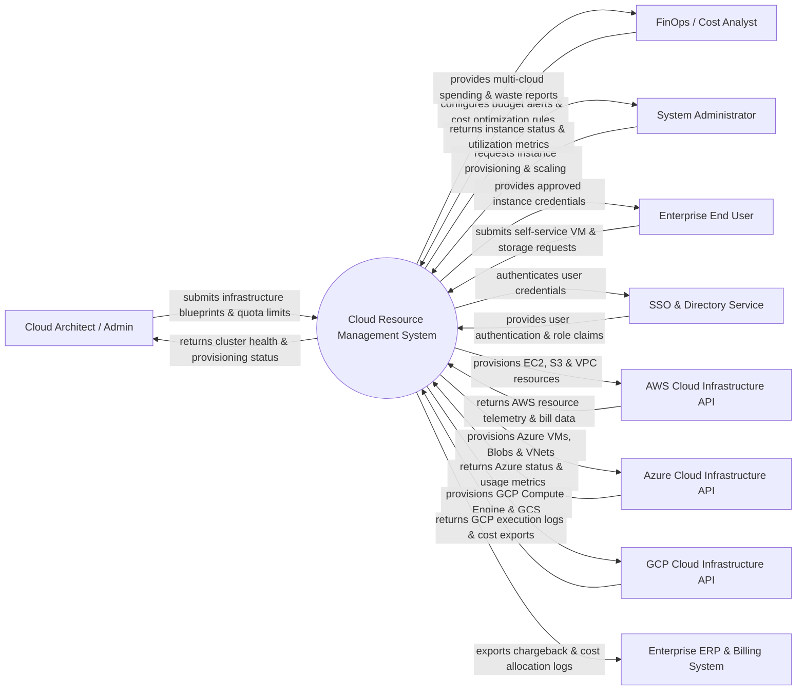

# Context Diagram — Cloud Resource Management System

## Mermaid Code

## Actor & Interaction Table | Bảng Actor & Tương tác

| # | Actor | Actor Type | Data Sent TO System | Data Received FROM System | Notes |
|---|-------|------------|---------------------|---------------------------|-------|
| 1 | Cloud Architect / Admin | Primary | Infrastructure blueprints, quota limits, compliance guardrails | Multi-cloud topology, cluster health, security posture | Oversees multi-cloud infrastructure strategy |
| 2 | FinOps / Cost Analyst | Primary | Budget thresholds, cost allocation tags, anomaly rules | Cost utilization reports, idle resource alerts, savings recommendations | Monitors and optimizes cloud spending |
| 3 | System Administrator | Primary | Scaling policies, VM power commands, maintenance schedules | Real-time CPU/RAM metrics, incident alerts, backup status | Manages day-to-day cloud operations |
| 4 | Enterprise End User | Primary | Self-service VM requests, sandbox environment requests | Access credentials, IP endpoints, active instance status | Consumes cloud resources for development/testing |
| 5 | Single Sign-On / Directory | Supporting | Identity claims, OAuth tokens, user group memberships | Authentication requests, session verification | Enterprise identity provider (Okta, Azure AD) |
| 6 | AWS Cloud API Provider | Supporting | AWS resource metrics, CloudWatch alerts, Cost Explorer data | Terraform/SDK provisioning API calls, tagging requests | Amazon Web Services API integration |
| 7 | Azure Cloud API Provider | Supporting | Azure VM status, Blob storage metrics, Cost Management API | ARM template deployments, REST API provisioning commands | Microsoft Azure API integration |
| 8 | GCP Cloud API Provider | Supporting | GCP Compute Engine metrics, BigQuery cost export logs | gcloud API calls, deployment manager templates | Google Cloud Platform API integration |
| 9 | Enterprise ERP & Billing | Supporting | Cost center IDs, general ledger accounts | Chargeback logs, department cost allocation summaries | Enterprise financial software (SAP, Oracle ERP) |

## System Boundary Description | Mô tả Scope Hệ thống

Hệ thống **Cloud Resource Management System (Cloud RMS)** cung cấp nền tảng quản lý tập trung tài nguyên điện toán đám mây đa nền tảng (Multi-Cloud: AWS, Azure, GCP).

- **Phạm vi bên trong hệ thống (In-Scope)**:
  - Tự động hóa khởi tạo (Provisioning), thay đổi quy mô (Auto-Scaling) và ngắt tài nguyên máy chủ ảo, kho lưu trữ và mạng.
  - Quản lý chi phí (FinOps), phân bổ chi phí theo phòng ban (Chargeback/Showback) và phát hiện tài nguyên lãng phí.
  - Giám sát chỉ số hiệu năng theo thời gian thực (CPU, Memory, Disk IO, Bandwidth) và phát cảnh báo sự cố.
  - Áp dụng các quy tắc tuân thủ an toàn (Security Guardrails), chính sách tag tài nguyên và tự động sao lưu dự phòng.

- **Bên ngoài phạm vi hệ thống (Out-of-Scope)**:
  - Trực tiếp sở hữu hoặc vận hành cơ sở hạ tầng trung tâm dữ liệu vật lý (do AWS, Azure, GCP chịu trách nhiệm).
  - Trực tiếp xử lý hạch toán kế toán chi tiết (nhiệm vụ của Enterprise ERP).
  - Thay thế hệ thống quản trị danh tính gốc (sử dụng SSO / Azure AD).
