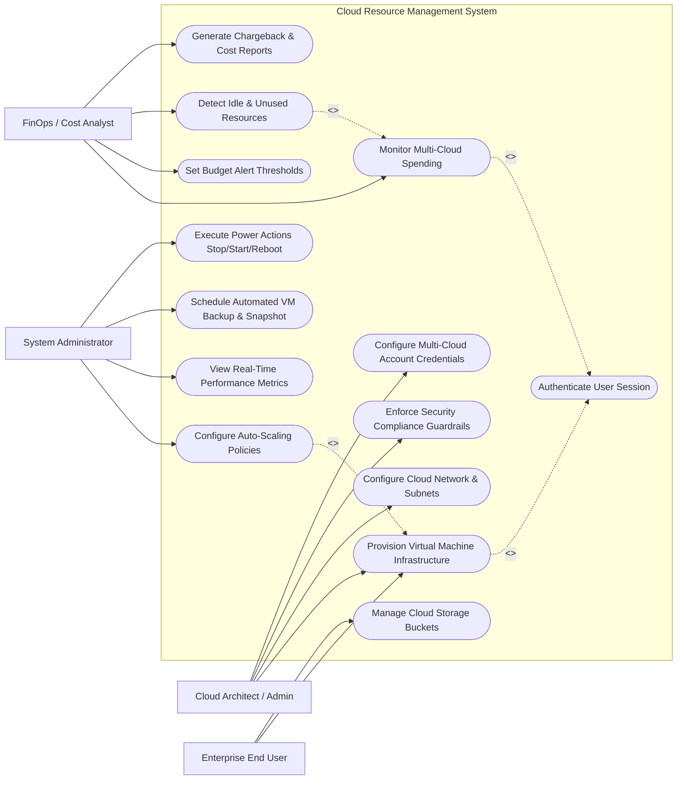

# Use Case Diagram — Cloud Resource Management System

## Mermaid Code

## Actor Table | Bảng Actor

| # | Actor | Actor Type | Role Description | Related Use Cases |
|---|-------|------------|------------------|-------------------|
| 1 | Cloud Architect / Admin | Primary | Designs multi-cloud topology, configures provider credentials, enforces compliance guardrails | UC01, UC03, UC10, UC12 |
| 2 | FinOps / Cost Analyst | Primary | Tracks multi-cloud spending, sets department budget limits, identifies cost-saving recommendations | UC06, UC07, UC08, UC13 |
| 3 | System Administrator | Primary | Manages instance auto-scaling, monitors performance telemetry, schedules backups, controls VM power | UC05, UC09, UC11, UC14 |
| 4 | Enterprise End User | Primary | Requests self-service virtual machines and cloud storage buckets within quota limits | UC01, UC02, UC04 |

## Use Case Table | Bảng Use Case

| # | UC ID | Use Case Name | Primary Actor | Secondary Actor | Description | Priority |
|---|-------|---------------|---------------|-----------------|-------------|----------|
| 1 | UC01 | Provision Virtual Machine Infrastructure | Enterprise End User | AWS / Azure / GCP | Deploys virtual machines across AWS EC2, Azure VM, or GCP Compute Engine | High |
| 2 | UC02 | Manage Cloud Storage Buckets | Enterprise End User | AWS S3 / Azure Blob | Creates, configures, and manages cloud object storage buckets and access policies | High |
| 3 | UC03 | Configure Cloud Network & Subnets | Cloud Architect | AWS VPC / Azure VNet | Sets up virtual private clouds, subnets, route tables, and security groups | High |
| 4 | UC04 | Authenticate User Session | System | Identity Provider | Validates user identity and role-based cloud access permissions | High |
| 5 | UC05 | Configure Auto-Scaling Policies | System Administrator | Cloud API Provider | Defines CPU/Memory threshold rules for dynamically scaling instance capacity | High |
| 6 | UC06 | Monitor Multi-Cloud Spending | FinOps Analyst | ERP Gateway | Consolidates and analyzes real-time cost telemetry across AWS, Azure, and GCP | High |
| 7 | UC07 | Set Budget Alert Thresholds | FinOps Analyst | Email Gateway | Configures automated notification alerts when spend reaches 80% or 100% of budget | High |
| 8 | UC08 | Detect Idle & Unused Resources | FinOps Analyst | Cloud API Provider | Identifies unattached Elastic IPs, unassociated EBS volumes, and idle VMs | Medium |
| 9 | UC09 | View Real-Time Performance Metrics | System Administrator | Cloud Monitoring API | Displays live telemetry graphs for CPU, RAM, Disk IOPS, and network throughput | Medium |
| 10 | UC10 | Enforce Security Compliance Guardrails | Cloud Architect | Security Scanner | Automatically audits cloud resources for CIS benchmark compliance and open ports | High |
| 11 | UC11 | Schedule Automated VM Backup & Snapshot | System Administrator | Storage Provider | Sets automated daily/weekly snapshot schedules for VM disaster recovery | Medium |
| 12 | UC12 | Configure Multi-Cloud Account Credentials | Cloud Architect | AWS / Azure / GCP | Stores encrypted IAM cross-account role credentials and API keys | High |
| 13 | UC13 | Generate Chargeback & Cost Reports | FinOps Analyst | ERP System | Exports monthly departmental cost allocation reports for internal billing | Medium |
| 14 | UC14 | Execute Power Actions Stop/Start/Reboot | System Administrator | Cloud API Provider | Sends instant start, stop, or reboot commands to target virtual machine instances | High |

## Use Case Specification | Đặc tả Use Case

---

### UC01 — Provision Virtual Machine Infrastructure

| Field | Detail |
|-------|--------|
| **UC ID** | UC01 |
| **Use Case Name** | Provision Virtual Machine Infrastructure |
| **Actor(s)** | Primary: Enterprise End User / Cloud Architect   Secondary: AWS / Azure / GCP API Provider |
| **Description** | Allows authorized users to deploy virtual machine instances across AWS, Azure, or GCP using pre-approved blueprints. |
| **Precondition** | 1. User must be authenticated and have quota allowance in target cost center.   2. Cloud provider account credentials must be active. |
| **Main Flow** | 1. User accesses "Provision Infrastructure" wizard from portal dashboard.   2. System prompts for Cloud Provider selection (AWS / Azure / GCP) and Target Region.   3. User selects OS Image (Ubuntu 22.04 LTS / Windows Server 2022) and Instance Size (e.g., t3.large - 2 vCPU, 8GB RAM).   4. User configures Network VPC, Subnet, Attached Storage Size, and Mandatory Environment Tags.   5. User clicks "Submit Provision Request".   6. System validates cost quota, formats Infrastructure-as-Code API payload, sends provisioning request to Target Cloud API, receives Instance ID and Public/Private IP, and records instance metadata. |
| **Alternative Flow** | **AF1** — Infrastructure Blueprint Template: User selects a pre-configured multi-tier blueprint (Web Server + DB Instance); System provisions all components simultaneously.   **AF2** — Spot/Preemptible Instance Option: User selects Spot instance option for 60% cost discount on short-lived workloads. |
| **Exception Flow** | **EX1** — Quota Exceeded: If user's department has reached max VM limit, System blocks request with message "Cost center quota limit reached".   **EX2** — Cloud API Timeout: If AWS/Azure API fails to respond within 60s, System marks request "Failed - Provider Timeout" and rolls back resource allocation. |
| **Postcondition** | Virtual machine is provisioned in status "Running", assigned IP addresses, and logged in resource inventory. |
| **Business Rule** | **BR1**: Every provisioned VM must include mandatory tags: `Owner`, `CostCenter`, `Environment` (Dev/Prod). |

---

### UC05 — Configure Auto-Scaling Policies

| Field | Detail |
|-------|--------|
| **UC ID** | UC05 |
| **Use Case Name** | Configure Auto-Scaling Policies |
| **Actor(s)** | Primary: System Administrator   Secondary: Cloud API Provider |
| **Description** | Defines dynamic scaling rules (Scale-Out and Scale-In) based on CPU utilization, memory consumption, or HTTP request count. |
| **Precondition** | 1. Target Auto-Scaling Group (ASG) or Scale Set must exist.   2. Administrator must possess Cloud Ops administrative privileges. |
| **Main Flow** | 1. Administrator selects target Auto-Scaling Group from Infrastructure List.   2. System displays current cluster size (Minimum: 2, Maximum: 10, Desired: 2).   3. Administrator defines Scale-Out Trigger Rule: "If Average CPU Utilization > 75% for 5 consecutive minutes, add 2 instances".   4. Administrator defines Scale-In Trigger Rule: "If Average CPU Utilization < 25% for 15 consecutive minutes, remove 1 instance".   5. Administrator sets Cooldown Period (e.g., 300 seconds) to prevent rapid flapping.   6. Administrator clicks "Apply Scaling Policy". System validates rules, dispatches policy update API call to Cloud Provider, and logs configuration change. |
| **Alternative Flow** | **AF1** — Scheduled Scaling: Administrator sets schedule-based scaling (e.g., scale out to 8 instances every Monday at 08:00 AM).   **AF2** — Target Tracking Policy: Administrator sets target tracking metric to maintain average CPU at exactly 50%. |
| **Exception Flow** | **EX1** — Min Greater Than Max: If Min Instances > Max Instances, System flags error "Minimum capacity cannot exceed Maximum capacity".   **EX2** — Cloud Provider Policy Limit: If ASG exceeds provider policy limit, System displays provider error response. |
| **Postcondition** | Auto-scaling policy is active on the cloud provider, continuously monitoring metrics for scaling triggers. |
| **Business Rule** | **BR1**: Production scaling groups must maintain a minimum of 2 instances across different Availability Zones for high availability. |

---

### UC06 — Monitor Multi-Cloud Spending

| Field | Detail |
|-------|--------|
| **UC ID** | UC06 |
| **Use Case Name** | Monitor Multi-Cloud Spending |
| **Actor(s)** | Primary: FinOps / Cost Analyst   Secondary: Enterprise ERP & Billing System |
| **Description** | Aggregates, normalizes, and visualizes daily and monthly cloud expenditure telemetry across AWS, Azure, and GCP into a single dashboard. |
| **Precondition** | 1. Multi-Cloud Cost Export APIs (AWS Cost Explorer, Azure Cost Management, GCP BigQuery Export) must be connected.   2. Cost Analyst must be logged in. |
| **Main Flow** | 1. FinOps Analyst accesses "Multi-Cloud FinOps Dashboard".   2. System queries cached cost database and fetches latest daily cost data feeds from AWS, Azure, and GCP.   3. System normalizes currency exchange rates and maps spending by Cost Center, Region, and Cloud Provider.   4. System renders interactive cost charts (Month-to-Date spend, Forecasted End-of-Month spend, Provider Breakdown).   5. Analyst filters cost data by tag `CostCenter=Engineering` and date range.   6. System updates visual charts, calculates month-over-month variance (+12%), and highlights top 5 most expensive cloud services. |
| **Alternative Flow** | **AF1** — Export Cost Data: Analyst clicks "Export CSV/Excel" to download raw itemized billing line items.   **AF2** — Currency Conversion: Analyst toggles currency selector to view spend in USD, EUR, or VND. |
| **Exception Flow** | **EX1** — Billing API Feed Disrupted: If Azure Cost API fails to return data, System displays cached data with notification "Azure feed delayed by 4 hours".   **EX2** — Unallocated Tag Detected: System flags warning if >10% of total spend contains unassigned cost tags. |
| **Postcondition** | Cost dashboard reflects normalized multi-cloud spending metrics, and forecasting models are updated. |
| **Business Rule** | **BR1**: Multi-cloud cost data must be refreshed at least once every 6 hours. |

---

### UC07 — Set Budget Alert Thresholds

| Field | Detail |
|-------|--------|
| **UC ID** | UC07 |
| **Use Case Name** | Set Budget Alert Thresholds |
| **Actor(s)** | Primary: FinOps / Cost Analyst   Secondary: Email & Notification Gateway |
| **Description** | Establishes monthly budget caps per department and configures automated email/Slack alerts when spending breaches threshold percentages. |
| **Precondition** | 1. Cost Center hierarchy must be defined.   2. Notification integration endpoints (Email/Slack Webhook) must be configured. |
| **Main Flow** | 1. FinOps Analyst opens "Budget Manager" panel.   2. Analyst selects Target Department (e.g., `Department: Data Analytics`) and sets Monthly Budget Amount (e.g., $15,000 USD).   3. Analyst sets Alert Trigger 1: "Actual Spend reaches 80% of budget" -> Notify Manager via Email.   4. Analyst sets Alert Trigger 2: "Forecasted Spend reaches 100% of budget" -> Send High Priority Alert to FinOps Slack Channel.   5. Analyst sets Alert Trigger 3: "Actual Spend reaches 110% of budget" -> Restrict new VM provisioning.   6. Analyst clicks "Save Budget Policy". System stores budget rules and initializes daily background checker job. |
| **Alternative Flow** | **AF1** — Auto-Shutdown Action: Analyst enables optional rule to automatically stop non-production Sandbox VMs if budget reaches 100%.   **AF2** — Dynamic Seasonal Budget: Analyst configures Q4 budget increase of 25% for holiday traffic peak. |
| **Exception Flow** | **EX1** — Budget Amount Zero: If budget amount entered is $0, System displays error "Budget must be greater than zero".   **EX2** — Notification Webhook Invalid: If Slack webhook URL returns 404, System alerts "Invalid notification URL". |
| **Postcondition** | Budget policy is saved, continuously monitored, and automated alerts dispatch upon threshold breach. |
| **Business Rule** | **BR1**: Budget breach alerts must trigger within 1 hour of cost data ingestion. |

---

### UC10 — Enforce Security Compliance Guardrails

| Field | Detail |
|-------|--------|
| **UC ID** | UC10 |
| **Use Case Name** | Enforce Security Compliance Guardrails |
| **Actor(s)** | Primary: Cloud Architect / Admin   Secondary: Security Scanner |
| **Description** | Audits cloud infrastructure configurations against security benchmarks (CIS, SOC2, HIPAA) and auto-remediates security violations. |
| **Precondition** | 1. Compliance policy engine must be active.   2. Multi-cloud accounts must be linked with audit permissions. |
| **Main Flow** | 1. Cloud Architect opens "Compliance & Governance" panel.   2. System displays overall Cloud Security Posture Score (e.g., 92% Compliant) across AWS, Azure, and GCP.   3. Architect activates compliance rule set: "Block Public S3 Buckets", "Enforce Storage Encryption at Rest", "Prohibit SSH Port 22 Open to 0.0.0.0/0".   4. Architect enables "Auto-Remediation" for critical violations.   5. System runs background compliance audit scan across all active cloud accounts.   6. If System detects an unencrypted S3 bucket or open SSH port, it logs security violation, revokes public access policy automatically, and notifies Cloud Architect. |
| **Alternative Flow** | **AF1** — Manual Remediation Approval: System alerts architect of violation and waits for "Approve Fix" button click before modifying cloud resource.   **AF2** — Temporary Exception Exemption: Architect grants 7-day security exception for specific staging IP address. |
| **Exception Flow** | **EX1** — Auto-Remediation API Failure: If cloud provider rejects policy revocation due to IAM permission error, System logs "Remediation Failed - IAM Error".   **EX2** — Compliance Audit Timeout: System alerts if account scan times out due to >10,000 resources. |
| **Postcondition** | Security guardrails are continuously enforced, non-compliant configurations remediated, and audit trail recorded. |
| **Business Rule** | **BR1**: S3/Blob storage buckets containing production data must never be publicly readable. |
