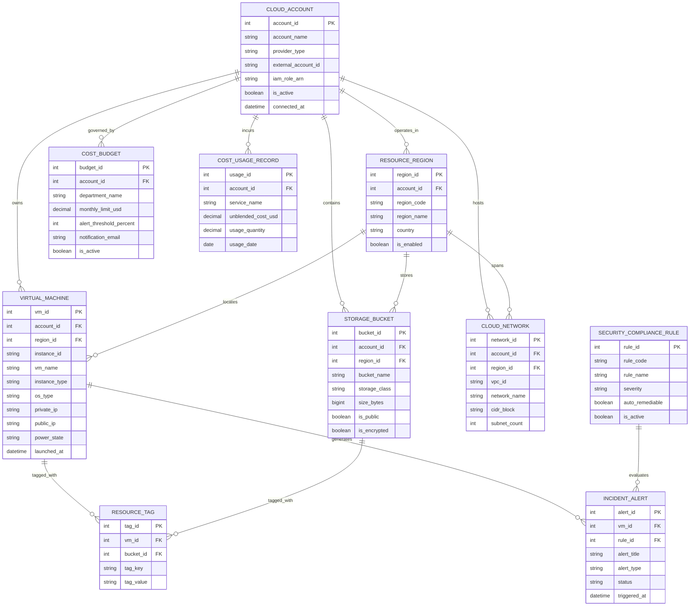

# Conceptual ERD — Cloud Resource Management System

## Mermaid Code

## Entity Description Table | Bảng mô tả Entity

| # | Entity Name | Vietnamese Name | Description | Key Attributes | Main Relationships |
|---|-------------|-----------------|-------------|----------------|-------------------|
| 1 | CLOUD_ACCOUNT | Tài khoản Đám mây | Lưu trữ thông tin tài khoản multi-cloud kết nối (AWS Account, Azure Subscription, GCP Project) | account_id (PK), account_name, provider_type, external_account_id | Operates in RESOURCE_REGION, owns VIRTUAL_MACHINE, incurs COST_USAGE |
| 2 | RESOURCE_REGION | Vùng Địa lý Đám mây | Đại diện cho các vùng trung tâm dữ liệu đám mây (e.g., us-east-1, ap-southeast-1) | region_id (PK), account_id (FK), region_code, region_name | Belongs to CLOUD_ACCOUNT, locates VIRTUAL_MACHINE & STORAGE_BUCKET |
| 3 | VIRTUAL_MACHINE | Máy chủ Ảo (VM/EC2) | Thực thể quản lý các máy chủ ảo (AWS EC2, Azure VM, GCP Compute Engine) | vm_id (PK), account_id (FK), region_id (FK), instance_id, power_state | Owned by CLOUD_ACCOUNT, tagged with RESOURCE_TAG, generates INCIDENT_ALERT |
| 4 | STORAGE_BUCKET | Kho Lưu trữ Khối (Bucket) | Thực thể lưu trữ đối tượng (AWS S3, Azure Blob Storage, GCP Bucket) | bucket_id (PK), account_id (FK), region_id (FK), bucket_name, size_bytes | Owned by CLOUD_ACCOUNT, tagged with RESOURCE_TAG |
| 5 | CLOUD_NETWORK | Mạng Ảo (VPC/VNet) | Quản lý mạng riêng ảo, dải IP subnet và cấu hình định tuyến đám mây | network_id (PK), account_id (FK), region_id (FK), vpc_id, cidr_block | Owned by CLOUD_ACCOUNT, spans RESOURCE_REGION |
| 6 | COST_BUDGET | Ngân sách Chi phí | Thiết lập hạn mức chi phí điện toán theo tháng cho từng phòng ban | budget_id (PK), account_id (FK), department_name, monthly_limit_usd | Governs CLOUD_ACCOUNT |
| 7 | RESOURCE_TAG | Thẻ Nhãn Tài nguyên | Quản lý cặp Key-Value dùng để gán nhãn chi phí và phân quyền cho tài nguyên | tag_id (PK), vm_id (FK), bucket_id (FK), tag_key, tag_value | Tagged for VIRTUAL_MACHINE and STORAGE_BUCKET |
| 8 | COST_USAGE_RECORD | Nhật ký Chi phí Sử dụng | Ghi nhận chi tiết chi phí sử dụng điện toán hàng ngày từ hóa đơn cloud | usage_id (PK), account_id (FK), service_name, unblended_cost_usd, usage_date | Incurred by CLOUD_ACCOUNT |
| 9 | SECURITY_COMPLIANCE_RULE | Quy tắc Tuân thủ An ninh | Định nghĩa các tiêu chí kiểm tra an toàn hạ tầng (CIS Benchmark, S3 Public check) | rule_id (PK), rule_code, rule_name, severity, auto_remediable | Evaluates INCIDENT_ALERT |
| 10 | INCIDENT_ALERT | Cảnh báo Sự cố & An ninh | Ghi nhận các cảnh báo quá tải CPU/RAM hoặc vi phạm quy tắc an ninh hạ tầng | alert_id (PK), vm_id (FK), rule_id (FK), alert_title, status | Generated by VIRTUAL_MACHINE, evaluated by SECURITY_RULE |

## Relationship Description | Mô tả Quan hệ

| # | From Entity | Cardinality | To Entity | Relationship Label | Business Explanation |
|---|-------------|-------------|-----------|-------------------|----------------------|
| 1 | CLOUD_ACCOUNT | 1 to Many | RESOURCE_REGION | operates_in | Một tài khoản đám mây có thể kích hoạt hoạt động ở nhiều Region địa lý. |
| 2 | CLOUD_ACCOUNT | 1 to Many | VIRTUAL_MACHINE | owns | Mot tài khoản đám mây sở hữu nhiều máy chủ ảo. |
| 3 | CLOUD_ACCOUNT | 1 to Many | STORAGE_BUCKET | contains | Một tài khoản đám mây chứa nhiều bucket lưu trữ đối tượng. |
| 4 | CLOUD_ACCOUNT | 1 to Many | CLOUD_NETWORK | hosts | Một tài khoản đám mây quản lý nhiều mạng riêng ảo (VPC/VNet). |
| 5 | CLOUD_ACCOUNT | 1 to Many | COST_BUDGET | governed_by | Một tài khoản đám mây được quản lý bởi các quy tắc hạn mức ngân sách. |
| 6 | CLOUD_ACCOUNT | 1 to Many | COST_USAGE_RECORD | incurs | Một tài khoản đám mây phát sinh nhiều bản ghi nợ chi phí hàng ngày. |
| 7 | RESOURCE_REGION | 1 to Many | VIRTUAL_MACHINE | locates | Một vùng địa lý định vị nhiều máy chủ ảo hoạt động. |
| 8 | RESOURCE_REGION | 1 to Many | STORAGE_BUCKET | stores | Một vùng địa lý lưu trữ dữ liệu của nhiều bucket. |
| 9 | VIRTUAL_MACHINE | 1 to Many | RESOURCE_TAG | tagged_with | Một máy chủ ảo được gán nhiều thẻ nhãn (Owner, CostCenter, Environment). |
| 10 | STORAGE_BUCKET | 1 to Many | RESOURCE_TAG | tagged_with | Một bucket lưu trữ được gán nhiều thẻ nhãn phân loại. |
| 11 | VIRTUAL_MACHINE | 1 to Many | INCIDENT_ALERT | generates | Một máy chủ ảo có thể phát sinh nhiều cảnh báo sự cố hiệu năng hoặc bảo mật. |
| 12 | SECURITY_COMPLIANCE_RULE | 1 to Many | INCIDENT_ALERT | evaluates | Quy tắc an ninh đánh giá và phát hiện tạo nên các bản ghi cảnh báo. |
