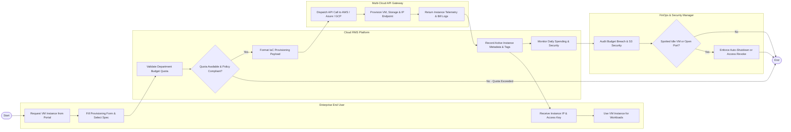

# Swimlane Diagram — Cloud Resource Management System

## Mermaid Code

## Flow Description | Mô tả luồng xử lý

| Lane | Actor | Role in Flow |
|------|-------|-------------|
| 1 | Enterprise End User | Khởi tạo yêu cầu máy chủ ảo qua cổng tự phục vụ, lựa chọn cấu hình phù hợp, tiếp nhận thông tin kết nối (IP/SSH key) và sử dụng cho công việc. |
| 2 | Cloud RMS Platform | Kiểm tra hạn mức ngân sách phòng ban, kiểm tra tính tuân thủ quy tắc an ninh, đóng gói yêu cầu dạng IaC, lưu vết tài nguyên và giám sát hoạt động. |
| 3 | Multi-Cloud API Gateway | Kết nối trực tiếp với API của AWS, Azure, GCP để khởi tạo hạ tầng thực tế (VM, Storage, Network) và trích xuất dữ liệu vận hành và hóa đơn. |
| 4 | FinOps & Security Manager | Kiểm soát báo cáo chi phí, phát hiện các máy chủ chạy ngầm không sử dụng (Idle VM) hoặc lỗ hổng bảo mật, thực hiện thu hồi hoặc tắt máy chủ tự động. |
