# Action Tree — Cloud Resource Management System

## Mermaid Code

```mermaid
graph TD
    Root["Cloud Resource Management System"]

    Root --> M1["Multi-Cloud Account Integration"]
    Root --> M2["Resource Provisioning & Infrastructure"]
    Root --> M3["Cost Optimization & FinOps"]
    Root --> M4["Monitoring & Telemetry Analytics"]
    Root --> M5["Security Compliance & Guardrails"]
    Root --> M6["Backup & Disaster Recovery"]

    M1 --> A11["Connect AWS / Azure / GCP Accounts"]
    M1 --> A12["Configure IAM Role Cross-Account Access"]
    M1 --> A13["Manage Multi-Region Footprints"]
    M1 --> A14["Enforce Global Cloud Quotas"]

    M2 --> A21["Provision Virtual Machine Instances"]
    M2 --> A22["Create Object Storage Buckets"]
    M2 --> A23["Configure Cloud VPC & Subnets"]
    M2 --> A24["Configure Dynamic Auto-Scaling Rules"]
    M2 --> A25["Execute Power Control Stop/Start/Reboot"]

    M3 --> A31["Consolidate Multi-Cloud Spending Feed"]
    M3 --> A32["Configure Department Budget Limits"]
    M3 --> A33["Detect Idle & Unused Cloud Resources"]
    M3 --> A34["Generate Department Chargeback Reports"]

    M4 --> A41["Track CPU / RAM Performance Metrics"]
    M4 --> A42["Monitor Disk IOPS & Network Bandwidth"]
    M4 --> A43["Configure Incident Threshold Alerts"]
    M4 --> A44["View Real-time Instance Health Map"]

    M5 --> A51["Audit CIS Security Benchmark Rules"]
    M5 --> A52["Detect Public S3 / Blob Buckets"]
    M5 --> A53["Enforce Mandatory Resource Tagging"]
    M5 --> A54["Execute Auto-Remediation Security Fix"]

    M6 --> A61["Schedule Automated VM Snapshots"]
    M6 --> A62["Configure Cross-Region Storage Replication"]
    M6 --> A63["Execute One-Click Disaster Recovery Restore"]
```

## Module Description | Mô tả Module

| # | Module | Description | Actions |
|---|--------|-------------|---------|
| 1 | Multi-Cloud Account Integration | Tích hợp và quản lý tài khoản kết nối đa đám mây (AWS, Azure, GCP), cấu hình quyền IAM và phân vùng địa lý. | Connect AWS / Azure / GCP Accounts, Configure IAM Role Cross-Account Access, Manage Multi-Region Footprints, Enforce Global Cloud Quotas |
| 2 | Resource Provisioning & Infrastructure | Tự động hóa khởi tạo máy chủ ảo, kho lưu trữ đối tượng, mạng riêng ảo, quy tắc auto-scaling và điều khiển nguồn. | Provision Virtual Machine Instances, Create Object Storage Buckets, Configure Cloud VPC & Subnets, Configure Dynamic Auto-Scaling Rules, Execute Power Control Stop/Start/Reboot |
| 3 | Cost Optimization & FinOps | Tổng hợp chi phí multi-cloud, thiết lập hạn mức ngân sách phòng ban, phát hiện tài nguyên lãng phí và xuất báo cáo phân bổ chi phí. | Consolidate Multi-Cloud Spending Feed, Configure Department Budget Limits, Detect Idle & Unused Cloud Resources, Generate Department Chargeback Reports |
| 4 | Monitoring & Telemetry Analytics | Giám sát các chỉ số hiệu năng (CPU, Memory, Disk, Network) theo thời gian thực và quản lý các cảnh báo ngưỡng sự cố. | Track CPU / RAM Performance Metrics, Monitor Disk IOPS & Network Bandwidth, Configure Incident Threshold Alerts, View Real-time Instance Health Map |
| 5 | Security Compliance & Guardrails | Kiểm tra tuân thủ an toàn hạ tầng theo chuẩn CIS, phát hiện tài nguyên công khai nguy hiểm và tự động khắc phục sự cố an ninh. | Audit CIS Security Benchmark Rules, Detect Public S3 / Blob Buckets, Enforce Mandatory Resource Tagging, Execute Auto-Remediation Security Fix |
| 6 | Backup & Disaster Recovery | Lập kịch bản sao lưu ảnh đĩa tự động (Snapshot), cấu hình nhân bản dữ liệu liên vùng và hỗ trợ khôi phục sau thiên tai. | Schedule Automated VM Snapshots, Configure Cross-Region Storage Replication, Execute One-Click Disaster Recovery Restore |
