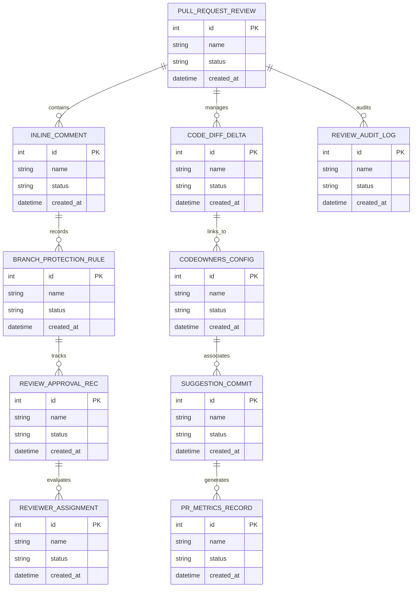

# Conceptual ERD — Code Review & Collaboration Platform

## Mermaid Code

## Entity Description Table | Bảng mô tả Entity

| # | Entity Name | Vietnamese Name | Description | Key Attributes | Main Relationships |
|---|-------------|-----------------|-------------|----------------|-------------------|
| 1 | PULL_REQUEST_REVIEW | Thực thể PULL_REQUEST_REVIEW | Quản lý thông tin chi tiết cho pull_request_review | id (PK), name, status, created_at | Links with related entities |
| 2 | INLINE_COMMENT | Thực thể INLINE_COMMENT | Quản lý thông tin chi tiết cho inline_comment | id (PK), name, status, created_at | Links with related entities |
| 3 | CODE_DIFF_DELTA | Thực thể CODE_DIFF_DELTA | Quản lý thông tin chi tiết cho code_diff_delta | id (PK), name, status, created_at | Links with related entities |
| 4 | BRANCH_PROTECTION_RULE | Thực thể BRANCH_PROTECTION_RULE | Quản lý thông tin chi tiết cho branch_protection_rule | id (PK), name, status, created_at | Links with related entities |
| 5 | CODEOWNERS_CONFIG | Thực thể CODEOWNERS_CONFIG | Quản lý thông tin chi tiết cho codeowners_config | id (PK), name, status, created_at | Links with related entities |
| 6 | REVIEW_APPROVAL_REC | Thực thể REVIEW_APPROVAL_REC | Quản lý thông tin chi tiết cho review_approval_rec | id (PK), name, status, created_at | Links with related entities |
| 7 | SUGGESTION_COMMIT | Thực thể SUGGESTION_COMMIT | Quản lý thông tin chi tiết cho suggestion_commit | id (PK), name, status, created_at | Links with related entities |
| 8 | REVIEWER_ASSIGNMENT | Thực thể REVIEWER_ASSIGNMENT | Quản lý thông tin chi tiết cho reviewer_assignment | id (PK), name, status, created_at | Links with related entities |
| 9 | PR_METRICS_RECORD | Thực thể PR_METRICS_RECORD | Quản lý thông tin chi tiết cho pr_metrics_record | id (PK), name, status, created_at | Links with related entities |
| 10 | REVIEW_AUDIT_LOG | Thực thể REVIEW_AUDIT_LOG | Quản lý thông tin chi tiết cho review_audit_log | id (PK), name, status, created_at | Links with related entities |

## Relationship Description | Mô tả Quan hệ

| # | From Entity | Cardinality | To Entity | Relationship Label | Business Explanation |
|---|-------------|-------------|-----------|-------------------|----------------------|
| 1 | PULL_REQUEST_REVIEW | 1 to Many | INLINE_COMMENT | relates_to | Quản lý mối quan hệ giữa PULL_REQUEST_REVIEW và INLINE_COMMENT |
| 2 | INLINE_COMMENT | 1 to Many | CODE_DIFF_DELTA | relates_to | Quản lý mối quan hệ giữa INLINE_COMMENT và CODE_DIFF_DELTA |
| 3 | CODE_DIFF_DELTA | 1 to Many | BRANCH_PROTECTION_RULE | relates_to | Quản lý mối quan hệ giữa CODE_DIFF_DELTA và BRANCH_PROTECTION_RULE |
| 4 | BRANCH_PROTECTION_RULE | 1 to Many | CODEOWNERS_CONFIG | relates_to | Quản lý mối quan hệ giữa BRANCH_PROTECTION_RULE và CODEOWNERS_CONFIG |
| 5 | CODEOWNERS_CONFIG | 1 to Many | REVIEW_APPROVAL_REC | relates_to | Quản lý mối quan hệ giữa CODEOWNERS_CONFIG và REVIEW_APPROVAL_REC |
| 6 | REVIEW_APPROVAL_REC | 1 to Many | SUGGESTION_COMMIT | relates_to | Quản lý mối quan hệ giữa REVIEW_APPROVAL_REC và SUGGESTION_COMMIT |
| 7 | SUGGESTION_COMMIT | 1 to Many | REVIEWER_ASSIGNMENT | relates_to | Quản lý mối quan hệ giữa SUGGESTION_COMMIT và REVIEWER_ASSIGNMENT |
| 8 | REVIEWER_ASSIGNMENT | 1 to Many | PR_METRICS_RECORD | relates_to | Quản lý mối quan hệ giữa REVIEWER_ASSIGNMENT và PR_METRICS_RECORD |
| 9 | PR_METRICS_RECORD | 1 to Many | REVIEW_AUDIT_LOG | relates_to | Quản lý mối quan hệ giữa PR_METRICS_RECORD và REVIEW_AUDIT_LOG |
